```python
#import libraries
import os
import pandas as pd
import numpy as np
import matplotlib.pyplot as plt
import seaborn as sns
import scipy
```


```python
#import data
df = pd.read_pickle(r'C:\Users\kickw\OneDrive\Documents\Instacart Basket Analysis\02 Data\Prepared Data\full_customers.pkl')

```

# Exercise


```python
#use crosstab to confirm that missing values in days_since_prior_order = new customer
crosstab=pd.crosstab(df['days_since_prior_order'],df['order_number'], dropna=False )
```


```python
crosstab
```


<div>
<style scoped>
    .dataframe tbody tr th:only-of-type {
        vertical-align: middle;
    }

    .dataframe tbody tr th {
        vertical-align: top;
    }

    .dataframe thead th {
        text-align: right;
    }
</style>
<table border="1" class="dataframe">
  <thead>
    <tr style="text-align: right;">
      <th>order_number</th>
      <th>1</th>
      <th>2</th>
      <th>3</th>
      <th>4</th>
      <th>5</th>
      <th>6</th>
      <th>7</th>
      <th>8</th>
      <th>9</th>
      <th>10</th>
      <th>...</th>
      <th>90</th>
      <th>91</th>
      <th>92</th>
      <th>93</th>
      <th>94</th>
      <th>95</th>
      <th>96</th>
      <th>97</th>
      <th>98</th>
      <th>99</th>
    </tr>
    <tr>
      <th>days_since_prior_order</th>
      <th></th>
      <th></th>
      <th></th>
      <th></th>
      <th></th>
      <th></th>
      <th></th>
      <th></th>
      <th></th>
      <th></th>
      <th></th>
      <th></th>
      <th></th>
      <th></th>
      <th></th>
      <th></th>
      <th></th>
      <th></th>
      <th></th>
      <th></th>
      <th></th>
    </tr>
  </thead>
  <tbody>
    <tr>
      <th>0.0</th>
      <td>0</td>
      <td>20562</td>
      <td>20452</td>
      <td>17998</td>
      <td>16451</td>
      <td>16061</td>
      <td>14396</td>
      <td>13896</td>
      <td>12782</td>
      <td>11471</td>
      <td>...</td>
      <td>1195</td>
      <td>1150</td>
      <td>1040</td>
      <td>937</td>
      <td>1136</td>
      <td>1099</td>
      <td>1041</td>
      <td>884</td>
      <td>1038</td>
      <td>936</td>
    </tr>
    <tr>
      <th>1.0</th>
      <td>0</td>
      <td>31693</td>
      <td>29975</td>
      <td>28025</td>
      <td>27109</td>
      <td>25545</td>
      <td>25013</td>
      <td>22935</td>
      <td>21797</td>
      <td>21081</td>
      <td>...</td>
      <td>2790</td>
      <td>2803</td>
      <td>2729</td>
      <td>2606</td>
      <td>2606</td>
      <td>2641</td>
      <td>2437</td>
      <td>2540</td>
      <td>2635</td>
      <td>2365</td>
    </tr>
    <tr>
      <th>2.0</th>
      <td>0</td>
      <td>46489</td>
      <td>46298</td>
      <td>43933</td>
      <td>40757</td>
      <td>40944</td>
      <td>38138</td>
      <td>37560</td>
      <td>35776</td>
      <td>33861</td>
      <td>...</td>
      <td>3624</td>
      <td>3558</td>
      <td>3314</td>
      <td>3592</td>
      <td>3323</td>
      <td>3073</td>
      <td>2986</td>
      <td>3058</td>
      <td>3092</td>
      <td>2612</td>
    </tr>
    <tr>
      <th>3.0</th>
      <td>0</td>
      <td>61701</td>
      <td>63450</td>
      <td>60047</td>
      <td>57931</td>
      <td>56219</td>
      <td>52916</td>
      <td>49333</td>
      <td>48324</td>
      <td>47858</td>
      <td>...</td>
      <td>3321</td>
      <td>3239</td>
      <td>2799</td>
      <td>3079</td>
      <td>2904</td>
      <td>2638</td>
      <td>2661</td>
      <td>2462</td>
      <td>2170</td>
      <td>2468</td>
    </tr>
    <tr>
      <th>4.0</th>
      <td>0</td>
      <td>76794</td>
      <td>78922</td>
      <td>73606</td>
      <td>70592</td>
      <td>66629</td>
      <td>62452</td>
      <td>61200</td>
      <td>59568</td>
      <td>57743</td>
      <td>...</td>
      <td>2344</td>
      <td>2260</td>
      <td>2492</td>
      <td>2032</td>
      <td>1800</td>
      <td>2083</td>
      <td>1918</td>
      <td>1795</td>
      <td>1695</td>
      <td>1813</td>
    </tr>
    <tr>
      <th>5.0</th>
      <td>0</td>
      <td>89103</td>
      <td>91826</td>
      <td>86577</td>
      <td>81933</td>
      <td>77645</td>
      <td>73637</td>
      <td>70078</td>
      <td>64515</td>
      <td>63201</td>
      <td>...</td>
      <td>1630</td>
      <td>1633</td>
      <td>1368</td>
      <td>984</td>
      <td>1216</td>
      <td>1222</td>
      <td>1168</td>
      <td>966</td>
      <td>912</td>
      <td>936</td>
    </tr>
    <tr>
      <th>6.0</th>
      <td>0</td>
      <td>120786</td>
      <td>123008</td>
      <td>114762</td>
      <td>106859</td>
      <td>100838</td>
      <td>96045</td>
      <td>89830</td>
      <td>87290</td>
      <td>78707</td>
      <td>...</td>
      <td>754</td>
      <td>842</td>
      <td>942</td>
      <td>1014</td>
      <td>837</td>
      <td>571</td>
      <td>490</td>
      <td>602</td>
      <td>485</td>
      <td>544</td>
    </tr>
    <tr>
      <th>7.0</th>
      <td>0</td>
      <td>184973</td>
      <td>181825</td>
      <td>167756</td>
      <td>157591</td>
      <td>143768</td>
      <td>137803</td>
      <td>128561</td>
      <td>120840</td>
      <td>114884</td>
      <td>...</td>
      <td>636</td>
      <td>575</td>
      <td>521</td>
      <td>440</td>
      <td>602</td>
      <td>422</td>
      <td>421</td>
      <td>378</td>
      <td>419</td>
      <td>323</td>
    </tr>
    <tr>
      <th>8.0</th>
      <td>0</td>
      <td>112446</td>
      <td>110849</td>
      <td>102316</td>
      <td>95041</td>
      <td>87712</td>
      <td>81714</td>
      <td>78825</td>
      <td>71139</td>
      <td>67639</td>
      <td>...</td>
      <td>239</td>
      <td>262</td>
      <td>228</td>
      <td>244</td>
      <td>275</td>
      <td>232</td>
      <td>235</td>
      <td>143</td>
      <td>137</td>
      <td>84</td>
    </tr>
    <tr>
      <th>9.0</th>
      <td>0</td>
      <td>73741</td>
      <td>75442</td>
      <td>68589</td>
      <td>65108</td>
      <td>58984</td>
      <td>54854</td>
      <td>50633</td>
      <td>47797</td>
      <td>43520</td>
      <td>...</td>
      <td>190</td>
      <td>90</td>
      <td>98</td>
      <td>101</td>
      <td>146</td>
      <td>91</td>
      <td>67</td>
      <td>102</td>
      <td>66</td>
      <td>65</td>
    </tr>
    <tr>
      <th>10.0</th>
      <td>0</td>
      <td>62086</td>
      <td>62509</td>
      <td>57733</td>
      <td>51960</td>
      <td>49513</td>
      <td>43765</td>
      <td>41157</td>
      <td>38478</td>
      <td>34952</td>
      <td>...</td>
      <td>60</td>
      <td>103</td>
      <td>222</td>
      <td>78</td>
      <td>45</td>
      <td>116</td>
      <td>4</td>
      <td>101</td>
      <td>42</td>
      <td>59</td>
    </tr>
    <tr>
      <th>11.0</th>
      <td>0</td>
      <td>55614</td>
      <td>55969</td>
      <td>52025</td>
      <td>45547</td>
      <td>42576</td>
      <td>40210</td>
      <td>36917</td>
      <td>33430</td>
      <td>30859</td>
      <td>...</td>
      <td>57</td>
      <td>83</td>
      <td>175</td>
      <td>55</td>
      <td>68</td>
      <td>126</td>
      <td>63</td>
      <td>64</td>
      <td>1</td>
      <td>19</td>
    </tr>
    <tr>
      <th>12.0</th>
      <td>0</td>
      <td>54652</td>
      <td>56694</td>
      <td>51086</td>
      <td>44658</td>
      <td>42636</td>
      <td>38713</td>
      <td>35364</td>
      <td>33508</td>
      <td>29881</td>
      <td>...</td>
      <td>58</td>
      <td>54</td>
      <td>70</td>
      <td>32</td>
      <td>50</td>
      <td>75</td>
      <td>55</td>
      <td>52</td>
      <td>5</td>
      <td>66</td>
    </tr>
    <tr>
      <th>13.0</th>
      <td>0</td>
      <td>64018</td>
      <td>66409</td>
      <td>58521</td>
      <td>54394</td>
      <td>47765</td>
      <td>44917</td>
      <td>41312</td>
      <td>38360</td>
      <td>34310</td>
      <td>...</td>
      <td>69</td>
      <td>93</td>
      <td>93</td>
      <td>80</td>
      <td>85</td>
      <td>24</td>
      <td>27</td>
      <td>61</td>
      <td>83</td>
      <td>68</td>
    </tr>
    <tr>
      <th>14.0</th>
      <td>0</td>
      <td>82183</td>
      <td>79832</td>
      <td>74785</td>
      <td>67539</td>
      <td>60532</td>
      <td>54907</td>
      <td>49278</td>
      <td>46311</td>
      <td>42415</td>
      <td>...</td>
      <td>38</td>
      <td>8</td>
      <td>13</td>
      <td>96</td>
      <td>55</td>
      <td>41</td>
      <td>32</td>
      <td>54</td>
      <td>33</td>
      <td>5</td>
    </tr>
    <tr>
      <th>15.0</th>
      <td>0</td>
      <td>54545</td>
      <td>53637</td>
      <td>50282</td>
      <td>44075</td>
      <td>39540</td>
      <td>35581</td>
      <td>33901</td>
      <td>29646</td>
      <td>27786</td>
      <td>...</td>
      <td>44</td>
      <td>14</td>
      <td>31</td>
      <td>25</td>
      <td>6</td>
      <td>23</td>
      <td>20</td>
      <td>17</td>
      <td>7</td>
      <td>17</td>
    </tr>
    <tr>
      <th>16.0</th>
      <td>0</td>
      <td>38933</td>
      <td>39557</td>
      <td>34522</td>
      <td>30613</td>
      <td>28318</td>
      <td>25446</td>
      <td>22432</td>
      <td>22382</td>
      <td>20600</td>
      <td>...</td>
      <td>65</td>
      <td>20</td>
      <td>7</td>
      <td>0</td>
      <td>12</td>
      <td>0</td>
      <td>39</td>
      <td>50</td>
      <td>17</td>
      <td>10</td>
    </tr>
    <tr>
      <th>17.0</th>
      <td>0</td>
      <td>31984</td>
      <td>32889</td>
      <td>29850</td>
      <td>26293</td>
      <td>23875</td>
      <td>20658</td>
      <td>18614</td>
      <td>17583</td>
      <td>16029</td>
      <td>...</td>
      <td>14</td>
      <td>0</td>
      <td>32</td>
      <td>0</td>
      <td>16</td>
      <td>7</td>
      <td>4</td>
      <td>23</td>
      <td>0</td>
      <td>5</td>
    </tr>
    <tr>
      <th>18.0</th>
      <td>0</td>
      <td>31647</td>
      <td>30512</td>
      <td>27334</td>
      <td>24877</td>
      <td>22018</td>
      <td>19187</td>
      <td>17612</td>
      <td>16775</td>
      <td>15079</td>
      <td>...</td>
      <td>0</td>
      <td>1</td>
      <td>13</td>
      <td>0</td>
      <td>20</td>
      <td>0</td>
      <td>51</td>
      <td>0</td>
      <td>0</td>
      <td>26</td>
    </tr>
    <tr>
      <th>19.0</th>
      <td>0</td>
      <td>29912</td>
      <td>31391</td>
      <td>26523</td>
      <td>23878</td>
      <td>21463</td>
      <td>19925</td>
      <td>17878</td>
      <td>15717</td>
      <td>14323</td>
      <td>...</td>
      <td>0</td>
      <td>6</td>
      <td>0</td>
      <td>0</td>
      <td>0</td>
      <td>0</td>
      <td>21</td>
      <td>14</td>
      <td>0</td>
      <td>0</td>
    </tr>
    <tr>
      <th>20.0</th>
      <td>0</td>
      <td>35525</td>
      <td>35247</td>
      <td>31798</td>
      <td>28773</td>
      <td>25548</td>
      <td>23141</td>
      <td>19800</td>
      <td>17144</td>
      <td>16049</td>
      <td>...</td>
      <td>31</td>
      <td>41</td>
      <td>7</td>
      <td>0</td>
      <td>9</td>
      <td>0</td>
      <td>0</td>
      <td>0</td>
      <td>0</td>
      <td>0</td>
    </tr>
    <tr>
      <th>21.0</th>
      <td>0</td>
      <td>43988</td>
      <td>44641</td>
      <td>37684</td>
      <td>32215</td>
      <td>31463</td>
      <td>26030</td>
      <td>23527</td>
      <td>20612</td>
      <td>19564</td>
      <td>...</td>
      <td>19</td>
      <td>0</td>
      <td>32</td>
      <td>12</td>
      <td>0</td>
      <td>19</td>
      <td>0</td>
      <td>0</td>
      <td>12</td>
      <td>0</td>
    </tr>
    <tr>
      <th>22.0</th>
      <td>0</td>
      <td>30065</td>
      <td>29510</td>
      <td>26614</td>
      <td>23413</td>
      <td>20501</td>
      <td>18507</td>
      <td>16960</td>
      <td>15420</td>
      <td>13878</td>
      <td>...</td>
      <td>0</td>
      <td>9</td>
      <td>0</td>
      <td>0</td>
      <td>0</td>
      <td>0</td>
      <td>0</td>
      <td>0</td>
      <td>0</td>
      <td>0</td>
    </tr>
    <tr>
      <th>23.0</th>
      <td>0</td>
      <td>22972</td>
      <td>24132</td>
      <td>19813</td>
      <td>17084</td>
      <td>15582</td>
      <td>13908</td>
      <td>11568</td>
      <td>11154</td>
      <td>8691</td>
      <td>...</td>
      <td>13</td>
      <td>0</td>
      <td>0</td>
      <td>0</td>
      <td>0</td>
      <td>9</td>
      <td>0</td>
      <td>0</td>
      <td>0</td>
      <td>0</td>
    </tr>
    <tr>
      <th>24.0</th>
      <td>0</td>
      <td>19305</td>
      <td>19456</td>
      <td>16919</td>
      <td>15728</td>
      <td>13545</td>
      <td>12414</td>
      <td>10809</td>
      <td>9517</td>
      <td>8262</td>
      <td>...</td>
      <td>0</td>
      <td>0</td>
      <td>0</td>
      <td>0</td>
      <td>0</td>
      <td>0</td>
      <td>0</td>
      <td>0</td>
      <td>0</td>
      <td>0</td>
    </tr>
    <tr>
      <th>25.0</th>
      <td>0</td>
      <td>18777</td>
      <td>19391</td>
      <td>16280</td>
      <td>14239</td>
      <td>12626</td>
      <td>10721</td>
      <td>9224</td>
      <td>8539</td>
      <td>7800</td>
      <td>...</td>
      <td>0</td>
      <td>0</td>
      <td>0</td>
      <td>0</td>
      <td>0</td>
      <td>0</td>
      <td>0</td>
      <td>0</td>
      <td>0</td>
      <td>0</td>
    </tr>
    <tr>
      <th>26.0</th>
      <td>0</td>
      <td>18465</td>
      <td>19484</td>
      <td>16087</td>
      <td>14937</td>
      <td>13003</td>
      <td>11812</td>
      <td>9911</td>
      <td>8723</td>
      <td>7919</td>
      <td>...</td>
      <td>0</td>
      <td>0</td>
      <td>0</td>
      <td>0</td>
      <td>0</td>
      <td>9</td>
      <td>0</td>
      <td>0</td>
      <td>0</td>
      <td>0</td>
    </tr>
    <tr>
      <th>27.0</th>
      <td>0</td>
      <td>21358</td>
      <td>22628</td>
      <td>20227</td>
      <td>18349</td>
      <td>14462</td>
      <td>12495</td>
      <td>11807</td>
      <td>10221</td>
      <td>8603</td>
      <td>...</td>
      <td>12</td>
      <td>0</td>
      <td>0</td>
      <td>0</td>
      <td>0</td>
      <td>0</td>
      <td>0</td>
      <td>0</td>
      <td>0</td>
      <td>0</td>
    </tr>
    <tr>
      <th>28.0</th>
      <td>0</td>
      <td>27986</td>
      <td>28801</td>
      <td>25284</td>
      <td>20886</td>
      <td>18138</td>
      <td>16549</td>
      <td>14244</td>
      <td>12713</td>
      <td>10904</td>
      <td>...</td>
      <td>0</td>
      <td>0</td>
      <td>0</td>
      <td>0</td>
      <td>0</td>
      <td>0</td>
      <td>6</td>
      <td>0</td>
      <td>0</td>
      <td>0</td>
    </tr>
    <tr>
      <th>29.0</th>
      <td>0</td>
      <td>19961</td>
      <td>19862</td>
      <td>17020</td>
      <td>14778</td>
      <td>13300</td>
      <td>11269</td>
      <td>10100</td>
      <td>8861</td>
      <td>7661</td>
      <td>...</td>
      <td>0</td>
      <td>4</td>
      <td>0</td>
      <td>0</td>
      <td>0</td>
      <td>0</td>
      <td>0</td>
      <td>0</td>
      <td>0</td>
      <td>0</td>
    </tr>
    <tr>
      <th>30.0</th>
      <td>0</td>
      <td>466066</td>
      <td>456111</td>
      <td>366302</td>
      <td>294777</td>
      <td>241493</td>
      <td>196722</td>
      <td>163879</td>
      <td>135547</td>
      <td>113156</td>
      <td>...</td>
      <td>6</td>
      <td>11</td>
      <td>3</td>
      <td>0</td>
      <td>0</td>
      <td>5</td>
      <td>0</td>
      <td>0</td>
      <td>8</td>
      <td>13</td>
    </tr>
  </tbody>
</table>
<p>31 rows × 99 columns</p>
</div>


```python
#save results to clipboard
crosstab.to_clipboard()
```

# Task

# 2.


```python
#Address any PII 
df.head()
```


<div>
<style scoped>
    .dataframe tbody tr th:only-of-type {
        vertical-align: middle;
    }

    .dataframe tbody tr th {
        vertical-align: top;
    }

    .dataframe thead th {
        text-align: right;
    }
</style>
<table border="1" class="dataframe">
  <thead>
    <tr style="text-align: right;">
      <th></th>
      <th>order_id</th>
      <th>user_id</th>
      <th>order_number</th>
      <th>orders_day_of_week</th>
      <th>order_hour_of_day</th>
      <th>days_since_prior_order</th>
      <th>customer_status</th>
      <th>product_id</th>
      <th>add_to_cart_order</th>
      <th>reordered</th>
      <th>...</th>
      <th>behavior_flag</th>
      <th>first_name</th>
      <th>last_name</th>
      <th>gender</th>
      <th>state</th>
      <th>age</th>
      <th>date_joined</th>
      <th>dependents</th>
      <th>marital_status</th>
      <th>income</th>
    </tr>
  </thead>
  <tbody>
    <tr>
      <th>0</th>
      <td>2539329</td>
      <td>1</td>
      <td>1</td>
      <td>2</td>
      <td>8</td>
      <td>NaN</td>
      <td>New Customer</td>
      <td>196</td>
      <td>1</td>
      <td>0</td>
      <td>...</td>
      <td>Regular customer</td>
      <td>Linda</td>
      <td>Nguyen</td>
      <td>Female</td>
      <td>Alabama</td>
      <td>31</td>
      <td>2/17/2019</td>
      <td>3</td>
      <td>married</td>
      <td>40423</td>
    </tr>
    <tr>
      <th>1</th>
      <td>2398795</td>
      <td>1</td>
      <td>2</td>
      <td>3</td>
      <td>7</td>
      <td>15.0</td>
      <td>Returning Customer</td>
      <td>196</td>
      <td>1</td>
      <td>1</td>
      <td>...</td>
      <td>Regular customer</td>
      <td>Linda</td>
      <td>Nguyen</td>
      <td>Female</td>
      <td>Alabama</td>
      <td>31</td>
      <td>2/17/2019</td>
      <td>3</td>
      <td>married</td>
      <td>40423</td>
    </tr>
    <tr>
      <th>2</th>
      <td>473747</td>
      <td>1</td>
      <td>3</td>
      <td>3</td>
      <td>12</td>
      <td>21.0</td>
      <td>Returning Customer</td>
      <td>196</td>
      <td>1</td>
      <td>1</td>
      <td>...</td>
      <td>Regular customer</td>
      <td>Linda</td>
      <td>Nguyen</td>
      <td>Female</td>
      <td>Alabama</td>
      <td>31</td>
      <td>2/17/2019</td>
      <td>3</td>
      <td>married</td>
      <td>40423</td>
    </tr>
    <tr>
      <th>3</th>
      <td>2254736</td>
      <td>1</td>
      <td>4</td>
      <td>4</td>
      <td>7</td>
      <td>29.0</td>
      <td>Returning Customer</td>
      <td>196</td>
      <td>1</td>
      <td>1</td>
      <td>...</td>
      <td>Regular customer</td>
      <td>Linda</td>
      <td>Nguyen</td>
      <td>Female</td>
      <td>Alabama</td>
      <td>31</td>
      <td>2/17/2019</td>
      <td>3</td>
      <td>married</td>
      <td>40423</td>
    </tr>
    <tr>
      <th>4</th>
      <td>431534</td>
      <td>1</td>
      <td>5</td>
      <td>4</td>
      <td>15</td>
      <td>28.0</td>
      <td>Returning Customer</td>
      <td>196</td>
      <td>1</td>
      <td>1</td>
      <td>...</td>
      <td>Regular customer</td>
      <td>Linda</td>
      <td>Nguyen</td>
      <td>Female</td>
      <td>Alabama</td>
      <td>31</td>
      <td>2/17/2019</td>
      <td>3</td>
      <td>married</td>
      <td>40423</td>
    </tr>
  </tbody>
</table>
<p>5 rows × 33 columns</p>
</div>


```python
#drop columns with names
df= df.drop(columns = ['first_name'])
```


```python
df= df.drop(columns = ['last_name'])
```

# 3.


```python
#view state value counts
df['state'].value_counts(dropna= False)
```


    Pennsylvania            667710
    California              660447
    Rhode Island            657655
    Georgia                 657072
    New Mexico              655143
    Arizona                 654545
    North Carolina          652338
    Oklahoma                652263
    Alaska                  649020
    Minnesota               648408
    Massachusetts           647000
    Wyoming                 644929
    Virginia                642075
    Missouri                641313
    Texas                   641058
    Colorado                639752
    Maine                   639149
    North Dakota            638999
    Alabama                 638617
    Louisiana               638174
    Kansas                  637991
    Delaware                637447
    South Carolina          637348
    Oregon                  636949
    Arkansas                636706
    Nevada                  636697
    New York                636697
    Montana                 635835
    South Dakota            634340
    Illinois                633490
    Hawaii                  633445
    Washington              633421
    Mississippi             633103
    Kentucky                632905
    Michigan                631622
    Florida                 629582
    Ohio                    629001
    Wisconsin               628552
    New Jersey              628292
    Indiana                 627768
    Maryland                627278
    Nebraska                626297
    Iowa                    626029
    Connecticut             623582
    Tennessee               618396
    New Hampshire           616006
    District of Columbia    614293
    West Virginia           612955
    Utah                    612451
    Vermont                 612256
    Idaho                   607811
    Name: state, dtype: int64


```python
# Create a regional segmentation of the data
regions = []
for value in df["state"]:
    if (value == "Maine" or value == "Vermont" or value == "New Hampshire" or value =="Massachusetts"  or value =="Rhode Island"  or value =="Connecticut" or value == "New York" or value== "Pennsylvania" or value == "New Jersey" ):
        regions.append("North East")
    elif (value == "Wisconsin" or value== "Michigan" or value== "Illinois" or value== "Indiana" or value== "Ohio" or value== "North Dakota" or value== "South Dakota" or value== "Nebraska" or value== "Kansas" or value== "Minnesota" or value== "Iowa" or value== "Missouri"):
        regions.append("Mid West")
    elif (value == "Delaware" or value== "Maryland" or value== "District of Columbia" or value== "Virginia" or value== "West Virginia" or value== "North Carolina" or value== "South Carolina" or value== "Georgia" or value== "Florida" or value== "Kentucky" or value== "Tennessee" or value== "Mississippi" or value== "Alabama" or value== "Oklahoma" or value== "Texas" or value== "Arkansas" or value== "Louisiana"):
        regions.append("South")
    elif (value == "Idaho" or value== "Montana" or value== "Wyoming" or value== "Nevada" or value== "Utah" or value== "Colorado" or value == "Arizona" or value== "New Mexico" or value== "Alaska" or value== "Washington" or value== "Oregon" or value== "California" or value== "Hawaii"):
        regions.append("West")
    else:
        regions.append("Error")
```


```python
regions
```


    ['South',
     'South',
     'South',
     'South',
     'South',
     'South',
     'South',
     'South',
     'South',
     'South',
     'South',
     'South',
     'South',
     'South',
     'South',
     'South',
     'South',
     'South',
     'South',
     'South',
     'South',
     'South',
     'South',
     'South',
     'South',
     'South',
     'South',
     'South',
     'South',
     'South',
     'South',
     'South',
     'South',
     'South',
     'South',
     'South',
     'South',
     'South',
     'South',
     'South',
     'South',
     'South',
     'South',
     'South',
     'South',
     'South',
     'South',
     'South',
     'South',
     'South',
     'South',
     'South',
     'South',
     'South',
     'South',
     'South',
     'South',
     'South',
     'South',
     'Mid West',
     'Mid West',
     'Mid West',
     'Mid West',
     'Mid West',
     'Mid West',
     'Mid West',
     'Mid West',
     'Mid West',
     'Mid West',
     'Mid West',
     'Mid West',
     'Mid West',
     'Mid West',
     'Mid West',
     'Mid West',
     'Mid West',
     'Mid West',
     'Mid West',
     'Mid West',
     'Mid West',
     'Mid West',
     'Mid West',
     'Mid West',
     'Mid West',
     'Mid West',
     'Mid West',
     'Mid West',
     'Mid West',
     'Mid West',
     'Mid West',
     'Mid West',
     'Mid West',
     'Mid West',
     'Mid West',
     'Mid West',
     'Mid West',
     'Mid West',
     'Mid West',
     'Mid West',
     'Mid West',
     'Mid West',
     'Mid West',
     'Mid West',
     'Mid West',
     'Mid West',
     'Mid West',
     'Mid West',
     'Mid West',
     'Mid West',
     'Mid West',
     'Mid West',
     'Mid West',
     'Mid West',
     'Mid West',
     'Mid West',
     'Mid West',
     'Mid West',
     'Mid West',
     'Mid West',
     'Mid West',
     'Mid West',
     'Mid West',
     'Mid West',
     'Mid West',
     'Mid West',
     'Mid West',
     'Mid West',
     'Mid West',
     'Mid West',
     'Mid West',
     'Mid West',
     'South',
     'South',
     'South',
     'South',
     'South',
     'South',
     'South',
     'South',
     'South',
     'South',
     'South',
     'South',
     'South',
     'South',
     'South',
     'South',
     'South',
     'South',
     'South',
     'South',
     'South',
     'South',
     'South',
     'South',
     'South',
     'South',
     'South',
     'South',
     'South',
     'South',
     'South',
     'South',
     'South',
     'South',
     'South',
     'South',
     'South',
     'South',
     'South',
     'South',
     'South',
     'South',
     'South',
     'South',
     'South',
     'South',
     'South',
     'South',
     'South',
     'South',
     'South',
     'South',
     'South',
     'South',
     'South',
     'South',
     'South',
     'South',
     'South',
     'South',
     'South',
     'South',
     'South',
     'South',
     'South',
     'South',
     'South',
     'South',
     'South',
     'South',
     'South',
     'South',
     'South',
     'South',
     'South',
     'South',
     'South',
     'South',
     'South',
     'South',
     'South',
     'South',
     'South',
     'South',
     'South',
     'South',
     'South',
     'South',
     'South',
     'South',
     'South',
     'South',
     'South',
     'South',
     'South',
     'South',
     'South',
     'South',
     'South',
     'South',
     'South',
     'South',
     'South',
     'South',
     'South',
     'South',
     'South',
     'South',
     'South',
     'South',
     'South',
     'South',
     'South',
     'South',
     'South',
     'South',
     'South',
     'South',
     'South',
     'South',
     'South',
     'South',
     'South',
     'South',
     'South',
     'South',
     'South',
     'South',
     'South',
     'South',
     'South',
     'South',
     'South',
     'South',
     'South',
     'South',
     'South',
     'South',
     'South',
     'South',
     'South',
     'South',
     'South',
     'South',
     'South',
     'South',
     'South',
     'South',
     'South',
     'South',
     'South',
     'South',
     'South',
     'South',
     'South',
     'South',
     'South',
     'South',
     'South',
     'South',
     'South',
     'South',
     'South',
     'South',
     'South',
     'South',
     'South',
     'South',
     'South',
     'South',
     'South',
     'South',
     'South',
     'South',
     'South',
     'South',
     'South',
     'South',
     'South',
     'South',
     'South',
     'South',
     'South',
     'South',
     'South',
     'South',
     'South',
     'South',
     'South',
     'South',
     'South',
     'South',
     'South',
     'South',
     'South',
     'South',
     'South',
     'South',
     'South',
     'South',
     'South',
     'South',
     'South',
     'South',
     'West',
     'West',
     'West',
     'West',
     'West',
     'West',
     'West',
     'West',
     'West',
     'West',
     'West',
     'West',
     'West',
     'West',
     'West',
     'West',
     'West',
     'West',
     'West',
     'West',
     'West',
     'West',
     'West',
     'West',
     'West',
     'West',
     'West',
     'West',
     'West',
     'West',
     'West',
     'West',
     'West',
     'West',
     'West',
     'West',
     'West',
     'West',
     'West',
     'West',
     'West',
     'West',
     'West',
     'West',
     'West',
     'West',
     'West',
     'West',
     'West',
     'West',
     'West',
     'West',
     'West',
     'West',
     'West',
     'West',
     'West',
     'West',
     'West',
     'West',
     'West',
     'West',
     'West',
     'West',
     'West',
     'West',
     'West',
     'West',
     'West',
     'West',
     'West',
     'West',
     'West',
     'West',
     'West',
     'West',
     'West',
     'West',
     'West',
     'West',
     'West',
     'West',
     'West',
     'West',
     'West',
     'West',
     'West',
     'West',
     'West',
     'West',
     'West',
     'West',
     'West',
     'West',
     'West',
     'West',
     'West',
     'West',
     'West',
     'West',
     'West',
     'West',
     'West',
     'West',
     'West',
     'West',
     'West',
     'West',
     'West',
     'West',
     'West',
     'West',
     'West',
     'West',
     'West',
     'West',
     'West',
     'West',
     'West',
     'West',
     'West',
     'West',
     'West',
     'West',
     'West',
     'West',
     'West',
     'West',
     'West',
     'West',
     'West',
     'West',
     'West',
     'West',
     'West',
     'West',
     'West',
     'West',
     'West',
     'West',
     'West',
     'West',
     'West',
     'West',
     'West',
     'West',
     'West',
     'West',
     'West',
     'West',
     'West',
     'West',
     'West',
     'West',
     'West',
     'West',
     'West',
     'West',
     'West',
     'West',
     'West',
     'West',
     'West',
     'West',
     'West',
     'West',
     'West',
     'West',
     'West',
     'West',
     'West',
     'West',
     'West',
     'West',
     'West',
     'West',
     'West',
     'West',
     'West',
     'West',
     'West',
     'West',
     'West',
     'West',
     'West',
     'West',
     'West',
     'West',
     'West',
     'West',
     'West',
     'West',
     'West',
     'West',
     'West',
     'West',
     'West',
     'West',
     'West',
     'West',
     'West',
     'West',
     'West',
     'West',
     'West',
     'South',
     'South',
     'South',
     'South',
     'South',
     'South',
     'South',
     'South',
     'South',
     'South',
     'South',
     'South',
     'South',
     'South',
     'South',
     'South',
     'South',
     'South',
     'South',
     'South',
     'South',
     'South',
     'South',
     'South',
     'South',
     'South',
     'South',
     'South',
     'South',
     'South',
     'South',
     'South',
     'South',
     'South',
     'South',
     'South',
     'South',
     'South',
     'South',
     'South',
     'South',
     'South',
     'South',
     'South',
     'South',
     'South',
     'South',
     'South',
     'South',
     'South',
     'South',
     'South',
     'South',
     'South',
     'South',
     'South',
     'South',
     'South',
     'South',
     'South',
     'South',
     'South',
     'South',
     'South',
     'South',
     'South',
     'South',
     'South',
     'South',
     'South',
     'South',
     'South',
     'South',
     'South',
     'South',
     'South',
     'South',
     'South',
     'South',
     'South',
     'South',
     'South',
     'South',
     'South',
     'South',
     'South',
     'South',
     'South',
     'South',
     'South',
     'South',
     'South',
     'South',
     'South',
     'South',
     'South',
     'South',
     'South',
     'South',
     'South',
     'South',
     'South',
     'South',
     'South',
     'South',
     'South',
     'South',
     'South',
     'South',
     'South',
     'South',
     'South',
     'South',
     'South',
     'South',
     'South',
     'South',
     'South',
     'South',
     'South',
     'South',
     'South',
     'South',
     'South',
     'South',
     'South',
     'South',
     'South',
     'South',
     'South',
     'South',
     'South',
     'South',
     'South',
     'South',
     'South',
     'South',
     'South',
     'South',
     'South',
     'South',
     'South',
     'South',
     'South',
     'South',
     'South',
     'South',
     'South',
     'South',
     'South',
     'South',
     'South',
     'South',
     'South',
     'South',
     'South',
     'South',
     'South',
     'South',
     'South',
     'South',
     'South',
     'South',
     'South',
     'South',
     'South',
     'South',
     'South',
     'South',
     'South',
     'South',
     'South',
     'South',
     'South',
     'South',
     'South',
     'South',
     'South',
     'South',
     'South',
     'South',
     'South',
     'South',
     'South',
     'South',
     'South',
     'South',
     'South',
     'South',
     'South',
     'South',
     'South',
     'South',
     'South',
     'South',
     'South',
     'South',
     'South',
     'South',
     'South',
     'South',
     'South',
     'South',
     'South',
     'South',
     'South',
     'South',
     'South',
     'South',
     'South',
     'South',
     'South',
     'South',
     'South',
     'South',
     'South',
     'South',
     'South',
     'South',
     'South',
     'South',
     'South',
     'South',
     'South',
     'South',
     'South',
     'South',
     'South',
     'South',
     'South',
     'South',
     'South',
     'South',
     'South',
     'South',
     'South',
     'South',
     'South',
     'South',
     'South',
     'South',
     'South',
     'South',
     'South',
     'South',
     'South',
     'South',
     'South',
     'South',
     'South',
     'South',
     'South',
     'South',
     'South',
     'South',
     'South',
     'South',
     'South',
     'South',
     'South',
     'South',
     'South',
     'South',
     'South',
     'South',
     'South',
     'South',
     'South',
     'South',
     'South',
     'South',
     'South',
     'South',
     'South',
     'South',
     'South',
     'South',
     'South',
     'South',
     'South',
     'South',
     'South',
     'South',
     'South',
     'South',
     'South',
     'South',
     'South',
     'South',
     'South',
     'South',
     'South',
     'South',
     'South',
     'South',
     'South',
     'South',
     'South',
     'South',
     'South',
     'South',
     'South',
     'South',
     'South',
     'South',
     'South',
     'South',
     'South',
     'South',
     'South',
     'South',
     'South',
     'South',
     'South',
     'South',
     'South',
     'South',
     'South',
     'South',
     'South',
     'South',
     'South',
     'South',
     'South',
     'South',
     'South',
     'South',
     'South',
     'South',
     'South',
     'South',
     'South',
     'South',
     'South',
     'South',
     'South',
     'South',
     'South',
     'South',
     'South',
     'South',
     'South',
     'South',
     'South',
     'South',
     'South',
     'South',
     'South',
     'South',
     'South',
     'South',
     'South',
     'South',
     'South',
     'South',
     'South',
     'South',
     'South',
     'South',
     'South',
     'South',
     'South',
     'South',
     'South',
     'South',
     'South',
     'South',
     'South',
     'South',
     'South',
     'South',
     'South',
     'South',
     'South',
     'South',
     'South',
     'South',
     'South',
     'South',
     'South',
     'South',
     'South',
     'South',
     'South',
     'South',
     'South',
     'South',
     'South',
     'South',
     'South',
     'South',
     'South',
     'South',
     'South',
     'South',
     'South',
     'South',
     'South',
     'South',
     'South',
     'South',
     'South',
     'South',
     'South',
     'South',
     'South',
     'South',
     'South',
     'South',
     'South',
     'South',
     'South',
     'South',
     'South',
     'South',
     'South',
     'South',
     'South',
     'South',
     'South',
     'South',
     'South',
     'South',
     'South',
     'South',
     'South',
     'South',
     'South',
     'South',
     'South',
     'South',
     'South',
     'South',
     'South',
     'South',
     'South',
     'South',
     'South',
     'South',
     'South',
     'South',
     'South',
     'South',
     'South',
     'South',
     'South',
     'South',
     'South',
     'South',
     'South',
     'South',
     'South',
     'South',
     'South',
     'South',
     'South',
     'South',
     'South',
     'South',
     'South',
     ...]


```python
#create a new variable to display customer region
df['country_region']= regions
```


```python
df['country_region'].value_counts(dropna= False)
```


    South         10801610
    West           8300445
    Mid West       7603810
    North East     5728347
    Name: country_region, dtype: int64


```python
# Is there a difference in spending habits between the different US regions?
```


```python
#median price of products bought by region
df.groupby(['country_region']).agg({'prices':['median']})
```


<div>
<style scoped>
    .dataframe tbody tr th:only-of-type {
        vertical-align: middle;
    }

    .dataframe tbody tr th {
        vertical-align: top;
    }

    .dataframe thead tr th {
        text-align: left;
    }

    .dataframe thead tr:last-of-type th {
        text-align: right;
    }
</style>
<table border="1" class="dataframe">
  <thead>
    <tr>
      <th></th>
      <th>prices</th>
    </tr>
    <tr>
      <th></th>
      <th>median</th>
    </tr>
    <tr>
      <th>country_region</th>
      <th></th>
    </tr>
  </thead>
  <tbody>
    <tr>
      <th>Mid West</th>
      <td>7.4</td>
    </tr>
    <tr>
      <th>North East</th>
      <td>7.4</td>
    </tr>
    <tr>
      <th>South</th>
      <td>7.4</td>
    </tr>
    <tr>
      <th>West</th>
      <td>7.4</td>
    </tr>
  </tbody>
</table>
</div>


```python
# total sales by region
df.groupby(['country_region']).agg({'prices':['sum']})
```


<div>
<style scoped>
    .dataframe tbody tr th:only-of-type {
        vertical-align: middle;
    }

    .dataframe tbody tr th {
        vertical-align: top;
    }

    .dataframe thead tr th {
        text-align: left;
    }

    .dataframe thead tr:last-of-type th {
        text-align: right;
    }
</style>
<table border="1" class="dataframe">
  <thead>
    <tr>
      <th></th>
      <th>prices</th>
    </tr>
    <tr>
      <th></th>
      <th>sum</th>
    </tr>
    <tr>
      <th>country_region</th>
      <th></th>
    </tr>
  </thead>
  <tbody>
    <tr>
      <th>Mid West</th>
      <td>9.668811e+07</td>
    </tr>
    <tr>
      <th>North East</th>
      <td>6.619906e+07</td>
    </tr>
    <tr>
      <th>South</th>
      <td>1.317394e+08</td>
    </tr>
    <tr>
      <th>West</th>
      <td>9.397244e+07</td>
    </tr>
  </tbody>
</table>
</div>


```python
#total order number by region
df.groupby(['country_region']).agg({'order_number':['sum']})
```


<div>
<style scoped>
    .dataframe tbody tr th:only-of-type {
        vertical-align: middle;
    }

    .dataframe tbody tr th {
        vertical-align: top;
    }

    .dataframe thead tr th {
        text-align: left;
    }

    .dataframe thead tr:last-of-type th {
        text-align: right;
    }
</style>
<table border="1" class="dataframe">
  <thead>
    <tr>
      <th></th>
      <th>order_number</th>
    </tr>
    <tr>
      <th></th>
      <th>sum</th>
    </tr>
    <tr>
      <th>country_region</th>
      <th></th>
    </tr>
  </thead>
  <tbody>
    <tr>
      <th>Mid West</th>
      <td>128692591</td>
    </tr>
    <tr>
      <th>North East</th>
      <td>98617491</td>
    </tr>
    <tr>
      <th>South</th>
      <td>185248791</td>
    </tr>
    <tr>
      <th>West</th>
      <td>143425956</td>
    </tr>
  </tbody>
</table>
</div>


```python
#median days since prior order by region
df.groupby(['country_region']).agg({'days_since_prior_order':['median']})
```


<div>
<style scoped>
    .dataframe tbody tr th:only-of-type {
        vertical-align: middle;
    }

    .dataframe tbody tr th {
        vertical-align: top;
    }

    .dataframe thead tr th {
        text-align: left;
    }

    .dataframe thead tr:last-of-type th {
        text-align: right;
    }
</style>
<table border="1" class="dataframe">
  <thead>
    <tr>
      <th></th>
      <th>days_since_prior_order</th>
    </tr>
    <tr>
      <th></th>
      <th>median</th>
    </tr>
    <tr>
      <th>country_region</th>
      <th></th>
    </tr>
  </thead>
  <tbody>
    <tr>
      <th>Mid West</th>
      <td>8.0</td>
    </tr>
    <tr>
      <th>North East</th>
      <td>8.0</td>
    </tr>
    <tr>
      <th>South</th>
      <td>8.0</td>
    </tr>
    <tr>
      <th>West</th>
      <td>8.0</td>
    </tr>
  </tbody>
</table>
</div>


```python
#median hour orders are placed by region
df.groupby(['country_region']).agg({'order_hour_of_day':['median']})
```


<div>
<style scoped>
    .dataframe tbody tr th:only-of-type {
        vertical-align: middle;
    }

    .dataframe tbody tr th {
        vertical-align: top;
    }

    .dataframe thead tr th {
        text-align: left;
    }

    .dataframe thead tr:last-of-type th {
        text-align: right;
    }
</style>
<table border="1" class="dataframe">
  <thead>
    <tr>
      <th></th>
      <th>order_hour_of_day</th>
    </tr>
    <tr>
      <th></th>
      <th>median</th>
    </tr>
    <tr>
      <th>country_region</th>
      <th></th>
    </tr>
  </thead>
  <tbody>
    <tr>
      <th>Mid West</th>
      <td>13</td>
    </tr>
    <tr>
      <th>North East</th>
      <td>13</td>
    </tr>
    <tr>
      <th>South</th>
      <td>13</td>
    </tr>
    <tr>
      <th>West</th>
      <td>13</td>
    </tr>
  </tbody>
</table>
</div>


The regions seem to have similar spending habits with the exception of the South having more orders placed, therefore earning more total revenue.

# 4.


```python
#create exclusion flag for low-activity customers (less than 5 orders) and exclude them from the data
```


```python
df.shape
```


    (32434212, 32)


```python
df['activity_category'] = df.groupby(['user_id'])['order_number'].transform('max')
```


```python
df.loc[df['activity_category']>=5, 'activity_flag']= 'High Activity'
df.loc[df['activity_category']<5, 'activity_flag']= 'Low Activity'
```


```python
#view value_counts
df['activity_flag'].value_counts(dropna= False)
```


    High Activity    30992664
    Low Activity      1441548
    Name: activity_flag, dtype: int64


```python
#export customers with low activity
low_activity= df.copy()
```


```python
low_activity= low_activity[low_activity.activity_category <5]
```


```python
low_activity
```


<div>
<style scoped>
    .dataframe tbody tr th:only-of-type {
        vertical-align: middle;
    }

    .dataframe tbody tr th {
        vertical-align: top;
    }

    .dataframe thead th {
        text-align: right;
    }
</style>
<table border="1" class="dataframe">
  <thead>
    <tr style="text-align: right;">
      <th></th>
      <th>order_id</th>
      <th>user_id</th>
      <th>order_number</th>
      <th>orders_day_of_week</th>
      <th>order_hour_of_day</th>
      <th>days_since_prior_order</th>
      <th>customer_status</th>
      <th>product_id</th>
      <th>add_to_cart_order</th>
      <th>reordered</th>
      <th>...</th>
      <th>gender</th>
      <th>state</th>
      <th>age</th>
      <th>date_joined</th>
      <th>dependents</th>
      <th>marital_status</th>
      <th>income</th>
      <th>country_region</th>
      <th>activity_category</th>
      <th>activity_flag</th>
    </tr>
  </thead>
  <tbody>
    <tr>
      <th>1513</th>
      <td>520620</td>
      <td>120</td>
      <td>1</td>
      <td>3</td>
      <td>11</td>
      <td>NaN</td>
      <td>New Customer</td>
      <td>196</td>
      <td>2</td>
      <td>0</td>
      <td>...</td>
      <td>Female</td>
      <td>Kentucky</td>
      <td>54</td>
      <td>3/2/2017</td>
      <td>2</td>
      <td>married</td>
      <td>99219</td>
      <td>South</td>
      <td>3</td>
      <td>Low Activity</td>
    </tr>
    <tr>
      <th>1514</th>
      <td>3273029</td>
      <td>120</td>
      <td>3</td>
      <td>2</td>
      <td>8</td>
      <td>19.0</td>
      <td>Returning Customer</td>
      <td>196</td>
      <td>2</td>
      <td>1</td>
      <td>...</td>
      <td>Female</td>
      <td>Kentucky</td>
      <td>54</td>
      <td>3/2/2017</td>
      <td>2</td>
      <td>married</td>
      <td>99219</td>
      <td>South</td>
      <td>3</td>
      <td>Low Activity</td>
    </tr>
    <tr>
      <th>1515</th>
      <td>520620</td>
      <td>120</td>
      <td>1</td>
      <td>3</td>
      <td>11</td>
      <td>NaN</td>
      <td>New Customer</td>
      <td>46149</td>
      <td>1</td>
      <td>0</td>
      <td>...</td>
      <td>Female</td>
      <td>Kentucky</td>
      <td>54</td>
      <td>3/2/2017</td>
      <td>2</td>
      <td>married</td>
      <td>99219</td>
      <td>South</td>
      <td>3</td>
      <td>Low Activity</td>
    </tr>
    <tr>
      <th>1516</th>
      <td>3273029</td>
      <td>120</td>
      <td>3</td>
      <td>2</td>
      <td>8</td>
      <td>19.0</td>
      <td>Returning Customer</td>
      <td>46149</td>
      <td>1</td>
      <td>1</td>
      <td>...</td>
      <td>Female</td>
      <td>Kentucky</td>
      <td>54</td>
      <td>3/2/2017</td>
      <td>2</td>
      <td>married</td>
      <td>99219</td>
      <td>South</td>
      <td>3</td>
      <td>Low Activity</td>
    </tr>
    <tr>
      <th>1517</th>
      <td>520620</td>
      <td>120</td>
      <td>1</td>
      <td>3</td>
      <td>11</td>
      <td>NaN</td>
      <td>New Customer</td>
      <td>26348</td>
      <td>3</td>
      <td>0</td>
      <td>...</td>
      <td>Female</td>
      <td>Kentucky</td>
      <td>54</td>
      <td>3/2/2017</td>
      <td>2</td>
      <td>married</td>
      <td>99219</td>
      <td>South</td>
      <td>3</td>
      <td>Low Activity</td>
    </tr>
    <tr>
      <th>...</th>
      <td>...</td>
      <td>...</td>
      <td>...</td>
      <td>...</td>
      <td>...</td>
      <td>...</td>
      <td>...</td>
      <td>...</td>
      <td>...</td>
      <td>...</td>
      <td>...</td>
      <td>...</td>
      <td>...</td>
      <td>...</td>
      <td>...</td>
      <td>...</td>
      <td>...</td>
      <td>...</td>
      <td>...</td>
      <td>...</td>
      <td>...</td>
    </tr>
    <tr>
      <th>32434181</th>
      <td>1947537</td>
      <td>166751</td>
      <td>3</td>
      <td>4</td>
      <td>7</td>
      <td>0.0</td>
      <td>Returning Customer</td>
      <td>49001</td>
      <td>1</td>
      <td>1</td>
      <td>...</td>
      <td>Female</td>
      <td>Oregon</td>
      <td>38</td>
      <td>8/17/2018</td>
      <td>1</td>
      <td>married</td>
      <td>41766</td>
      <td>West</td>
      <td>3</td>
      <td>Low Activity</td>
    </tr>
    <tr>
      <th>32434208</th>
      <td>484769</td>
      <td>66343</td>
      <td>1</td>
      <td>6</td>
      <td>11</td>
      <td>NaN</td>
      <td>New Customer</td>
      <td>47210</td>
      <td>1</td>
      <td>0</td>
      <td>...</td>
      <td>Female</td>
      <td>Tennessee</td>
      <td>22</td>
      <td>9/12/2017</td>
      <td>3</td>
      <td>married</td>
      <td>46151</td>
      <td>South</td>
      <td>4</td>
      <td>Low Activity</td>
    </tr>
    <tr>
      <th>32434209</th>
      <td>1561557</td>
      <td>66343</td>
      <td>2</td>
      <td>1</td>
      <td>11</td>
      <td>30.0</td>
      <td>Returning Customer</td>
      <td>47210</td>
      <td>1</td>
      <td>1</td>
      <td>...</td>
      <td>Female</td>
      <td>Tennessee</td>
      <td>22</td>
      <td>9/12/2017</td>
      <td>3</td>
      <td>married</td>
      <td>46151</td>
      <td>South</td>
      <td>4</td>
      <td>Low Activity</td>
    </tr>
    <tr>
      <th>32434210</th>
      <td>276317</td>
      <td>66343</td>
      <td>3</td>
      <td>6</td>
      <td>15</td>
      <td>19.0</td>
      <td>Returning Customer</td>
      <td>47210</td>
      <td>1</td>
      <td>1</td>
      <td>...</td>
      <td>Female</td>
      <td>Tennessee</td>
      <td>22</td>
      <td>9/12/2017</td>
      <td>3</td>
      <td>married</td>
      <td>46151</td>
      <td>South</td>
      <td>4</td>
      <td>Low Activity</td>
    </tr>
    <tr>
      <th>32434211</th>
      <td>2922475</td>
      <td>66343</td>
      <td>4</td>
      <td>1</td>
      <td>12</td>
      <td>30.0</td>
      <td>Returning Customer</td>
      <td>47210</td>
      <td>1</td>
      <td>1</td>
      <td>...</td>
      <td>Female</td>
      <td>Tennessee</td>
      <td>22</td>
      <td>9/12/2017</td>
      <td>3</td>
      <td>married</td>
      <td>46151</td>
      <td>South</td>
      <td>4</td>
      <td>Low Activity</td>
    </tr>
  </tbody>
</table>
<p>1441548 rows × 34 columns</p>
</div>


```python
low_activity.shape
```


    (1441548, 34)


```python
low_activity['activity_flag'].value_counts(dropna= False)
```


    Low Activity    1441548
    Name: activity_flag, dtype: int64


```python
#save low activity members
low_activity.to_pickle(r'C:\Users\kickw\OneDrive\Documents\Instacart Basket Analysis\02 Data\Prepared Data\low_activity_customers.pkl')
```


```python
#remove low activity customers from working dataframe
df= df[df.activity_category >=5]
```


```python
df['activity_flag'].value_counts(dropna= False)
```


    High Activity    30992664
    Name: activity_flag, dtype: int64


```python
df.columns
```


    Index(['order_id', 'user_id', 'order_number', 'orders_day_of_week',
           'order_hour_of_day', 'days_since_prior_order', 'customer_status',
           'product_id', 'add_to_cart_order', 'reordered', 'product_name',
           'aisle_id', 'department_id', 'prices', '_merge', 'price_range_loc',
           'Busiest_days', 'busiest_period_of_day', 'max_order', 'loyalty_flag',
           'spending_category', 'spending_flag', 'behavior_category',
           'behavior_flag', 'gender', 'state', 'age', 'date_joined', 'dependents',
           'marital_status', 'income', 'country_region', 'activity_category',
           'activity_flag'],
          dtype='object')


```python
df.shape
```


    (30992664, 34)


# 5.


```python
#create a profiling variable based on age, income, certain goods based on department, and dependents
#order day of week and hour of day may also be used if you can think of how they impact customer profiles
#ex. what characteristics would lead to profile single adult or young parent?

```

### Pet Owner Proflie


```python
#create pet owners profile 
pets=pd.crosstab(df['user_id'],df['department_id']==8, dropna=False )
```


```python
pets
```


<div>
<style scoped>
    .dataframe tbody tr th:only-of-type {
        vertical-align: middle;
    }

    .dataframe tbody tr th {
        vertical-align: top;
    }

    .dataframe thead th {
        text-align: right;
    }
</style>
<table border="1" class="dataframe">
  <thead>
    <tr style="text-align: right;">
      <th>department_id</th>
      <th>False</th>
      <th>True</th>
    </tr>
    <tr>
      <th>user_id</th>
      <th></th>
      <th></th>
    </tr>
  </thead>
  <tbody>
    <tr>
      <th>1</th>
      <td>59</td>
      <td>0</td>
    </tr>
    <tr>
      <th>2</th>
      <td>195</td>
      <td>0</td>
    </tr>
    <tr>
      <th>3</th>
      <td>88</td>
      <td>0</td>
    </tr>
    <tr>
      <th>4</th>
      <td>18</td>
      <td>0</td>
    </tr>
    <tr>
      <th>7</th>
      <td>205</td>
      <td>1</td>
    </tr>
    <tr>
      <th>...</th>
      <td>...</td>
      <td>...</td>
    </tr>
    <tr>
      <th>206203</th>
      <td>119</td>
      <td>0</td>
    </tr>
    <tr>
      <th>206206</th>
      <td>285</td>
      <td>0</td>
    </tr>
    <tr>
      <th>206207</th>
      <td>223</td>
      <td>0</td>
    </tr>
    <tr>
      <th>206208</th>
      <td>677</td>
      <td>0</td>
    </tr>
    <tr>
      <th>206209</th>
      <td>129</td>
      <td>0</td>
    </tr>
  </tbody>
</table>
<p>162633 rows × 2 columns</p>
</div>


```python
#move to excel for further manipulation
pets.to_clipboard()
```


```python
#import pet owners table from excel
owners= pd.read_csv(r'C:\Users\kickw\OneDrive\Documents\Instacart Basket Analysis\02 Data\Prepared Data\Pet_owners.csv')
```


```python
owners
```


<div>
<style scoped>
    .dataframe tbody tr th:only-of-type {
        vertical-align: middle;
    }

    .dataframe tbody tr th {
        vertical-align: top;
    }

    .dataframe thead th {
        text-align: right;
    }
</style>
<table border="1" class="dataframe">
  <thead>
    <tr style="text-align: right;">
      <th></th>
      <th>user_id</th>
      <th>Pet_Owner_Profile</th>
    </tr>
  </thead>
  <tbody>
    <tr>
      <th>0</th>
      <td>7</td>
      <td>Pet Owner</td>
    </tr>
    <tr>
      <th>1</th>
      <td>12</td>
      <td>Pet Owner</td>
    </tr>
    <tr>
      <th>2</th>
      <td>28</td>
      <td>Pet Owner</td>
    </tr>
    <tr>
      <th>3</th>
      <td>49</td>
      <td>Pet Owner</td>
    </tr>
    <tr>
      <th>4</th>
      <td>65</td>
      <td>Pet Owner</td>
    </tr>
    <tr>
      <th>...</th>
      <td>...</td>
      <td>...</td>
    </tr>
    <tr>
      <th>13170</th>
      <td>206165</td>
      <td>Pet Owner</td>
    </tr>
    <tr>
      <th>13171</th>
      <td>206166</td>
      <td>Pet Owner</td>
    </tr>
    <tr>
      <th>13172</th>
      <td>206168</td>
      <td>Pet Owner</td>
    </tr>
    <tr>
      <th>13173</th>
      <td>206176</td>
      <td>Pet Owner</td>
    </tr>
    <tr>
      <th>13174</th>
      <td>206201</td>
      <td>Pet Owner</td>
    </tr>
  </tbody>
</table>
<p>13175 rows × 2 columns</p>
</div>


```python
#number of pet owners
owners['Pet_Owner_Profile'].value_counts(dropna= False)
```


    Pet Owner    13175
    Name: Pet_Owner_Profile, dtype: int64


```python
#rename merge column so we can add another merge
df.rename(columns = {'_merge' : 'merged'}, inplace = True)
```


```python
# merge pet owners with original df
df_merged_pets = df.merge(owners, on = 'user_id', how= 'outer', indicator = True)
```


```python
df_merged_pets
```


<div>
<style scoped>
    .dataframe tbody tr th:only-of-type {
        vertical-align: middle;
    }

    .dataframe tbody tr th {
        vertical-align: top;
    }

    .dataframe thead th {
        text-align: right;
    }
</style>
<table border="1" class="dataframe">
  <thead>
    <tr style="text-align: right;">
      <th></th>
      <th>order_id</th>
      <th>user_id</th>
      <th>order_number</th>
      <th>orders_day_of_week</th>
      <th>order_hour_of_day</th>
      <th>days_since_prior_order</th>
      <th>customer_status</th>
      <th>product_id</th>
      <th>add_to_cart_order</th>
      <th>reordered</th>
      <th>...</th>
      <th>age</th>
      <th>date_joined</th>
      <th>dependents</th>
      <th>marital_status</th>
      <th>income</th>
      <th>country_region</th>
      <th>activity_category</th>
      <th>activity_flag</th>
      <th>Pet_Owner_Profile</th>
      <th>_merge</th>
    </tr>
  </thead>
  <tbody>
    <tr>
      <th>0</th>
      <td>2539329</td>
      <td>1</td>
      <td>1</td>
      <td>2</td>
      <td>8</td>
      <td>NaN</td>
      <td>New Customer</td>
      <td>196</td>
      <td>1</td>
      <td>0</td>
      <td>...</td>
      <td>31</td>
      <td>2/17/2019</td>
      <td>3</td>
      <td>married</td>
      <td>40423</td>
      <td>South</td>
      <td>10</td>
      <td>High Activity</td>
      <td>NaN</td>
      <td>left_only</td>
    </tr>
    <tr>
      <th>1</th>
      <td>2398795</td>
      <td>1</td>
      <td>2</td>
      <td>3</td>
      <td>7</td>
      <td>15.0</td>
      <td>Returning Customer</td>
      <td>196</td>
      <td>1</td>
      <td>1</td>
      <td>...</td>
      <td>31</td>
      <td>2/17/2019</td>
      <td>3</td>
      <td>married</td>
      <td>40423</td>
      <td>South</td>
      <td>10</td>
      <td>High Activity</td>
      <td>NaN</td>
      <td>left_only</td>
    </tr>
    <tr>
      <th>2</th>
      <td>473747</td>
      <td>1</td>
      <td>3</td>
      <td>3</td>
      <td>12</td>
      <td>21.0</td>
      <td>Returning Customer</td>
      <td>196</td>
      <td>1</td>
      <td>1</td>
      <td>...</td>
      <td>31</td>
      <td>2/17/2019</td>
      <td>3</td>
      <td>married</td>
      <td>40423</td>
      <td>South</td>
      <td>10</td>
      <td>High Activity</td>
      <td>NaN</td>
      <td>left_only</td>
    </tr>
    <tr>
      <th>3</th>
      <td>2254736</td>
      <td>1</td>
      <td>4</td>
      <td>4</td>
      <td>7</td>
      <td>29.0</td>
      <td>Returning Customer</td>
      <td>196</td>
      <td>1</td>
      <td>1</td>
      <td>...</td>
      <td>31</td>
      <td>2/17/2019</td>
      <td>3</td>
      <td>married</td>
      <td>40423</td>
      <td>South</td>
      <td>10</td>
      <td>High Activity</td>
      <td>NaN</td>
      <td>left_only</td>
    </tr>
    <tr>
      <th>4</th>
      <td>431534</td>
      <td>1</td>
      <td>5</td>
      <td>4</td>
      <td>15</td>
      <td>28.0</td>
      <td>Returning Customer</td>
      <td>196</td>
      <td>1</td>
      <td>1</td>
      <td>...</td>
      <td>31</td>
      <td>2/17/2019</td>
      <td>3</td>
      <td>married</td>
      <td>40423</td>
      <td>South</td>
      <td>10</td>
      <td>High Activity</td>
      <td>NaN</td>
      <td>left_only</td>
    </tr>
    <tr>
      <th>...</th>
      <td>...</td>
      <td>...</td>
      <td>...</td>
      <td>...</td>
      <td>...</td>
      <td>...</td>
      <td>...</td>
      <td>...</td>
      <td>...</td>
      <td>...</td>
      <td>...</td>
      <td>...</td>
      <td>...</td>
      <td>...</td>
      <td>...</td>
      <td>...</td>
      <td>...</td>
      <td>...</td>
      <td>...</td>
      <td>...</td>
      <td>...</td>
    </tr>
    <tr>
      <th>30992659</th>
      <td>3308056</td>
      <td>106143</td>
      <td>22</td>
      <td>4</td>
      <td>20</td>
      <td>10.0</td>
      <td>Returning Customer</td>
      <td>19675</td>
      <td>1</td>
      <td>1</td>
      <td>...</td>
      <td>25</td>
      <td>5/26/2017</td>
      <td>0</td>
      <td>single</td>
      <td>53755</td>
      <td>West</td>
      <td>26</td>
      <td>High Activity</td>
      <td>NaN</td>
      <td>left_only</td>
    </tr>
    <tr>
      <th>30992660</th>
      <td>2988973</td>
      <td>106143</td>
      <td>23</td>
      <td>2</td>
      <td>22</td>
      <td>5.0</td>
      <td>Returning Customer</td>
      <td>19675</td>
      <td>1</td>
      <td>1</td>
      <td>...</td>
      <td>25</td>
      <td>5/26/2017</td>
      <td>0</td>
      <td>single</td>
      <td>53755</td>
      <td>West</td>
      <td>26</td>
      <td>High Activity</td>
      <td>NaN</td>
      <td>left_only</td>
    </tr>
    <tr>
      <th>30992661</th>
      <td>930</td>
      <td>106143</td>
      <td>24</td>
      <td>6</td>
      <td>12</td>
      <td>4.0</td>
      <td>Returning Customer</td>
      <td>19675</td>
      <td>1</td>
      <td>1</td>
      <td>...</td>
      <td>25</td>
      <td>5/26/2017</td>
      <td>0</td>
      <td>single</td>
      <td>53755</td>
      <td>West</td>
      <td>26</td>
      <td>High Activity</td>
      <td>NaN</td>
      <td>left_only</td>
    </tr>
    <tr>
      <th>30992662</th>
      <td>467253</td>
      <td>106143</td>
      <td>25</td>
      <td>6</td>
      <td>16</td>
      <td>7.0</td>
      <td>Returning Customer</td>
      <td>19675</td>
      <td>1</td>
      <td>1</td>
      <td>...</td>
      <td>25</td>
      <td>5/26/2017</td>
      <td>0</td>
      <td>single</td>
      <td>53755</td>
      <td>West</td>
      <td>26</td>
      <td>High Activity</td>
      <td>NaN</td>
      <td>left_only</td>
    </tr>
    <tr>
      <th>30992663</th>
      <td>156685</td>
      <td>106143</td>
      <td>26</td>
      <td>4</td>
      <td>23</td>
      <td>5.0</td>
      <td>Returning Customer</td>
      <td>19675</td>
      <td>1</td>
      <td>1</td>
      <td>...</td>
      <td>25</td>
      <td>5/26/2017</td>
      <td>0</td>
      <td>single</td>
      <td>53755</td>
      <td>West</td>
      <td>26</td>
      <td>High Activity</td>
      <td>NaN</td>
      <td>left_only</td>
    </tr>
  </tbody>
</table>
<p>30992664 rows × 36 columns</p>
</div>


```python
#view value count
df_merged_pets['Pet_Owner_Profile'].value_counts(dropna= False)
```


    NaN          27539023
    Pet Owner     3453641
    Name: Pet_Owner_Profile, dtype: int64


```python
#assign "no pets" to users who are not pet owners
df_merged_pets['Pet_Owner_Profile']=df_merged_pets['Pet_Owner_Profile'].fillna("No Pets")
```


```python
df_merged_pets['Pet_Owner_Profile'].value_counts(dropna= False)
```


    No Pets      27539023
    Pet Owner     3453641
    Name: Pet_Owner_Profile, dtype: int64


```python
df_merged_pets
```


<div>
<style scoped>
    .dataframe tbody tr th:only-of-type {
        vertical-align: middle;
    }

    .dataframe tbody tr th {
        vertical-align: top;
    }

    .dataframe thead th {
        text-align: right;
    }
</style>
<table border="1" class="dataframe">
  <thead>
    <tr style="text-align: right;">
      <th></th>
      <th>order_id</th>
      <th>user_id</th>
      <th>order_number</th>
      <th>orders_day_of_week</th>
      <th>order_hour_of_day</th>
      <th>days_since_prior_order</th>
      <th>customer_status</th>
      <th>product_id</th>
      <th>add_to_cart_order</th>
      <th>reordered</th>
      <th>...</th>
      <th>age</th>
      <th>date_joined</th>
      <th>dependents</th>
      <th>marital_status</th>
      <th>income</th>
      <th>country_region</th>
      <th>activity_category</th>
      <th>activity_flag</th>
      <th>Pet_Owner_Profile</th>
      <th>_merge</th>
    </tr>
  </thead>
  <tbody>
    <tr>
      <th>0</th>
      <td>2539329</td>
      <td>1</td>
      <td>1</td>
      <td>2</td>
      <td>8</td>
      <td>NaN</td>
      <td>New Customer</td>
      <td>196</td>
      <td>1</td>
      <td>0</td>
      <td>...</td>
      <td>31</td>
      <td>2/17/2019</td>
      <td>3</td>
      <td>married</td>
      <td>40423</td>
      <td>South</td>
      <td>10</td>
      <td>High Activity</td>
      <td>No Pets</td>
      <td>left_only</td>
    </tr>
    <tr>
      <th>1</th>
      <td>2398795</td>
      <td>1</td>
      <td>2</td>
      <td>3</td>
      <td>7</td>
      <td>15.0</td>
      <td>Returning Customer</td>
      <td>196</td>
      <td>1</td>
      <td>1</td>
      <td>...</td>
      <td>31</td>
      <td>2/17/2019</td>
      <td>3</td>
      <td>married</td>
      <td>40423</td>
      <td>South</td>
      <td>10</td>
      <td>High Activity</td>
      <td>No Pets</td>
      <td>left_only</td>
    </tr>
    <tr>
      <th>2</th>
      <td>473747</td>
      <td>1</td>
      <td>3</td>
      <td>3</td>
      <td>12</td>
      <td>21.0</td>
      <td>Returning Customer</td>
      <td>196</td>
      <td>1</td>
      <td>1</td>
      <td>...</td>
      <td>31</td>
      <td>2/17/2019</td>
      <td>3</td>
      <td>married</td>
      <td>40423</td>
      <td>South</td>
      <td>10</td>
      <td>High Activity</td>
      <td>No Pets</td>
      <td>left_only</td>
    </tr>
    <tr>
      <th>3</th>
      <td>2254736</td>
      <td>1</td>
      <td>4</td>
      <td>4</td>
      <td>7</td>
      <td>29.0</td>
      <td>Returning Customer</td>
      <td>196</td>
      <td>1</td>
      <td>1</td>
      <td>...</td>
      <td>31</td>
      <td>2/17/2019</td>
      <td>3</td>
      <td>married</td>
      <td>40423</td>
      <td>South</td>
      <td>10</td>
      <td>High Activity</td>
      <td>No Pets</td>
      <td>left_only</td>
    </tr>
    <tr>
      <th>4</th>
      <td>431534</td>
      <td>1</td>
      <td>5</td>
      <td>4</td>
      <td>15</td>
      <td>28.0</td>
      <td>Returning Customer</td>
      <td>196</td>
      <td>1</td>
      <td>1</td>
      <td>...</td>
      <td>31</td>
      <td>2/17/2019</td>
      <td>3</td>
      <td>married</td>
      <td>40423</td>
      <td>South</td>
      <td>10</td>
      <td>High Activity</td>
      <td>No Pets</td>
      <td>left_only</td>
    </tr>
    <tr>
      <th>...</th>
      <td>...</td>
      <td>...</td>
      <td>...</td>
      <td>...</td>
      <td>...</td>
      <td>...</td>
      <td>...</td>
      <td>...</td>
      <td>...</td>
      <td>...</td>
      <td>...</td>
      <td>...</td>
      <td>...</td>
      <td>...</td>
      <td>...</td>
      <td>...</td>
      <td>...</td>
      <td>...</td>
      <td>...</td>
      <td>...</td>
      <td>...</td>
    </tr>
    <tr>
      <th>30992659</th>
      <td>3308056</td>
      <td>106143</td>
      <td>22</td>
      <td>4</td>
      <td>20</td>
      <td>10.0</td>
      <td>Returning Customer</td>
      <td>19675</td>
      <td>1</td>
      <td>1</td>
      <td>...</td>
      <td>25</td>
      <td>5/26/2017</td>
      <td>0</td>
      <td>single</td>
      <td>53755</td>
      <td>West</td>
      <td>26</td>
      <td>High Activity</td>
      <td>No Pets</td>
      <td>left_only</td>
    </tr>
    <tr>
      <th>30992660</th>
      <td>2988973</td>
      <td>106143</td>
      <td>23</td>
      <td>2</td>
      <td>22</td>
      <td>5.0</td>
      <td>Returning Customer</td>
      <td>19675</td>
      <td>1</td>
      <td>1</td>
      <td>...</td>
      <td>25</td>
      <td>5/26/2017</td>
      <td>0</td>
      <td>single</td>
      <td>53755</td>
      <td>West</td>
      <td>26</td>
      <td>High Activity</td>
      <td>No Pets</td>
      <td>left_only</td>
    </tr>
    <tr>
      <th>30992661</th>
      <td>930</td>
      <td>106143</td>
      <td>24</td>
      <td>6</td>
      <td>12</td>
      <td>4.0</td>
      <td>Returning Customer</td>
      <td>19675</td>
      <td>1</td>
      <td>1</td>
      <td>...</td>
      <td>25</td>
      <td>5/26/2017</td>
      <td>0</td>
      <td>single</td>
      <td>53755</td>
      <td>West</td>
      <td>26</td>
      <td>High Activity</td>
      <td>No Pets</td>
      <td>left_only</td>
    </tr>
    <tr>
      <th>30992662</th>
      <td>467253</td>
      <td>106143</td>
      <td>25</td>
      <td>6</td>
      <td>16</td>
      <td>7.0</td>
      <td>Returning Customer</td>
      <td>19675</td>
      <td>1</td>
      <td>1</td>
      <td>...</td>
      <td>25</td>
      <td>5/26/2017</td>
      <td>0</td>
      <td>single</td>
      <td>53755</td>
      <td>West</td>
      <td>26</td>
      <td>High Activity</td>
      <td>No Pets</td>
      <td>left_only</td>
    </tr>
    <tr>
      <th>30992663</th>
      <td>156685</td>
      <td>106143</td>
      <td>26</td>
      <td>4</td>
      <td>23</td>
      <td>5.0</td>
      <td>Returning Customer</td>
      <td>19675</td>
      <td>1</td>
      <td>1</td>
      <td>...</td>
      <td>25</td>
      <td>5/26/2017</td>
      <td>0</td>
      <td>single</td>
      <td>53755</td>
      <td>West</td>
      <td>26</td>
      <td>High Activity</td>
      <td>No Pets</td>
      <td>left_only</td>
    </tr>
  </tbody>
</table>
<p>30992664 rows × 36 columns</p>
</div>


```python
#dataframe is too large so we will decide which columns to remove
df_merged_pets.columns
```


    Index(['order_id', 'user_id', 'order_number', 'orders_day_of_week',
           'order_hour_of_day', 'days_since_prior_order', 'customer_status',
           'product_id', 'add_to_cart_order', 'reordered', 'product_name',
           'aisle_id', 'department_id', 'prices', 'merged', 'price_range_loc',
           'Busiest_days', 'busiest_period_of_day', 'max_order', 'loyalty_flag',
           'spending_category', 'spending_flag', 'behavior_category',
           'behavior_flag', 'gender', 'state', 'age', 'date_joined', 'dependents',
           'marital_status', 'income', 'country_region', 'activity_category',
           'activity_flag', 'Pet_Owner_Profile', '_merge'],
          dtype='object')


```python
# dataframe is too large so will drop these unnecessary columns
df_merged_pets=df_merged_pets.drop(columns = ['_merge','order_id', 'order_number', 'orders_day_of_week',
       'order_hour_of_day', 'days_since_prior_order', 'customer_status',
       'product_id', 'add_to_cart_order', 'reordered', 'product_name',
       'aisle_id', 'department_id', 'prices', 'merged', 'price_range_loc',
       'Busiest_days', 'busiest_period_of_day', 'max_order', 'loyalty_flag',
       'spending_category', 'spending_flag', 'behavior_category',
       'behavior_flag', 'gender', 'state', 'age', 'date_joined', 'dependents',
       'marital_status', 'income', 'country_region', 'activity_category',
       'activity_flag'])
```


```python
df_merged_pets
```


<div>
<style scoped>
    .dataframe tbody tr th:only-of-type {
        vertical-align: middle;
    }

    .dataframe tbody tr th {
        vertical-align: top;
    }

    .dataframe thead th {
        text-align: right;
    }
</style>
<table border="1" class="dataframe">
  <thead>
    <tr style="text-align: right;">
      <th></th>
      <th>user_id</th>
      <th>Pet_Owner_Profile</th>
    </tr>
  </thead>
  <tbody>
    <tr>
      <th>0</th>
      <td>1</td>
      <td>No Pets</td>
    </tr>
    <tr>
      <th>1</th>
      <td>1</td>
      <td>No Pets</td>
    </tr>
    <tr>
      <th>2</th>
      <td>1</td>
      <td>No Pets</td>
    </tr>
    <tr>
      <th>3</th>
      <td>1</td>
      <td>No Pets</td>
    </tr>
    <tr>
      <th>4</th>
      <td>1</td>
      <td>No Pets</td>
    </tr>
    <tr>
      <th>...</th>
      <td>...</td>
      <td>...</td>
    </tr>
    <tr>
      <th>30992659</th>
      <td>106143</td>
      <td>No Pets</td>
    </tr>
    <tr>
      <th>30992660</th>
      <td>106143</td>
      <td>No Pets</td>
    </tr>
    <tr>
      <th>30992661</th>
      <td>106143</td>
      <td>No Pets</td>
    </tr>
    <tr>
      <th>30992662</th>
      <td>106143</td>
      <td>No Pets</td>
    </tr>
    <tr>
      <th>30992663</th>
      <td>106143</td>
      <td>No Pets</td>
    </tr>
  </tbody>
</table>
<p>30992664 rows × 2 columns</p>
</div>


### Diet Profile


```python
#create diet profile
#customers who do not buy from departmnts: 12,16,20 may be vegan
#customers who do not buy from departmnts: 12 but do buy from 16,20 may be vegetarian
#customers who buy from department 12 are carnivores

diet =pd.crosstab(df['user_id'],df['department_id'], dropna=False )
```


```python
diet
```


<div>
<style scoped>
    .dataframe tbody tr th:only-of-type {
        vertical-align: middle;
    }

    .dataframe tbody tr th {
        vertical-align: top;
    }

    .dataframe thead th {
        text-align: right;
    }
</style>
<table border="1" class="dataframe">
  <thead>
    <tr style="text-align: right;">
      <th>department_id</th>
      <th>1</th>
      <th>2</th>
      <th>3</th>
      <th>4</th>
      <th>5</th>
      <th>6</th>
      <th>7</th>
      <th>8</th>
      <th>9</th>
      <th>10</th>
      <th>...</th>
      <th>12</th>
      <th>13</th>
      <th>14</th>
      <th>15</th>
      <th>16</th>
      <th>17</th>
      <th>18</th>
      <th>19</th>
      <th>20</th>
      <th>21</th>
    </tr>
    <tr>
      <th>user_id</th>
      <th></th>
      <th></th>
      <th></th>
      <th></th>
      <th></th>
      <th></th>
      <th></th>
      <th></th>
      <th></th>
      <th></th>
      <th></th>
      <th></th>
      <th></th>
      <th></th>
      <th></th>
      <th></th>
      <th></th>
      <th></th>
      <th></th>
      <th></th>
      <th></th>
    </tr>
  </thead>
  <tbody>
    <tr>
      <th>1</th>
      <td>0</td>
      <td>0</td>
      <td>0</td>
      <td>5</td>
      <td>0</td>
      <td>0</td>
      <td>13</td>
      <td>0</td>
      <td>0</td>
      <td>0</td>
      <td>...</td>
      <td>0</td>
      <td>1</td>
      <td>3</td>
      <td>0</td>
      <td>13</td>
      <td>2</td>
      <td>0</td>
      <td>22</td>
      <td>0</td>
      <td>0</td>
    </tr>
    <tr>
      <th>2</th>
      <td>17</td>
      <td>0</td>
      <td>2</td>
      <td>36</td>
      <td>0</td>
      <td>3</td>
      <td>9</td>
      <td>0</td>
      <td>0</td>
      <td>0</td>
      <td>...</td>
      <td>1</td>
      <td>11</td>
      <td>3</td>
      <td>1</td>
      <td>48</td>
      <td>0</td>
      <td>0</td>
      <td>42</td>
      <td>21</td>
      <td>0</td>
    </tr>
    <tr>
      <th>3</th>
      <td>6</td>
      <td>0</td>
      <td>0</td>
      <td>38</td>
      <td>0</td>
      <td>0</td>
      <td>3</td>
      <td>0</td>
      <td>4</td>
      <td>0</td>
      <td>...</td>
      <td>0</td>
      <td>4</td>
      <td>0</td>
      <td>0</td>
      <td>21</td>
      <td>1</td>
      <td>0</td>
      <td>9</td>
      <td>2</td>
      <td>0</td>
    </tr>
    <tr>
      <th>4</th>
      <td>3</td>
      <td>0</td>
      <td>2</td>
      <td>2</td>
      <td>2</td>
      <td>0</td>
      <td>3</td>
      <td>0</td>
      <td>0</td>
      <td>0</td>
      <td>...</td>
      <td>0</td>
      <td>0</td>
      <td>0</td>
      <td>1</td>
      <td>0</td>
      <td>2</td>
      <td>0</td>
      <td>1</td>
      <td>2</td>
      <td>0</td>
    </tr>
    <tr>
      <th>7</th>
      <td>4</td>
      <td>0</td>
      <td>5</td>
      <td>57</td>
      <td>0</td>
      <td>0</td>
      <td>51</td>
      <td>1</td>
      <td>0</td>
      <td>0</td>
      <td>...</td>
      <td>8</td>
      <td>9</td>
      <td>0</td>
      <td>6</td>
      <td>32</td>
      <td>1</td>
      <td>0</td>
      <td>19</td>
      <td>13</td>
      <td>0</td>
    </tr>
    <tr>
      <th>...</th>
      <td>...</td>
      <td>...</td>
      <td>...</td>
      <td>...</td>
      <td>...</td>
      <td>...</td>
      <td>...</td>
      <td>...</td>
      <td>...</td>
      <td>...</td>
      <td>...</td>
      <td>...</td>
      <td>...</td>
      <td>...</td>
      <td>...</td>
      <td>...</td>
      <td>...</td>
      <td>...</td>
      <td>...</td>
      <td>...</td>
      <td>...</td>
    </tr>
    <tr>
      <th>206203</th>
      <td>14</td>
      <td>0</td>
      <td>3</td>
      <td>36</td>
      <td>0</td>
      <td>0</td>
      <td>19</td>
      <td>0</td>
      <td>0</td>
      <td>1</td>
      <td>...</td>
      <td>3</td>
      <td>9</td>
      <td>0</td>
      <td>8</td>
      <td>14</td>
      <td>2</td>
      <td>0</td>
      <td>8</td>
      <td>1</td>
      <td>0</td>
    </tr>
    <tr>
      <th>206206</th>
      <td>76</td>
      <td>1</td>
      <td>2</td>
      <td>34</td>
      <td>0</td>
      <td>4</td>
      <td>33</td>
      <td>0</td>
      <td>1</td>
      <td>0</td>
      <td>...</td>
      <td>2</td>
      <td>14</td>
      <td>1</td>
      <td>9</td>
      <td>39</td>
      <td>12</td>
      <td>0</td>
      <td>42</td>
      <td>5</td>
      <td>0</td>
    </tr>
    <tr>
      <th>206207</th>
      <td>21</td>
      <td>0</td>
      <td>3</td>
      <td>50</td>
      <td>0</td>
      <td>1</td>
      <td>20</td>
      <td>0</td>
      <td>8</td>
      <td>0</td>
      <td>...</td>
      <td>6</td>
      <td>15</td>
      <td>4</td>
      <td>11</td>
      <td>52</td>
      <td>0</td>
      <td>1</td>
      <td>23</td>
      <td>8</td>
      <td>0</td>
    </tr>
    <tr>
      <th>206208</th>
      <td>26</td>
      <td>0</td>
      <td>62</td>
      <td>197</td>
      <td>0</td>
      <td>3</td>
      <td>20</td>
      <td>0</td>
      <td>17</td>
      <td>0</td>
      <td>...</td>
      <td>22</td>
      <td>38</td>
      <td>17</td>
      <td>11</td>
      <td>161</td>
      <td>6</td>
      <td>3</td>
      <td>59</td>
      <td>28</td>
      <td>2</td>
    </tr>
    <tr>
      <th>206209</th>
      <td>2</td>
      <td>0</td>
      <td>9</td>
      <td>19</td>
      <td>0</td>
      <td>1</td>
      <td>10</td>
      <td>0</td>
      <td>3</td>
      <td>0</td>
      <td>...</td>
      <td>2</td>
      <td>8</td>
      <td>9</td>
      <td>7</td>
      <td>28</td>
      <td>14</td>
      <td>0</td>
      <td>11</td>
      <td>6</td>
      <td>0</td>
    </tr>
  </tbody>
</table>
<p>162633 rows × 21 columns</p>
</div>


```python
diet.to_clipboard()
```


```python
diet= pd.read_csv(r'C:\Users\kickw\OneDrive\Documents\Instacart Basket Analysis\02 Data\Prepared Data\diet.csv')
```


```python
# merge diet with original df
profiles_pets_diet = df_merged_pets.merge(diet, on = 'user_id', how= 'outer', indicator = True)
```


```python
#view new profile dataframe
profiles_pets_diet
```


<div>
<style scoped>
    .dataframe tbody tr th:only-of-type {
        vertical-align: middle;
    }

    .dataframe tbody tr th {
        vertical-align: top;
    }

    .dataframe thead th {
        text-align: right;
    }
</style>
<table border="1" class="dataframe">
  <thead>
    <tr style="text-align: right;">
      <th></th>
      <th>user_id</th>
      <th>Pet_Owner_Profile</th>
      <th>Diet_Profile</th>
      <th>_merge</th>
    </tr>
  </thead>
  <tbody>
    <tr>
      <th>0</th>
      <td>1</td>
      <td>No Pets</td>
      <td>NaN</td>
      <td>left_only</td>
    </tr>
    <tr>
      <th>1</th>
      <td>1</td>
      <td>No Pets</td>
      <td>NaN</td>
      <td>left_only</td>
    </tr>
    <tr>
      <th>2</th>
      <td>1</td>
      <td>No Pets</td>
      <td>NaN</td>
      <td>left_only</td>
    </tr>
    <tr>
      <th>3</th>
      <td>1</td>
      <td>No Pets</td>
      <td>NaN</td>
      <td>left_only</td>
    </tr>
    <tr>
      <th>4</th>
      <td>1</td>
      <td>No Pets</td>
      <td>NaN</td>
      <td>left_only</td>
    </tr>
    <tr>
      <th>...</th>
      <td>...</td>
      <td>...</td>
      <td>...</td>
      <td>...</td>
    </tr>
    <tr>
      <th>30992659</th>
      <td>106143</td>
      <td>No Pets</td>
      <td>NaN</td>
      <td>left_only</td>
    </tr>
    <tr>
      <th>30992660</th>
      <td>106143</td>
      <td>No Pets</td>
      <td>NaN</td>
      <td>left_only</td>
    </tr>
    <tr>
      <th>30992661</th>
      <td>106143</td>
      <td>No Pets</td>
      <td>NaN</td>
      <td>left_only</td>
    </tr>
    <tr>
      <th>30992662</th>
      <td>106143</td>
      <td>No Pets</td>
      <td>NaN</td>
      <td>left_only</td>
    </tr>
    <tr>
      <th>30992663</th>
      <td>106143</td>
      <td>No Pets</td>
      <td>NaN</td>
      <td>left_only</td>
    </tr>
  </tbody>
</table>
<p>30992664 rows × 4 columns</p>
</div>


```python
profiles_pets_diet=profiles_pets_diet.drop(columns = ['_merge'])
```


```python
#view diet profile value counts
profiles_pets_diet['Diet_Profile'].value_counts(dropna= False)
```


    Carnivore Diet     23075225
    Vegetarian Diet     5135243
    NaN                 2614522
    Vegan Diet           167674
    Name: Diet_Profile, dtype: int64


```python
#users who do not fit any of the diet profiles will have their diet as "undetermined"
profiles_pets_diet['Diet_Profile']=profiles_pets_diet['Diet_Profile'].fillna("Undetermined")
```


```python
#view diet profile value counts
profiles_pets_diet['Diet_Profile'].value_counts(dropna= False)
```


    Carnivore Diet     23075225
    Vegetarian Diet     5135243
    Undetermined        2614522
    Vegan Diet           167674
    Name: Diet_Profile, dtype: int64


### Wealth Profile


```python
df['income'].describe()
```


    count    3.099266e+07
    mean     9.967322e+04
    std      4.313928e+04
    min      2.590300e+04
    25%      6.728900e+04
    50%      9.676500e+04
    75%      1.281010e+05
    max      5.939010e+05
    Name: income, dtype: float64


```python
df['income_category'] = df.groupby(['user_id'])['income'].transform('max')
```


```python
df.loc[df['income_category']<=67289, 'income_flag']= 'Lower Income'
```


```python
df.loc[(df['income_category']<128101) & (df['income_category']>67289), 'income_flag']= 'Average Income'
```


```python
df.loc[df['income_category']>=128101, 'income_flag']= 'Higher Income'
```


```python
df['income_flag'].value_counts(dropna= False)
```


    Average Income    15496108
    Lower Income       7748290
    Higher Income      7748266
    Name: income_flag, dtype: int64


```python
wealth =pd.crosstab(df['user_id'], df['income_flag'], dropna=False )
```


```python
wealth
```


<div>
<style scoped>
    .dataframe tbody tr th:only-of-type {
        vertical-align: middle;
    }

    .dataframe tbody tr th {
        vertical-align: top;
    }

    .dataframe thead th {
        text-align: right;
    }
</style>
<table border="1" class="dataframe">
  <thead>
    <tr style="text-align: right;">
      <th>income_flag</th>
      <th>Average Income</th>
      <th>Higher Income</th>
      <th>Lower Income</th>
    </tr>
    <tr>
      <th>user_id</th>
      <th></th>
      <th></th>
      <th></th>
    </tr>
  </thead>
  <tbody>
    <tr>
      <th>1</th>
      <td>0</td>
      <td>0</td>
      <td>59</td>
    </tr>
    <tr>
      <th>2</th>
      <td>0</td>
      <td>0</td>
      <td>195</td>
    </tr>
    <tr>
      <th>3</th>
      <td>88</td>
      <td>0</td>
      <td>0</td>
    </tr>
    <tr>
      <th>4</th>
      <td>0</td>
      <td>0</td>
      <td>18</td>
    </tr>
    <tr>
      <th>7</th>
      <td>206</td>
      <td>0</td>
      <td>0</td>
    </tr>
    <tr>
      <th>...</th>
      <td>...</td>
      <td>...</td>
      <td>...</td>
    </tr>
    <tr>
      <th>206203</th>
      <td>119</td>
      <td>0</td>
      <td>0</td>
    </tr>
    <tr>
      <th>206206</th>
      <td>285</td>
      <td>0</td>
      <td>0</td>
    </tr>
    <tr>
      <th>206207</th>
      <td>223</td>
      <td>0</td>
      <td>0</td>
    </tr>
    <tr>
      <th>206208</th>
      <td>0</td>
      <td>677</td>
      <td>0</td>
    </tr>
    <tr>
      <th>206209</th>
      <td>0</td>
      <td>129</td>
      <td>0</td>
    </tr>
  </tbody>
</table>
<p>162633 rows × 3 columns</p>
</div>


```python
wealth.to_clipboard()
```


```python
wealth= pd.read_csv(r'C:\Users\kickw\OneDrive\Documents\Instacart Basket Analysis\02 Data\Prepared Data\income.csv')
```


```python
wealth
```


<div>
<style scoped>
    .dataframe tbody tr th:only-of-type {
        vertical-align: middle;
    }

    .dataframe tbody tr th {
        vertical-align: top;
    }

    .dataframe thead th {
        text-align: right;
    }
</style>
<table border="1" class="dataframe">
  <thead>
    <tr style="text-align: right;">
      <th></th>
      <th>user_id</th>
      <th>Income_Profile</th>
    </tr>
  </thead>
  <tbody>
    <tr>
      <th>0</th>
      <td>1</td>
      <td>Lower Income</td>
    </tr>
    <tr>
      <th>1</th>
      <td>2</td>
      <td>Lower Income</td>
    </tr>
    <tr>
      <th>2</th>
      <td>4</td>
      <td>Lower Income</td>
    </tr>
    <tr>
      <th>3</th>
      <td>10</td>
      <td>Lower Income</td>
    </tr>
    <tr>
      <th>4</th>
      <td>15</td>
      <td>Lower Income</td>
    </tr>
    <tr>
      <th>...</th>
      <td>...</td>
      <td>...</td>
    </tr>
    <tr>
      <th>162628</th>
      <td>206182</td>
      <td>Higher Income</td>
    </tr>
    <tr>
      <th>162629</th>
      <td>206189</td>
      <td>Higher Income</td>
    </tr>
    <tr>
      <th>162630</th>
      <td>206199</td>
      <td>Higher Income</td>
    </tr>
    <tr>
      <th>162631</th>
      <td>206208</td>
      <td>Higher Income</td>
    </tr>
    <tr>
      <th>162632</th>
      <td>206209</td>
      <td>Higher Income</td>
    </tr>
  </tbody>
</table>
<p>162633 rows × 2 columns</p>
</div>


```python
# merge wealth with original df
profiles_pets_diet_wealth = profiles_pets_diet.merge(wealth, on = 'user_id', how= 'outer', indicator = True)
```


```python
profiles_pets_diet_wealth
```


<div>
<style scoped>
    .dataframe tbody tr th:only-of-type {
        vertical-align: middle;
    }

    .dataframe tbody tr th {
        vertical-align: top;
    }

    .dataframe thead th {
        text-align: right;
    }
</style>
<table border="1" class="dataframe">
  <thead>
    <tr style="text-align: right;">
      <th></th>
      <th>user_id</th>
      <th>Pet_Owner_Profile</th>
      <th>Diet_Profile</th>
      <th>Income_Profile</th>
      <th>_merge</th>
    </tr>
  </thead>
  <tbody>
    <tr>
      <th>0</th>
      <td>1</td>
      <td>No Pets</td>
      <td>Undetermined</td>
      <td>Lower Income</td>
      <td>both</td>
    </tr>
    <tr>
      <th>1</th>
      <td>1</td>
      <td>No Pets</td>
      <td>Undetermined</td>
      <td>Lower Income</td>
      <td>both</td>
    </tr>
    <tr>
      <th>2</th>
      <td>1</td>
      <td>No Pets</td>
      <td>Undetermined</td>
      <td>Lower Income</td>
      <td>both</td>
    </tr>
    <tr>
      <th>3</th>
      <td>1</td>
      <td>No Pets</td>
      <td>Undetermined</td>
      <td>Lower Income</td>
      <td>both</td>
    </tr>
    <tr>
      <th>4</th>
      <td>1</td>
      <td>No Pets</td>
      <td>Undetermined</td>
      <td>Lower Income</td>
      <td>both</td>
    </tr>
    <tr>
      <th>...</th>
      <td>...</td>
      <td>...</td>
      <td>...</td>
      <td>...</td>
      <td>...</td>
    </tr>
    <tr>
      <th>30992659</th>
      <td>106143</td>
      <td>No Pets</td>
      <td>Undetermined</td>
      <td>Lower Income</td>
      <td>both</td>
    </tr>
    <tr>
      <th>30992660</th>
      <td>106143</td>
      <td>No Pets</td>
      <td>Undetermined</td>
      <td>Lower Income</td>
      <td>both</td>
    </tr>
    <tr>
      <th>30992661</th>
      <td>106143</td>
      <td>No Pets</td>
      <td>Undetermined</td>
      <td>Lower Income</td>
      <td>both</td>
    </tr>
    <tr>
      <th>30992662</th>
      <td>106143</td>
      <td>No Pets</td>
      <td>Undetermined</td>
      <td>Lower Income</td>
      <td>both</td>
    </tr>
    <tr>
      <th>30992663</th>
      <td>106143</td>
      <td>No Pets</td>
      <td>Undetermined</td>
      <td>Lower Income</td>
      <td>both</td>
    </tr>
  </tbody>
</table>
<p>30992664 rows × 5 columns</p>
</div>


```python
profiles_pets_diet_wealth=profiles_pets_diet_wealth.drop(columns = ['_merge'])
```


```python
#view income profile value counts
profiles_pets_diet_wealth['Income_Profile'].value_counts(dropna= False)
```


    Average Income    15496108
    Lower Income       7748290
    Higher Income      7748266
    Name: Income_Profile, dtype: int64


### Age


```python
df['age'].describe()
```


    count    3.099266e+07
    mean     4.946793e+01
    std      1.848520e+01
    min      1.800000e+01
    25%      3.300000e+01
    50%      4.900000e+01
    75%      6.500000e+01
    max      8.100000e+01
    Name: age, dtype: float64


```python
df['aged'] = df.groupby(['user_id'])['age'].transform('max')
```


```python
df.loc[df['age']<40, 'Age_Profile']= 'Younger'
```


```python
df.loc[(df['age']<60) & (df['age']>=40), 'Age_Profile']= 'Middle Aged'
```


```python
df.loc[df['age']>=60, 'Age_Profile']= 'Older'
```


```python
df['Age_Profile'].value_counts(dropna= False)
```


    Younger        10674650
    Older          10583941
    Middle Aged     9734073
    Name: Age_Profile, dtype: int64


```python
#crosstab of age of users
age=pd.crosstab(df['user_id'],df['Age_Profile'], dropna=False )
```


```python
age
```


<div>
<style scoped>
    .dataframe tbody tr th:only-of-type {
        vertical-align: middle;
    }

    .dataframe tbody tr th {
        vertical-align: top;
    }

    .dataframe thead th {
        text-align: right;
    }
</style>
<table border="1" class="dataframe">
  <thead>
    <tr style="text-align: right;">
      <th>Age_Profile</th>
      <th>Middle Aged</th>
      <th>Older</th>
      <th>Younger</th>
    </tr>
    <tr>
      <th>user_id</th>
      <th></th>
      <th></th>
      <th></th>
    </tr>
  </thead>
  <tbody>
    <tr>
      <th>1</th>
      <td>0</td>
      <td>0</td>
      <td>59</td>
    </tr>
    <tr>
      <th>2</th>
      <td>0</td>
      <td>195</td>
      <td>0</td>
    </tr>
    <tr>
      <th>3</th>
      <td>0</td>
      <td>0</td>
      <td>88</td>
    </tr>
    <tr>
      <th>4</th>
      <td>0</td>
      <td>0</td>
      <td>18</td>
    </tr>
    <tr>
      <th>7</th>
      <td>0</td>
      <td>0</td>
      <td>206</td>
    </tr>
    <tr>
      <th>...</th>
      <td>...</td>
      <td>...</td>
      <td>...</td>
    </tr>
    <tr>
      <th>206203</th>
      <td>0</td>
      <td>119</td>
      <td>0</td>
    </tr>
    <tr>
      <th>206206</th>
      <td>0</td>
      <td>0</td>
      <td>285</td>
    </tr>
    <tr>
      <th>206207</th>
      <td>0</td>
      <td>223</td>
      <td>0</td>
    </tr>
    <tr>
      <th>206208</th>
      <td>0</td>
      <td>677</td>
      <td>0</td>
    </tr>
    <tr>
      <th>206209</th>
      <td>0</td>
      <td>129</td>
      <td>0</td>
    </tr>
  </tbody>
</table>
<p>162633 rows × 3 columns</p>
</div>


```python
age.to_clipboard()
```


```python
age_profile= pd.read_csv(r'C:\Users\kickw\OneDrive\Documents\Instacart Basket Analysis\02 Data\Prepared Data\age.csv')
```


```python
# merge diet with original df
profiles_pets_diet_wealth_age = profiles_pets_diet_wealth.merge(age_profile, on = 'user_id', how= 'outer', indicator = True)
```


```python
profiles_pets_diet_wealth_age
```


<div>
<style scoped>
    .dataframe tbody tr th:only-of-type {
        vertical-align: middle;
    }

    .dataframe tbody tr th {
        vertical-align: top;
    }

    .dataframe thead th {
        text-align: right;
    }
</style>
<table border="1" class="dataframe">
  <thead>
    <tr style="text-align: right;">
      <th></th>
      <th>user_id</th>
      <th>Pet_Owner_Profile</th>
      <th>Diet_Profile</th>
      <th>Income_Profile</th>
      <th>Age_Profile</th>
      <th>_merge</th>
    </tr>
  </thead>
  <tbody>
    <tr>
      <th>0</th>
      <td>1</td>
      <td>No Pets</td>
      <td>Undetermined</td>
      <td>Lower Income</td>
      <td>Younger</td>
      <td>both</td>
    </tr>
    <tr>
      <th>1</th>
      <td>1</td>
      <td>No Pets</td>
      <td>Undetermined</td>
      <td>Lower Income</td>
      <td>Younger</td>
      <td>both</td>
    </tr>
    <tr>
      <th>2</th>
      <td>1</td>
      <td>No Pets</td>
      <td>Undetermined</td>
      <td>Lower Income</td>
      <td>Younger</td>
      <td>both</td>
    </tr>
    <tr>
      <th>3</th>
      <td>1</td>
      <td>No Pets</td>
      <td>Undetermined</td>
      <td>Lower Income</td>
      <td>Younger</td>
      <td>both</td>
    </tr>
    <tr>
      <th>4</th>
      <td>1</td>
      <td>No Pets</td>
      <td>Undetermined</td>
      <td>Lower Income</td>
      <td>Younger</td>
      <td>both</td>
    </tr>
    <tr>
      <th>...</th>
      <td>...</td>
      <td>...</td>
      <td>...</td>
      <td>...</td>
      <td>...</td>
      <td>...</td>
    </tr>
    <tr>
      <th>30992659</th>
      <td>106143</td>
      <td>No Pets</td>
      <td>Undetermined</td>
      <td>Lower Income</td>
      <td>Younger</td>
      <td>both</td>
    </tr>
    <tr>
      <th>30992660</th>
      <td>106143</td>
      <td>No Pets</td>
      <td>Undetermined</td>
      <td>Lower Income</td>
      <td>Younger</td>
      <td>both</td>
    </tr>
    <tr>
      <th>30992661</th>
      <td>106143</td>
      <td>No Pets</td>
      <td>Undetermined</td>
      <td>Lower Income</td>
      <td>Younger</td>
      <td>both</td>
    </tr>
    <tr>
      <th>30992662</th>
      <td>106143</td>
      <td>No Pets</td>
      <td>Undetermined</td>
      <td>Lower Income</td>
      <td>Younger</td>
      <td>both</td>
    </tr>
    <tr>
      <th>30992663</th>
      <td>106143</td>
      <td>No Pets</td>
      <td>Undetermined</td>
      <td>Lower Income</td>
      <td>Younger</td>
      <td>both</td>
    </tr>
  </tbody>
</table>
<p>30992664 rows × 6 columns</p>
</div>


```python
profiles_pets_diet_wealth_age=profiles_pets_diet_wealth_age.drop(columns = ['_merge'])
```


```python
profiles_pets_diet_wealth_age['Age_Profile'].value_counts(dropna= False)
```


    Younger        10674650
    Older          10583941
    Middle Aged     9734073
    Name: Age_Profile, dtype: int64


### Family Status


```python
#crosstab of user's dependent status
family=pd.crosstab(df['user_id'],df['dependents'], dropna=False )
```


```python
family
```


<div>
<style scoped>
    .dataframe tbody tr th:only-of-type {
        vertical-align: middle;
    }

    .dataframe tbody tr th {
        vertical-align: top;
    }

    .dataframe thead th {
        text-align: right;
    }
</style>
<table border="1" class="dataframe">
  <thead>
    <tr style="text-align: right;">
      <th>dependents</th>
      <th>0</th>
      <th>1</th>
      <th>2</th>
      <th>3</th>
    </tr>
    <tr>
      <th>user_id</th>
      <th></th>
      <th></th>
      <th></th>
      <th></th>
    </tr>
  </thead>
  <tbody>
    <tr>
      <th>1</th>
      <td>0</td>
      <td>0</td>
      <td>0</td>
      <td>59</td>
    </tr>
    <tr>
      <th>2</th>
      <td>0</td>
      <td>0</td>
      <td>0</td>
      <td>195</td>
    </tr>
    <tr>
      <th>3</th>
      <td>0</td>
      <td>0</td>
      <td>0</td>
      <td>88</td>
    </tr>
    <tr>
      <th>4</th>
      <td>0</td>
      <td>0</td>
      <td>0</td>
      <td>18</td>
    </tr>
    <tr>
      <th>7</th>
      <td>0</td>
      <td>0</td>
      <td>206</td>
      <td>0</td>
    </tr>
    <tr>
      <th>...</th>
      <td>...</td>
      <td>...</td>
      <td>...</td>
      <td>...</td>
    </tr>
    <tr>
      <th>206203</th>
      <td>0</td>
      <td>0</td>
      <td>0</td>
      <td>119</td>
    </tr>
    <tr>
      <th>206206</th>
      <td>0</td>
      <td>0</td>
      <td>285</td>
      <td>0</td>
    </tr>
    <tr>
      <th>206207</th>
      <td>0</td>
      <td>223</td>
      <td>0</td>
      <td>0</td>
    </tr>
    <tr>
      <th>206208</th>
      <td>0</td>
      <td>677</td>
      <td>0</td>
      <td>0</td>
    </tr>
    <tr>
      <th>206209</th>
      <td>0</td>
      <td>0</td>
      <td>0</td>
      <td>129</td>
    </tr>
  </tbody>
</table>
<p>162633 rows × 4 columns</p>
</div>


```python
family.to_clipboard()
```


```python
#import manipulated family dataset
family_profile= pd.read_csv(r'C:\Users\kickw\OneDrive\Documents\Instacart Basket Analysis\02 Data\Prepared Data\family.csv')
```


```python
# merge diet with original df
profiles_pets_diet_wealth_age_family = profiles_pets_diet_wealth_age.merge(family_profile, on = 'user_id', how= 'outer', indicator = True)
```


```python
profiles_pets_diet_wealth_age_family
```


<div>
<style scoped>
    .dataframe tbody tr th:only-of-type {
        vertical-align: middle;
    }

    .dataframe tbody tr th {
        vertical-align: top;
    }

    .dataframe thead th {
        text-align: right;
    }
</style>
<table border="1" class="dataframe">
  <thead>
    <tr style="text-align: right;">
      <th></th>
      <th>user_id</th>
      <th>Pet_Owner_Profile</th>
      <th>Diet_Profile</th>
      <th>Income_Profile</th>
      <th>Age_Profile</th>
      <th>Family_Status_Profile</th>
      <th>_merge</th>
    </tr>
  </thead>
  <tbody>
    <tr>
      <th>0</th>
      <td>1</td>
      <td>No Pets</td>
      <td>Undetermined</td>
      <td>Lower Income</td>
      <td>Younger</td>
      <td>Family</td>
      <td>both</td>
    </tr>
    <tr>
      <th>1</th>
      <td>1</td>
      <td>No Pets</td>
      <td>Undetermined</td>
      <td>Lower Income</td>
      <td>Younger</td>
      <td>Family</td>
      <td>both</td>
    </tr>
    <tr>
      <th>2</th>
      <td>1</td>
      <td>No Pets</td>
      <td>Undetermined</td>
      <td>Lower Income</td>
      <td>Younger</td>
      <td>Family</td>
      <td>both</td>
    </tr>
    <tr>
      <th>3</th>
      <td>1</td>
      <td>No Pets</td>
      <td>Undetermined</td>
      <td>Lower Income</td>
      <td>Younger</td>
      <td>Family</td>
      <td>both</td>
    </tr>
    <tr>
      <th>4</th>
      <td>1</td>
      <td>No Pets</td>
      <td>Undetermined</td>
      <td>Lower Income</td>
      <td>Younger</td>
      <td>Family</td>
      <td>both</td>
    </tr>
    <tr>
      <th>...</th>
      <td>...</td>
      <td>...</td>
      <td>...</td>
      <td>...</td>
      <td>...</td>
      <td>...</td>
      <td>...</td>
    </tr>
    <tr>
      <th>30992659</th>
      <td>106143</td>
      <td>No Pets</td>
      <td>Undetermined</td>
      <td>Lower Income</td>
      <td>Younger</td>
      <td>Individual</td>
      <td>both</td>
    </tr>
    <tr>
      <th>30992660</th>
      <td>106143</td>
      <td>No Pets</td>
      <td>Undetermined</td>
      <td>Lower Income</td>
      <td>Younger</td>
      <td>Individual</td>
      <td>both</td>
    </tr>
    <tr>
      <th>30992661</th>
      <td>106143</td>
      <td>No Pets</td>
      <td>Undetermined</td>
      <td>Lower Income</td>
      <td>Younger</td>
      <td>Individual</td>
      <td>both</td>
    </tr>
    <tr>
      <th>30992662</th>
      <td>106143</td>
      <td>No Pets</td>
      <td>Undetermined</td>
      <td>Lower Income</td>
      <td>Younger</td>
      <td>Individual</td>
      <td>both</td>
    </tr>
    <tr>
      <th>30992663</th>
      <td>106143</td>
      <td>No Pets</td>
      <td>Undetermined</td>
      <td>Lower Income</td>
      <td>Younger</td>
      <td>Individual</td>
      <td>both</td>
    </tr>
  </tbody>
</table>
<p>30992664 rows × 7 columns</p>
</div>


```python
profiles_pets_diet_wealth_age_family =profiles_pets_diet_wealth_age_family.drop(columns = ['_merge'])
```


```python
profiles_pets_diet_wealth_age_family['Family_Status_Profile'].value_counts(dropna= False)
```


    Family        23245632
    Individual     7747032
    Name: Family_Status_Profile, dtype: int64


```python
#remove all duplictes
df_dups= profiles_pets_diet_wealth_age_family[profiles_pets_diet_wealth_age_family.duplicated()]
df_dups
```


<div>
<style scoped>
    .dataframe tbody tr th:only-of-type {
        vertical-align: middle;
    }

    .dataframe tbody tr th {
        vertical-align: top;
    }

    .dataframe thead th {
        text-align: right;
    }
</style>
<table border="1" class="dataframe">
  <thead>
    <tr style="text-align: right;">
      <th></th>
      <th>user_id</th>
      <th>Pet_Owner_Profile</th>
      <th>Diet_Profile</th>
      <th>Income_Profile</th>
      <th>Age_Profile</th>
      <th>Family_Status_Profile</th>
    </tr>
  </thead>
  <tbody>
    <tr>
      <th>1</th>
      <td>1</td>
      <td>No Pets</td>
      <td>Undetermined</td>
      <td>Lower Income</td>
      <td>Younger</td>
      <td>Family</td>
    </tr>
    <tr>
      <th>2</th>
      <td>1</td>
      <td>No Pets</td>
      <td>Undetermined</td>
      <td>Lower Income</td>
      <td>Younger</td>
      <td>Family</td>
    </tr>
    <tr>
      <th>3</th>
      <td>1</td>
      <td>No Pets</td>
      <td>Undetermined</td>
      <td>Lower Income</td>
      <td>Younger</td>
      <td>Family</td>
    </tr>
    <tr>
      <th>4</th>
      <td>1</td>
      <td>No Pets</td>
      <td>Undetermined</td>
      <td>Lower Income</td>
      <td>Younger</td>
      <td>Family</td>
    </tr>
    <tr>
      <th>5</th>
      <td>1</td>
      <td>No Pets</td>
      <td>Undetermined</td>
      <td>Lower Income</td>
      <td>Younger</td>
      <td>Family</td>
    </tr>
    <tr>
      <th>...</th>
      <td>...</td>
      <td>...</td>
      <td>...</td>
      <td>...</td>
      <td>...</td>
      <td>...</td>
    </tr>
    <tr>
      <th>30992659</th>
      <td>106143</td>
      <td>No Pets</td>
      <td>Undetermined</td>
      <td>Lower Income</td>
      <td>Younger</td>
      <td>Individual</td>
    </tr>
    <tr>
      <th>30992660</th>
      <td>106143</td>
      <td>No Pets</td>
      <td>Undetermined</td>
      <td>Lower Income</td>
      <td>Younger</td>
      <td>Individual</td>
    </tr>
    <tr>
      <th>30992661</th>
      <td>106143</td>
      <td>No Pets</td>
      <td>Undetermined</td>
      <td>Lower Income</td>
      <td>Younger</td>
      <td>Individual</td>
    </tr>
    <tr>
      <th>30992662</th>
      <td>106143</td>
      <td>No Pets</td>
      <td>Undetermined</td>
      <td>Lower Income</td>
      <td>Younger</td>
      <td>Individual</td>
    </tr>
    <tr>
      <th>30992663</th>
      <td>106143</td>
      <td>No Pets</td>
      <td>Undetermined</td>
      <td>Lower Income</td>
      <td>Younger</td>
      <td>Individual</td>
    </tr>
  </tbody>
</table>
<p>30830031 rows × 6 columns</p>
</div>


```python
profiles_pets_diet_wealth_age_family.shape
```


    (30992664, 6)


```python
profiles_pets_diet_wealth_age_family=profiles_pets_diet_wealth_age_family.drop_duplicates()
```


```python
profiles_pets_diet_wealth_age_family.shape
```


    (162633, 6)


```python
profiles_pets_diet_wealth_age_family
```


<div>
<style scoped>
    .dataframe tbody tr th:only-of-type {
        vertical-align: middle;
    }

    .dataframe tbody tr th {
        vertical-align: top;
    }

    .dataframe thead th {
        text-align: right;
    }
</style>
<table border="1" class="dataframe">
  <thead>
    <tr style="text-align: right;">
      <th></th>
      <th>user_id</th>
      <th>Pet_Owner_Profile</th>
      <th>Diet_Profile</th>
      <th>Income_Profile</th>
      <th>Age_Profile</th>
      <th>Family_Status_Profile</th>
    </tr>
  </thead>
  <tbody>
    <tr>
      <th>0</th>
      <td>1</td>
      <td>No Pets</td>
      <td>Undetermined</td>
      <td>Lower Income</td>
      <td>Younger</td>
      <td>Family</td>
    </tr>
    <tr>
      <th>59</th>
      <td>15</td>
      <td>No Pets</td>
      <td>Undetermined</td>
      <td>Lower Income</td>
      <td>Older</td>
      <td>Individual</td>
    </tr>
    <tr>
      <th>131</th>
      <td>19</td>
      <td>No Pets</td>
      <td>Carnivore Diet</td>
      <td>Higher Income</td>
      <td>Older</td>
      <td>Family</td>
    </tr>
    <tr>
      <th>335</th>
      <td>21</td>
      <td>No Pets</td>
      <td>Vegetarian Diet</td>
      <td>Average Income</td>
      <td>Older</td>
      <td>Individual</td>
    </tr>
    <tr>
      <th>540</th>
      <td>31</td>
      <td>No Pets</td>
      <td>Carnivore Diet</td>
      <td>Lower Income</td>
      <td>Younger</td>
      <td>Family</td>
    </tr>
    <tr>
      <th>...</th>
      <td>...</td>
      <td>...</td>
      <td>...</td>
      <td>...</td>
      <td>...</td>
      <td>...</td>
    </tr>
    <tr>
      <th>30992601</th>
      <td>178074</td>
      <td>No Pets</td>
      <td>Undetermined</td>
      <td>Lower Income</td>
      <td>Middle Aged</td>
      <td>Individual</td>
    </tr>
    <tr>
      <th>30992613</th>
      <td>11534</td>
      <td>No Pets</td>
      <td>Undetermined</td>
      <td>Average Income</td>
      <td>Older</td>
      <td>Individual</td>
    </tr>
    <tr>
      <th>30992625</th>
      <td>105857</td>
      <td>No Pets</td>
      <td>Undetermined</td>
      <td>Lower Income</td>
      <td>Younger</td>
      <td>Family</td>
    </tr>
    <tr>
      <th>30992631</th>
      <td>120516</td>
      <td>No Pets</td>
      <td>Undetermined</td>
      <td>Average Income</td>
      <td>Younger</td>
      <td>Individual</td>
    </tr>
    <tr>
      <th>30992638</th>
      <td>106143</td>
      <td>No Pets</td>
      <td>Undetermined</td>
      <td>Lower Income</td>
      <td>Younger</td>
      <td>Individual</td>
    </tr>
  </tbody>
</table>
<p>162633 rows × 6 columns</p>
</div>


# 6.


```python
#create visual for profile distribution
```


```python
#Pet owner distribution
```


```python
plt.gcf().subplots_adjust(bottom=0.25)
Pet_bar= profiles_pets_diet_wealth_age_family['Pet_Owner_Profile'].value_counts().plot.bar()
```


    
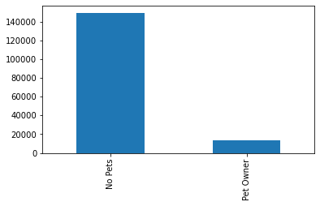
    


```python
#diet distribution
plt.gcf().subplots_adjust(bottom=0.35)
Diet_bar= profiles_pets_diet_wealth_age_family['Diet_Profile'].value_counts().plot.bar()
```


    
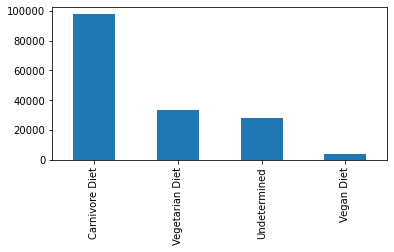
    


```python
#income distribution
plt.gcf().subplots_adjust(bottom=0.35)
Wealth_bar= profiles_pets_diet_wealth_age_family['Income_Profile'].value_counts().plot.bar()
```


    
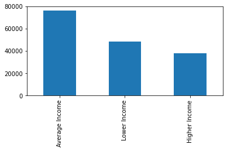
    


```python
#age distribution
plt.gcf().subplots_adjust(bottom=0.3)
Age_bar= profiles_pets_diet_wealth_age_family['Age_Profile'].value_counts().plot.bar()
```


    
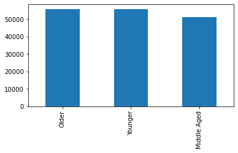
    


```python
#Family Status distribution
plt.gcf().subplots_adjust(bottom=0.25)
Family_bar= profiles_pets_diet_wealth_age_family['Family_Status_Profile'].value_counts().plot.bar()
```


    
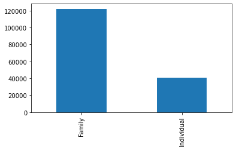
    


# 7.


```python
#merge the profiles dataset with the original data
df_profiles = df.merge(profiles_pets_diet_wealth_age_family, on = 'user_id', how= 'outer', indicator = True)
```


```python
df_profiles.head()
```


<div>
<style scoped>
    .dataframe tbody tr th:only-of-type {
        vertical-align: middle;
    }

    .dataframe tbody tr th {
        vertical-align: top;
    }

    .dataframe thead th {
        text-align: right;
    }
</style>
<table border="1" class="dataframe">
  <thead>
    <tr style="text-align: right;">
      <th></th>
      <th>order_id</th>
      <th>user_id</th>
      <th>order_number</th>
      <th>orders_day_of_week</th>
      <th>order_hour_of_day</th>
      <th>days_since_prior_order</th>
      <th>customer_status</th>
      <th>product_id</th>
      <th>add_to_cart_order</th>
      <th>reordered</th>
      <th>...</th>
      <th>income_category</th>
      <th>income_flag</th>
      <th>aged</th>
      <th>Age_Profile_x</th>
      <th>Pet_Owner_Profile</th>
      <th>Diet_Profile</th>
      <th>Income_Profile</th>
      <th>Age_Profile_y</th>
      <th>Family_Status_Profile</th>
      <th>_merge</th>
    </tr>
  </thead>
  <tbody>
    <tr>
      <th>0</th>
      <td>2539329</td>
      <td>1</td>
      <td>1</td>
      <td>2</td>
      <td>8</td>
      <td>NaN</td>
      <td>New Customer</td>
      <td>196</td>
      <td>1</td>
      <td>0</td>
      <td>...</td>
      <td>40423</td>
      <td>Lower Income</td>
      <td>31</td>
      <td>Younger</td>
      <td>No Pets</td>
      <td>Undetermined</td>
      <td>Lower Income</td>
      <td>Younger</td>
      <td>Family</td>
      <td>both</td>
    </tr>
    <tr>
      <th>1</th>
      <td>2398795</td>
      <td>1</td>
      <td>2</td>
      <td>3</td>
      <td>7</td>
      <td>15.0</td>
      <td>Returning Customer</td>
      <td>196</td>
      <td>1</td>
      <td>1</td>
      <td>...</td>
      <td>40423</td>
      <td>Lower Income</td>
      <td>31</td>
      <td>Younger</td>
      <td>No Pets</td>
      <td>Undetermined</td>
      <td>Lower Income</td>
      <td>Younger</td>
      <td>Family</td>
      <td>both</td>
    </tr>
    <tr>
      <th>2</th>
      <td>473747</td>
      <td>1</td>
      <td>3</td>
      <td>3</td>
      <td>12</td>
      <td>21.0</td>
      <td>Returning Customer</td>
      <td>196</td>
      <td>1</td>
      <td>1</td>
      <td>...</td>
      <td>40423</td>
      <td>Lower Income</td>
      <td>31</td>
      <td>Younger</td>
      <td>No Pets</td>
      <td>Undetermined</td>
      <td>Lower Income</td>
      <td>Younger</td>
      <td>Family</td>
      <td>both</td>
    </tr>
    <tr>
      <th>3</th>
      <td>2254736</td>
      <td>1</td>
      <td>4</td>
      <td>4</td>
      <td>7</td>
      <td>29.0</td>
      <td>Returning Customer</td>
      <td>196</td>
      <td>1</td>
      <td>1</td>
      <td>...</td>
      <td>40423</td>
      <td>Lower Income</td>
      <td>31</td>
      <td>Younger</td>
      <td>No Pets</td>
      <td>Undetermined</td>
      <td>Lower Income</td>
      <td>Younger</td>
      <td>Family</td>
      <td>both</td>
    </tr>
    <tr>
      <th>4</th>
      <td>431534</td>
      <td>1</td>
      <td>5</td>
      <td>4</td>
      <td>15</td>
      <td>28.0</td>
      <td>Returning Customer</td>
      <td>196</td>
      <td>1</td>
      <td>1</td>
      <td>...</td>
      <td>40423</td>
      <td>Lower Income</td>
      <td>31</td>
      <td>Younger</td>
      <td>No Pets</td>
      <td>Undetermined</td>
      <td>Lower Income</td>
      <td>Younger</td>
      <td>Family</td>
      <td>both</td>
    </tr>
  </tbody>
</table>
<p>5 rows × 44 columns</p>
</div>


```python
df_profiles['_merge'].value_counts(dropna= False)
```


    both          30992664
    right_only           0
    left_only            0
    Name: _merge, dtype: int64


```python
#aggregate max, mean, and min variables on customer-profile level for usage frequency and expenditure
```


```python
#Pet Profile: Do customer's ages differ basd on if they are pet owners?
df = pd.read_pickle(r'/Users/jlsanabria77/Desktop/17-02.2021 Instacat Basket Analysis 3/02 Data/Prepared Data/ords_prods_merged88.pkl'
```


<div>
<style scoped>
    .dataframe tbody tr th:only-of-type {
        vertical-align: middle;
    }

    .dataframe tbody tr th {
        vertical-align: top;
    }

    .dataframe thead tr th {
        text-align: left;
    }

    .dataframe thead tr:last-of-type th {
        text-align: right;
    }
</style>
<table border="1" class="dataframe">
  <thead>
    <tr>
      <th></th>
      <th colspan="3" halign="left">age</th>
    </tr>
    <tr>
      <th></th>
      <th>mean</th>
      <th>min</th>
      <th>max</th>
    </tr>
    <tr>
      <th>Pet_Owner_Profile</th>
      <th></th>
      <th></th>
      <th></th>
    </tr>
  </thead>
  <tbody>
    <tr>
      <th>No Pets</th>
      <td>49.443741</td>
      <td>18</td>
      <td>81</td>
    </tr>
    <tr>
      <th>Pet Owner</th>
      <td>49.660842</td>
      <td>18</td>
      <td>81</td>
    </tr>
  </tbody>
</table>
</div>


There seems to be no difference in age between owners and non-pet owners.


```python
#Pet Profile: income and pet ownership
df_profiles.groupby('Pet_Owner_Profile').agg({'income':['mean', 'min', 'max']})
```


<div>
<style scoped>
    .dataframe tbody tr th:only-of-type {
        vertical-align: middle;
    }

    .dataframe tbody tr th {
        vertical-align: top;
    }

    .dataframe thead tr th {
        text-align: left;
    }

    .dataframe thead tr:last-of-type th {
        text-align: right;
    }
</style>
<table border="1" class="dataframe">
  <thead>
    <tr>
      <th></th>
      <th colspan="3" halign="left">income</th>
    </tr>
    <tr>
      <th></th>
      <th>mean</th>
      <th>min</th>
      <th>max</th>
    </tr>
    <tr>
      <th>Pet_Owner_Profile</th>
      <th></th>
      <th></th>
      <th></th>
    </tr>
  </thead>
  <tbody>
    <tr>
      <th>No Pets</th>
      <td>99034.832599</td>
      <td>25903</td>
      <td>593901</td>
    </tr>
    <tr>
      <th>Pet Owner</th>
      <td>104763.663843</td>
      <td>26256</td>
      <td>591089</td>
    </tr>
  </tbody>
</table>
</div>


On average, pet owners have a higher income.


```python
#Diet Profile: Do customers spend different amounts of money based on their diet?
df_profiles.groupby('Diet_Profile').agg({'prices':['mean', 'min', 'max']})
```


<div>
<style scoped>
    .dataframe tbody tr th:only-of-type {
        vertical-align: middle;
    }

    .dataframe tbody tr th {
        vertical-align: top;
    }

    .dataframe thead tr th {
        text-align: left;
    }

    .dataframe thead tr:last-of-type th {
        text-align: right;
    }
</style>
<table border="1" class="dataframe">
  <thead>
    <tr>
      <th></th>
      <th colspan="3" halign="left">prices</th>
    </tr>
    <tr>
      <th></th>
      <th>mean</th>
      <th>min</th>
      <th>max</th>
    </tr>
    <tr>
      <th>Diet_Profile</th>
      <th></th>
      <th></th>
      <th></th>
    </tr>
  </thead>
  <tbody>
    <tr>
      <th>Carnivore Diet</th>
      <td>11.998676</td>
      <td>1.0</td>
      <td>99999.0</td>
    </tr>
    <tr>
      <th>Undetermined</th>
      <td>13.117344</td>
      <td>1.0</td>
      <td>99999.0</td>
    </tr>
    <tr>
      <th>Vegan Diet</th>
      <td>6.968024</td>
      <td>1.0</td>
      <td>20.0</td>
    </tr>
    <tr>
      <th>Vegetarian Diet</th>
      <td>11.205974</td>
      <td>1.0</td>
      <td>99999.0</td>
    </tr>
  </tbody>
</table>
</div>


Customers with a vegan diet spend significantly less than users with other diets.


```python
#Diet Profile: diet and order frequency
df_profiles.groupby('Diet_Profile').agg({'days_since_prior_order':['mean', 'min', 'max']})
```


<div>
<style scoped>
    .dataframe tbody tr th:only-of-type {
        vertical-align: middle;
    }

    .dataframe tbody tr th {
        vertical-align: top;
    }

    .dataframe thead tr th {
        text-align: left;
    }

    .dataframe thead tr:last-of-type th {
        text-align: right;
    }
</style>
<table border="1" class="dataframe">
  <thead>
    <tr>
      <th></th>
      <th colspan="3" halign="left">days_since_prior_order</th>
    </tr>
    <tr>
      <th></th>
      <th>mean</th>
      <th>min</th>
      <th>max</th>
    </tr>
    <tr>
      <th>Diet_Profile</th>
      <th></th>
      <th></th>
      <th></th>
    </tr>
  </thead>
  <tbody>
    <tr>
      <th>Carnivore Diet</th>
      <td>10.564650</td>
      <td>0.0</td>
      <td>30.0</td>
    </tr>
    <tr>
      <th>Undetermined</th>
      <td>11.073157</td>
      <td>0.0</td>
      <td>30.0</td>
    </tr>
    <tr>
      <th>Vegan Diet</th>
      <td>13.223032</td>
      <td>0.0</td>
      <td>30.0</td>
    </tr>
    <tr>
      <th>Vegetarian Diet</th>
      <td>11.720344</td>
      <td>0.0</td>
      <td>30.0</td>
    </tr>
  </tbody>
</table>
</div>


Carnivores order more frequently.


```python
#Wealth Profile: income by age
df_profiles.groupby('age').agg({'income':['mean','median','min', 'max']})
```


<div>
<style scoped>
    .dataframe tbody tr th:only-of-type {
        vertical-align: middle;
    }

    .dataframe tbody tr th {
        vertical-align: top;
    }

    .dataframe thead tr th {
        text-align: left;
    }

    .dataframe thead tr:last-of-type th {
        text-align: right;
    }
</style>
<table border="1" class="dataframe">
  <thead>
    <tr>
      <th></th>
      <th colspan="4" halign="left">income</th>
    </tr>
    <tr>
      <th></th>
      <th>mean</th>
      <th>median</th>
      <th>min</th>
      <th>max</th>
    </tr>
    <tr>
      <th>age</th>
      <th></th>
      <th></th>
      <th></th>
      <th></th>
    </tr>
  </thead>
  <tbody>
    <tr>
      <th>18</th>
      <td>70652.501234</td>
      <td>68788</td>
      <td>26067</td>
      <td>357226</td>
    </tr>
    <tr>
      <th>19</th>
      <td>69883.063492</td>
      <td>69227</td>
      <td>25972</td>
      <td>396364</td>
    </tr>
    <tr>
      <th>20</th>
      <td>70966.370184</td>
      <td>70658</td>
      <td>26024</td>
      <td>338939</td>
    </tr>
    <tr>
      <th>21</th>
      <td>70733.473650</td>
      <td>70315</td>
      <td>25937</td>
      <td>372571</td>
    </tr>
    <tr>
      <th>22</th>
      <td>70022.794044</td>
      <td>69422</td>
      <td>26070</td>
      <td>369192</td>
    </tr>
    <tr>
      <th>...</th>
      <td>...</td>
      <td>...</td>
      <td>...</td>
      <td>...</td>
    </tr>
    <tr>
      <th>77</th>
      <td>116898.142653</td>
      <td>117320</td>
      <td>30031</td>
      <td>512331</td>
    </tr>
    <tr>
      <th>78</th>
      <td>117517.024472</td>
      <td>118074</td>
      <td>29113</td>
      <td>381735</td>
    </tr>
    <tr>
      <th>79</th>
      <td>115403.937920</td>
      <td>115680</td>
      <td>29330</td>
      <td>579169</td>
    </tr>
    <tr>
      <th>80</th>
      <td>114435.768375</td>
      <td>113446</td>
      <td>30290</td>
      <td>569253</td>
    </tr>
    <tr>
      <th>81</th>
      <td>115426.257331</td>
      <td>116165</td>
      <td>29834</td>
      <td>571932</td>
    </tr>
  </tbody>
</table>
<p>64 rows × 4 columns</p>
</div>


The median income was calculated since the mean seemed higher than normal, this did not change the outcome very much. This may be due to Instacart being seen as a luxury service and therefore customers will have higher incomes than the general population. 


```python
#Wealth Profile: income and ordering time
df_profiles.groupby('Income_Profile').agg({'order_hour_of_day':['mean', 'min', 'max']})
```


<div>
<style scoped>
    .dataframe tbody tr th:only-of-type {
        vertical-align: middle;
    }

    .dataframe tbody tr th {
        vertical-align: top;
    }

    .dataframe thead tr th {
        text-align: left;
    }

    .dataframe thead tr:last-of-type th {
        text-align: right;
    }
</style>
<table border="1" class="dataframe">
  <thead>
    <tr>
      <th></th>
      <th colspan="3" halign="left">order_hour_of_day</th>
    </tr>
    <tr>
      <th></th>
      <th>mean</th>
      <th>min</th>
      <th>max</th>
    </tr>
    <tr>
      <th>Income_Profile</th>
      <th></th>
      <th></th>
      <th></th>
    </tr>
  </thead>
  <tbody>
    <tr>
      <th>Average Income</th>
      <td>13.437729</td>
      <td>0</td>
      <td>23</td>
    </tr>
    <tr>
      <th>Higher Income</th>
      <td>13.452003</td>
      <td>0</td>
      <td>23</td>
    </tr>
    <tr>
      <th>Lower Income</th>
      <td>13.315838</td>
      <td>0</td>
      <td>23</td>
    </tr>
  </tbody>
</table>
</div>


there is no difference in ordering hours based on income.


```python
#Age Profile: age and ordering time
df_profiles.groupby('Age_Profile_y').agg({'order_hour_of_day':['mean', 'min', 'max']})
```


<div>
<style scoped>
    .dataframe tbody tr th:only-of-type {
        vertical-align: middle;
    }

    .dataframe tbody tr th {
        vertical-align: top;
    }

    .dataframe thead tr th {
        text-align: left;
    }

    .dataframe thead tr:last-of-type th {
        text-align: right;
    }
</style>
<table border="1" class="dataframe">
  <thead>
    <tr>
      <th></th>
      <th colspan="3" halign="left">order_hour_of_day</th>
    </tr>
    <tr>
      <th></th>
      <th>mean</th>
      <th>min</th>
      <th>max</th>
    </tr>
    <tr>
      <th>Age_Profile_y</th>
      <th></th>
      <th></th>
      <th></th>
    </tr>
  </thead>
  <tbody>
    <tr>
      <th>Middle Aged</th>
      <td>13.418602</td>
      <td>0</td>
      <td>23</td>
    </tr>
    <tr>
      <th>Older</th>
      <td>13.415554</td>
      <td>0</td>
      <td>23</td>
    </tr>
    <tr>
      <th>Younger</th>
      <td>13.399042</td>
      <td>0</td>
      <td>23</td>
    </tr>
  </tbody>
</table>
</div>


there is no difference in ordering hours based on age.


```python
#Age Profile: age and dependents
df_profiles.groupby('Age_Profile_y').agg({'dependents':['mean', 'min', 'max']})
```


<div>
<style scoped>
    .dataframe tbody tr th:only-of-type {
        vertical-align: middle;
    }

    .dataframe tbody tr th {
        vertical-align: top;
    }

    .dataframe thead tr th {
        text-align: left;
    }

    .dataframe thead tr:last-of-type th {
        text-align: right;
    }
</style>
<table border="1" class="dataframe">
  <thead>
    <tr>
      <th></th>
      <th colspan="3" halign="left">dependents</th>
    </tr>
    <tr>
      <th></th>
      <th>mean</th>
      <th>min</th>
      <th>max</th>
    </tr>
    <tr>
      <th>Age_Profile_y</th>
      <th></th>
      <th></th>
      <th></th>
    </tr>
  </thead>
  <tbody>
    <tr>
      <th>Middle Aged</th>
      <td>1.495247</td>
      <td>0</td>
      <td>3</td>
    </tr>
    <tr>
      <th>Older</th>
      <td>1.507061</td>
      <td>0</td>
      <td>3</td>
    </tr>
    <tr>
      <th>Younger</th>
      <td>1.502555</td>
      <td>0</td>
      <td>3</td>
    </tr>
  </tbody>
</table>
</div>


There is no significant difference in number of dependents based on a user's age profile.


```python
#Family Profile:family and income
df_profiles.groupby('Family_Status_Profile').agg({'income':['mean', 'min', 'max']})
```


<div>
<style scoped>
    .dataframe tbody tr th:only-of-type {
        vertical-align: middle;
    }

    .dataframe tbody tr th {
        vertical-align: top;
    }

    .dataframe thead tr th {
        text-align: left;
    }

    .dataframe thead tr:last-of-type th {
        text-align: right;
    }
</style>
<table border="1" class="dataframe">
  <thead>
    <tr>
      <th></th>
      <th colspan="3" halign="left">income</th>
    </tr>
    <tr>
      <th></th>
      <th>mean</th>
      <th>min</th>
      <th>max</th>
    </tr>
    <tr>
      <th>Family_Status_Profile</th>
      <th></th>
      <th></th>
      <th></th>
    </tr>
  </thead>
  <tbody>
    <tr>
      <th>Family</th>
      <td>99599.122688</td>
      <td>25911</td>
      <td>593901</td>
    </tr>
    <tr>
      <th>Individual</th>
      <td>99895.555355</td>
      <td>25903</td>
      <td>584097</td>
    </tr>
  </tbody>
</table>
</div>


There is no clear correlation between family status and a user's income.


```python
#Family Profile:family and age
df_profiles.groupby('Family_Status_Profile').agg({'age':['mean', 'min', 'max']})
```


<div>
<style scoped>
    .dataframe tbody tr th:only-of-type {
        vertical-align: middle;
    }

    .dataframe tbody tr th {
        vertical-align: top;
    }

    .dataframe thead tr th {
        text-align: left;
    }

    .dataframe thead tr:last-of-type th {
        text-align: right;
    }
</style>
<table border="1" class="dataframe">
  <thead>
    <tr>
      <th></th>
      <th colspan="3" halign="left">age</th>
    </tr>
    <tr>
      <th></th>
      <th>mean</th>
      <th>min</th>
      <th>max</th>
    </tr>
    <tr>
      <th>Family_Status_Profile</th>
      <th></th>
      <th></th>
      <th></th>
    </tr>
  </thead>
  <tbody>
    <tr>
      <th>Family</th>
      <td>49.454874</td>
      <td>18</td>
      <td>81</td>
    </tr>
    <tr>
      <th>Individual</th>
      <td>49.507118</td>
      <td>18</td>
      <td>81</td>
    </tr>
  </tbody>
</table>
</div>


There is no clear correlation between family status and a user's age.

# 8.


```python
#compare customer profiles with regions and departments, any links?
```


```python
#Pet Profile by region
crosstab_pet_region=pd.crosstab(df_profiles['country_region'],df_profiles['Pet_Owner_Profile'], dropna=False )
crosstab_pet_region
```


<div>
<style scoped>
    .dataframe tbody tr th:only-of-type {
        vertical-align: middle;
    }

    .dataframe tbody tr th {
        vertical-align: top;
    }

    .dataframe thead th {
        text-align: right;
    }
</style>
<table border="1" class="dataframe">
  <thead>
    <tr style="text-align: right;">
      <th>Pet_Owner_Profile</th>
      <th>No Pets</th>
      <th>Pet Owner</th>
    </tr>
    <tr>
      <th>country_region</th>
      <th></th>
      <th></th>
    </tr>
  </thead>
  <tbody>
    <tr>
      <th>Mid West</th>
      <td>6439726</td>
      <td>827981</td>
    </tr>
    <tr>
      <th>North East</th>
      <td>4871316</td>
      <td>598752</td>
    </tr>
    <tr>
      <th>South</th>
      <td>9202136</td>
      <td>1118326</td>
    </tr>
    <tr>
      <th>West</th>
      <td>7025845</td>
      <td>908582</td>
    </tr>
  </tbody>
</table>
</div>


All regions have a similar ratio of pet owners and non-owners, with non-pet owners being more common.


```python
#pet profile by department_id
crosstab_pet_department=pd.crosstab(df_profiles['department_id'],df_profiles['Pet_Owner_Profile'], dropna=False )
crosstab_pet_department
```


<div>
<style scoped>
    .dataframe tbody tr th:only-of-type {
        vertical-align: middle;
    }

    .dataframe tbody tr th {
        vertical-align: top;
    }

    .dataframe thead th {
        text-align: right;
    }
</style>
<table border="1" class="dataframe">
  <thead>
    <tr style="text-align: right;">
      <th>Pet_Owner_Profile</th>
      <th>No Pets</th>
      <th>Pet Owner</th>
    </tr>
    <tr>
      <th>department_id</th>
      <th></th>
      <th></th>
    </tr>
  </thead>
  <tbody>
    <tr>
      <th>1</th>
      <td>1843265</td>
      <td>280077</td>
    </tr>
    <tr>
      <th>2</th>
      <td>29218</td>
      <td>5193</td>
    </tr>
    <tr>
      <th>3</th>
      <td>987099</td>
      <td>137927</td>
    </tr>
    <tr>
      <th>4</th>
      <td>8309662</td>
      <td>769614</td>
    </tr>
    <tr>
      <th>5</th>
      <td>118116</td>
      <td>26558</td>
    </tr>
    <tr>
      <th>6</th>
      <td>225074</td>
      <td>30917</td>
    </tr>
    <tr>
      <th>7</th>
      <td>2252578</td>
      <td>319356</td>
    </tr>
    <tr>
      <th>8</th>
      <td>0</td>
      <td>93065</td>
    </tr>
    <tr>
      <th>9</th>
      <td>721902</td>
      <td>100234</td>
    </tr>
    <tr>
      <th>10</th>
      <td>31331</td>
      <td>2120</td>
    </tr>
    <tr>
      <th>11</th>
      <td>348727</td>
      <td>75688</td>
    </tr>
    <tr>
      <th>12</th>
      <td>595232</td>
      <td>79553</td>
    </tr>
    <tr>
      <th>13</th>
      <td>1567049</td>
      <td>215854</td>
    </tr>
    <tr>
      <th>14</th>
      <td>603339</td>
      <td>74756</td>
    </tr>
    <tr>
      <th>15</th>
      <td>886208</td>
      <td>125866</td>
    </tr>
    <tr>
      <th>16</th>
      <td>4666549</td>
      <td>525279</td>
    </tr>
    <tr>
      <th>17</th>
      <td>565938</td>
      <td>133920</td>
    </tr>
    <tr>
      <th>18</th>
      <td>374825</td>
      <td>35567</td>
    </tr>
    <tr>
      <th>19</th>
      <td>2461225</td>
      <td>305181</td>
    </tr>
    <tr>
      <th>20</th>
      <td>894305</td>
      <td>109529</td>
    </tr>
    <tr>
      <th>21</th>
      <td>57381</td>
      <td>7387</td>
    </tr>
  </tbody>
</table>
</div>


```python
#Diet profile by region
crosstab_diet_region=pd.crosstab(df_profiles['country_region'],df_profiles['Diet_Profile'], dropna=False )
crosstab_diet_region
```


<div>
<style scoped>
    .dataframe tbody tr th:only-of-type {
        vertical-align: middle;
    }

    .dataframe tbody tr th {
        vertical-align: top;
    }

    .dataframe thead th {
        text-align: right;
    }
</style>
<table border="1" class="dataframe">
  <thead>
    <tr style="text-align: right;">
      <th>Diet_Profile</th>
      <th>Carnivore Diet</th>
      <th>Undetermined</th>
      <th>Vegan Diet</th>
      <th>Vegetarian Diet</th>
    </tr>
    <tr>
      <th>country_region</th>
      <th></th>
      <th></th>
      <th></th>
      <th></th>
    </tr>
  </thead>
  <tbody>
    <tr>
      <th>Mid West</th>
      <td>5391076</td>
      <td>618834</td>
      <td>38230</td>
      <td>1219567</td>
    </tr>
    <tr>
      <th>North East</th>
      <td>4080093</td>
      <td>454644</td>
      <td>30309</td>
      <td>905022</td>
    </tr>
    <tr>
      <th>South</th>
      <td>7680881</td>
      <td>865474</td>
      <td>55479</td>
      <td>1718628</td>
    </tr>
    <tr>
      <th>West</th>
      <td>5923175</td>
      <td>675570</td>
      <td>43656</td>
      <td>1292026</td>
    </tr>
  </tbody>
</table>
</div>


Of the MidWest users, 74% are carnivores, 8.5% have undetermined diets, .5% are vegan, 17% are vegetarian.
Of the North East Users, 74.5% are carnivores, 8.4% have undetermined diets, .6% are vegan, 16.5% are vegatarian.
Of the Southern Users, 74.4% are carnivores, 8.4% have undetermined diets, .5% are vegan, 16.7% are vegatarian.
Of the Westerners Users, 74.7% are carnivores, 8.5% have undetermined diets, .6% are vegan, 16.3% are vegatarian.

There are no differences in diet based on location


```python
#diet profile by department_id
crosstab_diet_department=pd.crosstab(df_profiles['department_id'],df_profiles['Diet_Profile'], dropna=False )
crosstab_diet_department
```


<div>
<style scoped>
    .dataframe tbody tr th:only-of-type {
        vertical-align: middle;
    }

    .dataframe tbody tr th {
        vertical-align: top;
    }

    .dataframe thead th {
        text-align: right;
    }
</style>
<table border="1" class="dataframe">
  <thead>
    <tr style="text-align: right;">
      <th>Diet_Profile</th>
      <th>Carnivore Diet</th>
      <th>Undetermined</th>
      <th>Vegan Diet</th>
      <th>Vegetarian Diet</th>
    </tr>
    <tr>
      <th>department_id</th>
      <th></th>
      <th></th>
      <th></th>
      <th></th>
    </tr>
  </thead>
  <tbody>
    <tr>
      <th>1</th>
      <td>1611622</td>
      <td>138482</td>
      <td>8113</td>
      <td>365125</td>
    </tr>
    <tr>
      <th>2</th>
      <td>23645</td>
      <td>4104</td>
      <td>288</td>
      <td>6374</td>
    </tr>
    <tr>
      <th>3</th>
      <td>868046</td>
      <td>77386</td>
      <td>2580</td>
      <td>177014</td>
    </tr>
    <tr>
      <th>4</th>
      <td>6954318</td>
      <td>654071</td>
      <td>73370</td>
      <td>1397517</td>
    </tr>
    <tr>
      <th>5</th>
      <td>80885</td>
      <td>28005</td>
      <td>3809</td>
      <td>31975</td>
    </tr>
    <tr>
      <th>6</th>
      <td>198644</td>
      <td>13725</td>
      <td>592</td>
      <td>43030</td>
    </tr>
    <tr>
      <th>7</th>
      <td>1658394</td>
      <td>367653</td>
      <td>26167</td>
      <td>519720</td>
    </tr>
    <tr>
      <th>8</th>
      <td>69899</td>
      <td>6596</td>
      <td>290</td>
      <td>16280</td>
    </tr>
    <tr>
      <th>9</th>
      <td>670073</td>
      <td>37917</td>
      <td>1222</td>
      <td>112924</td>
    </tr>
    <tr>
      <th>10</th>
      <td>22216</td>
      <td>3765</td>
      <td>398</td>
      <td>7072</td>
    </tr>
    <tr>
      <th>11</th>
      <td>289786</td>
      <td>49478</td>
      <td>3272</td>
      <td>81879</td>
    </tr>
    <tr>
      <th>12</th>
      <td>673782</td>
      <td>1003</td>
      <td>0</td>
      <td>0</td>
    </tr>
    <tr>
      <th>13</th>
      <td>1365791</td>
      <td>131504</td>
      <td>6803</td>
      <td>278805</td>
    </tr>
    <tr>
      <th>14</th>
      <td>466189</td>
      <td>78842</td>
      <td>3370</td>
      <td>129694</td>
    </tr>
    <tr>
      <th>15</th>
      <td>814737</td>
      <td>47925</td>
      <td>2616</td>
      <td>146796</td>
    </tr>
    <tr>
      <th>16</th>
      <td>3850609</td>
      <td>505603</td>
      <td>0</td>
      <td>835616</td>
    </tr>
    <tr>
      <th>17</th>
      <td>476311</td>
      <td>97227</td>
      <td>7986</td>
      <td>118334</td>
    </tr>
    <tr>
      <th>18</th>
      <td>337650</td>
      <td>21038</td>
      <td>841</td>
      <td>50863</td>
    </tr>
    <tr>
      <th>19</th>
      <td>1837311</td>
      <td>322235</td>
      <td>25719</td>
      <td>581141</td>
    </tr>
    <tr>
      <th>20</th>
      <td>758339</td>
      <td>22176</td>
      <td>0</td>
      <td>223319</td>
    </tr>
    <tr>
      <th>21</th>
      <td>46978</td>
      <td>5787</td>
      <td>238</td>
      <td>11765</td>
    </tr>
  </tbody>
</table>
</div>


```python
#income profile by region
crosstab_income_region=pd.crosstab(df_profiles['country_region'],df_profiles['Income_Profile'], dropna=False )
crosstab_income_region
```


<div>
<style scoped>
    .dataframe tbody tr th:only-of-type {
        vertical-align: middle;
    }

    .dataframe tbody tr th {
        vertical-align: top;
    }

    .dataframe thead th {
        text-align: right;
    }
</style>
<table border="1" class="dataframe">
  <thead>
    <tr style="text-align: right;">
      <th>Income_Profile</th>
      <th>Average Income</th>
      <th>Higher Income</th>
      <th>Lower Income</th>
    </tr>
    <tr>
      <th>country_region</th>
      <th></th>
      <th></th>
      <th></th>
    </tr>
  </thead>
  <tbody>
    <tr>
      <th>Mid West</th>
      <td>3631713</td>
      <td>1843691</td>
      <td>1792303</td>
    </tr>
    <tr>
      <th>North East</th>
      <td>2727585</td>
      <td>1374284</td>
      <td>1368199</td>
    </tr>
    <tr>
      <th>South</th>
      <td>5173237</td>
      <td>2551358</td>
      <td>2595867</td>
    </tr>
    <tr>
      <th>West</th>
      <td>3963573</td>
      <td>1978933</td>
      <td>1991921</td>
    </tr>
  </tbody>
</table>
</div>


User Totals:
MW:7267707 NE:5470068 S:10320462 W:7934427
Income Totals:
A:15496108 H:7748266  L:7748290

In the Mid West user's incomes are: 50% average, 25.4% high, 24.6% low.
In the North East user's incomes are: 49.9% average, 25.1% high, 25% low.
In the South user's incomes are: 50.1% average, 24.7% high, 25.2% low.
In the West user's incomes are: 50% average, 24.9% high, 25.1% low.

All regions have very similar income statistics. The South has the highest percentage of low income users and the Mid West has the highest percentage of high income users.


```python
#income profile by department_id
crosstab_income_department=pd.crosstab(df_profiles['department_id'],df_profiles['Income_Profile'], dropna=False )
crosstab_income_department
```


<div>
<style scoped>
    .dataframe tbody tr th:only-of-type {
        vertical-align: middle;
    }

    .dataframe tbody tr th {
        vertical-align: top;
    }

    .dataframe thead th {
        text-align: right;
    }
</style>
<table border="1" class="dataframe">
  <thead>
    <tr style="text-align: right;">
      <th>Income_Profile</th>
      <th>Average Income</th>
      <th>Higher Income</th>
      <th>Lower Income</th>
    </tr>
    <tr>
      <th>department_id</th>
      <th></th>
      <th></th>
      <th></th>
    </tr>
  </thead>
  <tbody>
    <tr>
      <th>1</th>
      <td>1070386</td>
      <td>541570</td>
      <td>511386</td>
    </tr>
    <tr>
      <th>2</th>
      <td>17127</td>
      <td>8711</td>
      <td>8573</td>
    </tr>
    <tr>
      <th>3</th>
      <td>567015</td>
      <td>291202</td>
      <td>266809</td>
    </tr>
    <tr>
      <th>4</th>
      <td>4664929</td>
      <td>2289686</td>
      <td>2124661</td>
    </tr>
    <tr>
      <th>5</th>
      <td>66961</td>
      <td>40885</td>
      <td>36828</td>
    </tr>
    <tr>
      <th>6</th>
      <td>132924</td>
      <td>65342</td>
      <td>57725</td>
    </tr>
    <tr>
      <th>7</th>
      <td>1210197</td>
      <td>618574</td>
      <td>743163</td>
    </tr>
    <tr>
      <th>8</th>
      <td>46348</td>
      <td>24963</td>
      <td>21754</td>
    </tr>
    <tr>
      <th>9</th>
      <td>429239</td>
      <td>212923</td>
      <td>179974</td>
    </tr>
    <tr>
      <th>10</th>
      <td>16510</td>
      <td>7541</td>
      <td>9400</td>
    </tr>
    <tr>
      <th>11</th>
      <td>210464</td>
      <td>106170</td>
      <td>107781</td>
    </tr>
    <tr>
      <th>12</th>
      <td>364324</td>
      <td>182891</td>
      <td>127570</td>
    </tr>
    <tr>
      <th>13</th>
      <td>907706</td>
      <td>457229</td>
      <td>417968</td>
    </tr>
    <tr>
      <th>14</th>
      <td>324001</td>
      <td>164613</td>
      <td>189481</td>
    </tr>
    <tr>
      <th>15</th>
      <td>523736</td>
      <td>265877</td>
      <td>222461</td>
    </tr>
    <tr>
      <th>16</th>
      <td>2641860</td>
      <td>1317763</td>
      <td>1232205</td>
    </tr>
    <tr>
      <th>17</th>
      <td>339170</td>
      <td>177269</td>
      <td>183419</td>
    </tr>
    <tr>
      <th>18</th>
      <td>220892</td>
      <td>105674</td>
      <td>83826</td>
    </tr>
    <tr>
      <th>19</th>
      <td>1205149</td>
      <td>602028</td>
      <td>959229</td>
    </tr>
    <tr>
      <th>20</th>
      <td>504674</td>
      <td>251021</td>
      <td>248139</td>
    </tr>
    <tr>
      <th>21</th>
      <td>32496</td>
      <td>16334</td>
      <td>15938</td>
    </tr>
  </tbody>
</table>
</div>


```python
#age profile by region
crosstab_age_region=pd.crosstab(df_profiles['country_region'],df_profiles['Age_Profile_y'], dropna=False )
crosstab_age_region
```


<div>
<style scoped>
    .dataframe tbody tr th:only-of-type {
        vertical-align: middle;
    }

    .dataframe tbody tr th {
        vertical-align: top;
    }

    .dataframe thead th {
        text-align: right;
    }
</style>
<table border="1" class="dataframe">
  <thead>
    <tr style="text-align: right;">
      <th>Age_Profile_y</th>
      <th>Middle Aged</th>
      <th>Older</th>
      <th>Younger</th>
    </tr>
    <tr>
      <th>country_region</th>
      <th></th>
      <th></th>
      <th></th>
    </tr>
  </thead>
  <tbody>
    <tr>
      <th>Mid West</th>
      <td>2325092</td>
      <td>2457349</td>
      <td>2485266</td>
    </tr>
    <tr>
      <th>North East</th>
      <td>1710462</td>
      <td>1886052</td>
      <td>1873554</td>
    </tr>
    <tr>
      <th>South</th>
      <td>3184413</td>
      <td>3524584</td>
      <td>3611465</td>
    </tr>
    <tr>
      <th>West</th>
      <td>2514106</td>
      <td>2715956</td>
      <td>2704365</td>
    </tr>
  </tbody>
</table>
</div>


The Mid West and South have more younger users while the North East and West have more oler users.


```python
#age profile by department_id
crosstab_age_department=pd.crosstab(df_profiles['department_id'],df_profiles['Age_Profile_y'], dropna=False )
crosstab_age_department
```


<div>
<style scoped>
    .dataframe tbody tr th:only-of-type {
        vertical-align: middle;
    }

    .dataframe tbody tr th {
        vertical-align: top;
    }

    .dataframe thead th {
        text-align: right;
    }
</style>
<table border="1" class="dataframe">
  <thead>
    <tr style="text-align: right;">
      <th>Age_Profile_y</th>
      <th>Middle Aged</th>
      <th>Older</th>
      <th>Younger</th>
    </tr>
    <tr>
      <th>department_id</th>
      <th></th>
      <th></th>
      <th></th>
    </tr>
  </thead>
  <tbody>
    <tr>
      <th>1</th>
      <td>666568</td>
      <td>729439</td>
      <td>727335</td>
    </tr>
    <tr>
      <th>2</th>
      <td>10689</td>
      <td>11604</td>
      <td>12118</td>
    </tr>
    <tr>
      <th>3</th>
      <td>353973</td>
      <td>383651</td>
      <td>387402</td>
    </tr>
    <tr>
      <th>4</th>
      <td>2846302</td>
      <td>3104121</td>
      <td>3128853</td>
    </tr>
    <tr>
      <th>5</th>
      <td>45382</td>
      <td>47630</td>
      <td>51662</td>
    </tr>
    <tr>
      <th>6</th>
      <td>80697</td>
      <td>86448</td>
      <td>88846</td>
    </tr>
    <tr>
      <th>7</th>
      <td>814071</td>
      <td>883680</td>
      <td>874183</td>
    </tr>
    <tr>
      <th>8</th>
      <td>29388</td>
      <td>31757</td>
      <td>31920</td>
    </tr>
    <tr>
      <th>9</th>
      <td>258535</td>
      <td>280102</td>
      <td>283499</td>
    </tr>
    <tr>
      <th>10</th>
      <td>10403</td>
      <td>11424</td>
      <td>11624</td>
    </tr>
    <tr>
      <th>11</th>
      <td>135802</td>
      <td>143775</td>
      <td>144838</td>
    </tr>
    <tr>
      <th>12</th>
      <td>211531</td>
      <td>232753</td>
      <td>230501</td>
    </tr>
    <tr>
      <th>13</th>
      <td>560661</td>
      <td>610017</td>
      <td>612225</td>
    </tr>
    <tr>
      <th>14</th>
      <td>213440</td>
      <td>230205</td>
      <td>234450</td>
    </tr>
    <tr>
      <th>15</th>
      <td>317911</td>
      <td>344447</td>
      <td>349716</td>
    </tr>
    <tr>
      <th>16</th>
      <td>1625883</td>
      <td>1767659</td>
      <td>1798286</td>
    </tr>
    <tr>
      <th>17</th>
      <td>220117</td>
      <td>240636</td>
      <td>239105</td>
    </tr>
    <tr>
      <th>18</th>
      <td>130198</td>
      <td>138738</td>
      <td>141456</td>
    </tr>
    <tr>
      <th>19</th>
      <td>867386</td>
      <td>940733</td>
      <td>958287</td>
    </tr>
    <tr>
      <th>20</th>
      <td>314654</td>
      <td>343335</td>
      <td>345845</td>
    </tr>
    <tr>
      <th>21</th>
      <td>20482</td>
      <td>21787</td>
      <td>22499</td>
    </tr>
  </tbody>
</table>
</div>


```python
#family status profile by region
crosstab_family_region=pd.crosstab(df_profiles['country_region'],df_profiles['Family_Status_Profile'], dropna=False )
crosstab_family_region
```


<div>
<style scoped>
    .dataframe tbody tr th:only-of-type {
        vertical-align: middle;
    }

    .dataframe tbody tr th {
        vertical-align: top;
    }

    .dataframe thead th {
        text-align: right;
    }
</style>
<table border="1" class="dataframe">
  <thead>
    <tr style="text-align: right;">
      <th>Family_Status_Profile</th>
      <th>Family</th>
      <th>Individual</th>
    </tr>
    <tr>
      <th>country_region</th>
      <th></th>
      <th></th>
    </tr>
  </thead>
  <tbody>
    <tr>
      <th>Mid West</th>
      <td>5443220</td>
      <td>1824487</td>
    </tr>
    <tr>
      <th>North East</th>
      <td>4114240</td>
      <td>1355828</td>
    </tr>
    <tr>
      <th>South</th>
      <td>7736110</td>
      <td>2584352</td>
    </tr>
    <tr>
      <th>West</th>
      <td>5952062</td>
      <td>1982365</td>
    </tr>
  </tbody>
</table>
</div>


In all regions, Instacart users are about 300% more likely to be families than individuals.


```python
#family status profile by department_id
crosstab_family_department=pd.crosstab(df_profiles['department_id'],df_profiles['Family_Status_Profile'], dropna=False )
crosstab_family_department
```


<div>
<style scoped>
    .dataframe tbody tr th:only-of-type {
        vertical-align: middle;
    }

    .dataframe tbody tr th {
        vertical-align: top;
    }

    .dataframe thead th {
        text-align: right;
    }
</style>
<table border="1" class="dataframe">
  <thead>
    <tr style="text-align: right;">
      <th>Family_Status_Profile</th>
      <th>Family</th>
      <th>Individual</th>
    </tr>
    <tr>
      <th>department_id</th>
      <th></th>
      <th></th>
    </tr>
  </thead>
  <tbody>
    <tr>
      <th>1</th>
      <td>1593593</td>
      <td>529749</td>
    </tr>
    <tr>
      <th>2</th>
      <td>25697</td>
      <td>8714</td>
    </tr>
    <tr>
      <th>3</th>
      <td>842540</td>
      <td>282486</td>
    </tr>
    <tr>
      <th>4</th>
      <td>6803834</td>
      <td>2275442</td>
    </tr>
    <tr>
      <th>5</th>
      <td>107822</td>
      <td>36852</td>
    </tr>
    <tr>
      <th>6</th>
      <td>191530</td>
      <td>64461</td>
    </tr>
    <tr>
      <th>7</th>
      <td>1926585</td>
      <td>645349</td>
    </tr>
    <tr>
      <th>8</th>
      <td>69463</td>
      <td>23602</td>
    </tr>
    <tr>
      <th>9</th>
      <td>617840</td>
      <td>204296</td>
    </tr>
    <tr>
      <th>10</th>
      <td>25451</td>
      <td>8000</td>
    </tr>
    <tr>
      <th>11</th>
      <td>318180</td>
      <td>106235</td>
    </tr>
    <tr>
      <th>12</th>
      <td>508906</td>
      <td>165879</td>
    </tr>
    <tr>
      <th>13</th>
      <td>1338937</td>
      <td>443966</td>
    </tr>
    <tr>
      <th>14</th>
      <td>509770</td>
      <td>168325</td>
    </tr>
    <tr>
      <th>15</th>
      <td>761054</td>
      <td>251020</td>
    </tr>
    <tr>
      <th>16</th>
      <td>3893613</td>
      <td>1298215</td>
    </tr>
    <tr>
      <th>17</th>
      <td>528500</td>
      <td>171358</td>
    </tr>
    <tr>
      <th>18</th>
      <td>307064</td>
      <td>103328</td>
    </tr>
    <tr>
      <th>19</th>
      <td>2075968</td>
      <td>690438</td>
    </tr>
    <tr>
      <th>20</th>
      <td>750452</td>
      <td>253382</td>
    </tr>
    <tr>
      <th>21</th>
      <td>48833</td>
      <td>15935</td>
    </tr>
  </tbody>
</table>
</div>


```python
#money spent Profile by hour
crosstab_prices_hour=pd.crosstab(df['prices'],df['order_hour_of_day'], dropna=False )
crosstab_prices_hour
```


<div>
<style scoped>
    .dataframe tbody tr th:only-of-type {
        vertical-align: middle;
    }

    .dataframe tbody tr th {
        vertical-align: top;
    }

    .dataframe thead th {
        text-align: right;
    }
</style>
<table border="1" class="dataframe">
  <thead>
    <tr style="text-align: right;">
      <th>order_hour_of_day</th>
      <th>0</th>
      <th>1</th>
      <th>2</th>
      <th>3</th>
      <th>4</th>
      <th>5</th>
      <th>6</th>
      <th>7</th>
      <th>8</th>
      <th>9</th>
      <th>...</th>
      <th>14</th>
      <th>15</th>
      <th>16</th>
      <th>17</th>
      <th>18</th>
      <th>19</th>
      <th>20</th>
      <th>21</th>
      <th>22</th>
      <th>23</th>
    </tr>
    <tr>
      <th>prices</th>
      <th></th>
      <th></th>
      <th></th>
      <th></th>
      <th></th>
      <th></th>
      <th></th>
      <th></th>
      <th></th>
      <th></th>
      <th></th>
      <th></th>
      <th></th>
      <th></th>
      <th></th>
      <th></th>
      <th></th>
      <th></th>
      <th></th>
      <th></th>
      <th></th>
    </tr>
  </thead>
  <tbody>
    <tr>
      <th>1.0</th>
      <td>741</td>
      <td>341</td>
      <td>223</td>
      <td>178</td>
      <td>189</td>
      <td>313</td>
      <td>901</td>
      <td>2938</td>
      <td>5310</td>
      <td>7814</td>
      <td>...</td>
      <td>9299</td>
      <td>9322</td>
      <td>8793</td>
      <td>7396</td>
      <td>5792</td>
      <td>4305</td>
      <td>3316</td>
      <td>2608</td>
      <td>2028</td>
      <td>1290</td>
    </tr>
    <tr>
      <th>1.1</th>
      <td>1643</td>
      <td>834</td>
      <td>485</td>
      <td>369</td>
      <td>385</td>
      <td>695</td>
      <td>2221</td>
      <td>6650</td>
      <td>12803</td>
      <td>17751</td>
      <td>...</td>
      <td>18958</td>
      <td>18609</td>
      <td>17833</td>
      <td>14702</td>
      <td>11597</td>
      <td>9282</td>
      <td>7282</td>
      <td>6198</td>
      <td>4969</td>
      <td>3073</td>
    </tr>
    <tr>
      <th>1.2</th>
      <td>1586</td>
      <td>815</td>
      <td>493</td>
      <td>373</td>
      <td>410</td>
      <td>679</td>
      <td>2021</td>
      <td>6306</td>
      <td>12482</td>
      <td>17815</td>
      <td>...</td>
      <td>20441</td>
      <td>20209</td>
      <td>19431</td>
      <td>15958</td>
      <td>12237</td>
      <td>9225</td>
      <td>7162</td>
      <td>5906</td>
      <td>4493</td>
      <td>2854</td>
    </tr>
    <tr>
      <th>1.3</th>
      <td>2695</td>
      <td>1407</td>
      <td>855</td>
      <td>537</td>
      <td>696</td>
      <td>1138</td>
      <td>3961</td>
      <td>12232</td>
      <td>22851</td>
      <td>32015</td>
      <td>...</td>
      <td>33300</td>
      <td>32668</td>
      <td>31238</td>
      <td>25578</td>
      <td>20591</td>
      <td>15788</td>
      <td>12499</td>
      <td>10426</td>
      <td>8285</td>
      <td>5245</td>
    </tr>
    <tr>
      <th>1.4</th>
      <td>2555</td>
      <td>1296</td>
      <td>777</td>
      <td>521</td>
      <td>591</td>
      <td>1028</td>
      <td>3350</td>
      <td>10669</td>
      <td>20378</td>
      <td>28977</td>
      <td>...</td>
      <td>31354</td>
      <td>30505</td>
      <td>28391</td>
      <td>23056</td>
      <td>17750</td>
      <td>13610</td>
      <td>10977</td>
      <td>9629</td>
      <td>7610</td>
      <td>4710</td>
    </tr>
    <tr>
      <th>...</th>
      <td>...</td>
      <td>...</td>
      <td>...</td>
      <td>...</td>
      <td>...</td>
      <td>...</td>
      <td>...</td>
      <td>...</td>
      <td>...</td>
      <td>...</td>
      <td>...</td>
      <td>...</td>
      <td>...</td>
      <td>...</td>
      <td>...</td>
      <td>...</td>
      <td>...</td>
      <td>...</td>
      <td>...</td>
      <td>...</td>
      <td>...</td>
    </tr>
    <tr>
      <th>24.8</th>
      <td>2</td>
      <td>1</td>
      <td>1</td>
      <td>2</td>
      <td>1</td>
      <td>1</td>
      <td>2</td>
      <td>4</td>
      <td>19</td>
      <td>25</td>
      <td>...</td>
      <td>23</td>
      <td>31</td>
      <td>39</td>
      <td>29</td>
      <td>19</td>
      <td>11</td>
      <td>9</td>
      <td>11</td>
      <td>9</td>
      <td>9</td>
    </tr>
    <tr>
      <th>24.9</th>
      <td>34</td>
      <td>18</td>
      <td>11</td>
      <td>8</td>
      <td>7</td>
      <td>17</td>
      <td>69</td>
      <td>194</td>
      <td>304</td>
      <td>377</td>
      <td>...</td>
      <td>477</td>
      <td>513</td>
      <td>432</td>
      <td>375</td>
      <td>314</td>
      <td>217</td>
      <td>169</td>
      <td>99</td>
      <td>93</td>
      <td>52</td>
    </tr>
    <tr>
      <th>25.0</th>
      <td>97</td>
      <td>31</td>
      <td>29</td>
      <td>17</td>
      <td>16</td>
      <td>36</td>
      <td>133</td>
      <td>355</td>
      <td>667</td>
      <td>919</td>
      <td>...</td>
      <td>1096</td>
      <td>1160</td>
      <td>1071</td>
      <td>899</td>
      <td>639</td>
      <td>458</td>
      <td>362</td>
      <td>320</td>
      <td>268</td>
      <td>141</td>
    </tr>
    <tr>
      <th>14900.0</th>
      <td>24</td>
      <td>16</td>
      <td>11</td>
      <td>11</td>
      <td>9</td>
      <td>15</td>
      <td>37</td>
      <td>104</td>
      <td>198</td>
      <td>294</td>
      <td>...</td>
      <td>334</td>
      <td>348</td>
      <td>381</td>
      <td>303</td>
      <td>242</td>
      <td>189</td>
      <td>131</td>
      <td>91</td>
      <td>58</td>
      <td>34</td>
    </tr>
    <tr>
      <th>99999.0</th>
      <td>2</td>
      <td>0</td>
      <td>3</td>
      <td>1</td>
      <td>1</td>
      <td>2</td>
      <td>6</td>
      <td>23</td>
      <td>46</td>
      <td>50</td>
      <td>...</td>
      <td>52</td>
      <td>56</td>
      <td>56</td>
      <td>49</td>
      <td>28</td>
      <td>28</td>
      <td>16</td>
      <td>11</td>
      <td>5</td>
      <td>5</td>
    </tr>
  </tbody>
</table>
<p>242 rows × 24 columns</p>
</div>


# 9.


```python
#produce charts to illustrate results
```


```python
#pet and regions stacked bar
pet_region_profile= crosstab_pet_region.plot.bar(stacked= True)
plt.legend(title='Pet Ownership')
```


    <matplotlib.legend.Legend at 0x1f7e5398310>


    
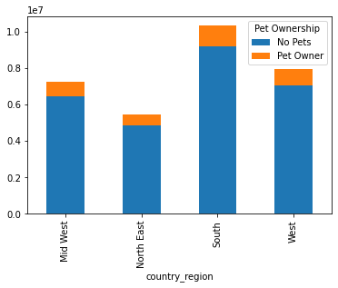
    


```python
#pet and department stacked bar
pet_department_profile= crosstab_pet_department.plot.bar(stacked= True)
plt.legend(title='Pet Ownership')
```


    <matplotlib.legend.Legend at 0x1f7e5376730>


    
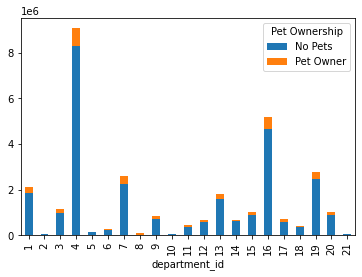
    


```python
#diet and region stacked bar
diet_region_profile= crosstab_diet_region.plot.bar(stacked= True)
plt.legend(title='Diet')
```


    <matplotlib.legend.Legend at 0x1f6f3c9f160>


    
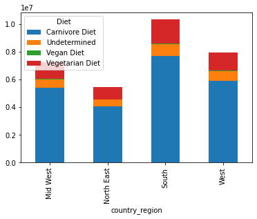
    


```python
#diet and department stacked bar
diet_department_profile= crosstab_diet_department.plot.bar(stacked= True)
plt.legend(title='Diet')
```


    <matplotlib.legend.Legend at 0x1f6f3e41220>


    
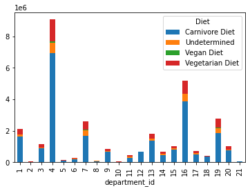
    


```python
#income and region stacked bar
income_region_profile= crosstab_income_region.plot.bar(stacked= True)
plt.legend(title='Income Category')
```


    <matplotlib.legend.Legend at 0x1f6f41814c0>


    
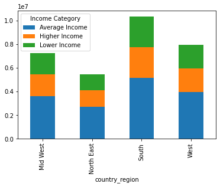
    


```python
#income and department stacked bar
income_department_profile= crosstab_income_department.plot.bar(stacked= True)
plt.legend(title='Income Category')
```


    <matplotlib.legend.Legend at 0x1f6f4404550>


    
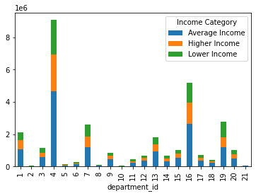
    


```python
#age and region stacked bar
age_region_profile= crosstab_age_region.plot.bar(stacked= True)
plt.legend(title='Age Category')
```


    <matplotlib.legend.Legend at 0x1f6f3cd84c0>


    
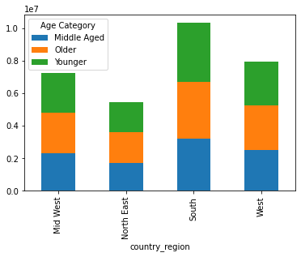
    


```python
#age and department stacked bar
age_department_profile= crosstab_age_department.plot.bar(stacked= True)
plt.legend(title='Age Category')
```


    <matplotlib.legend.Legend at 0x1f6f603c6a0>


    
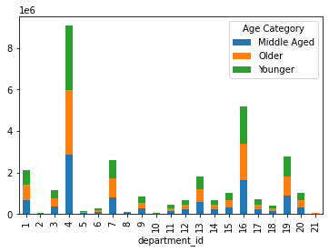
    


```python
#family and region stacked bar
family_region_profile= crosstab_family_region.plot.bar(stacked= True)
plt.legend(title='Family Status')
```


    <matplotlib.legend.Legend at 0x1f6f6553e80>


    
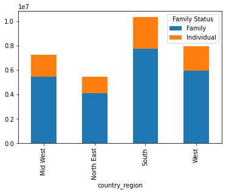
    


```python
#family and department stacked bar
family_department_profile= crosstab_family_department.plot.bar(stacked= True)
plt.legend(title='Family Status')
```


    <matplotlib.legend.Legend at 0x1f6f65a4400>


    
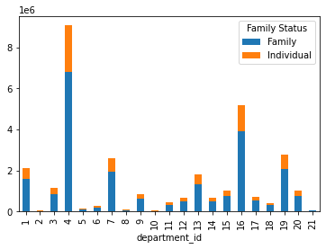
    


```python
#distribution of products in each price range
plt.gcf().subplots_adjust(bottom=0.4)
price_range_bar= df['price_range_loc'].value_counts().plot.bar()
```


    
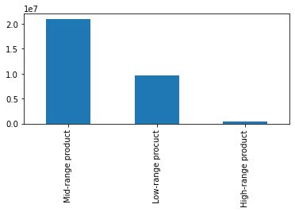
    


```python
#money spent per hour line graph
money_hour_line= sns.lineplot(data= df, x= 'order_hour_of_day', y= 'prices')
```


    
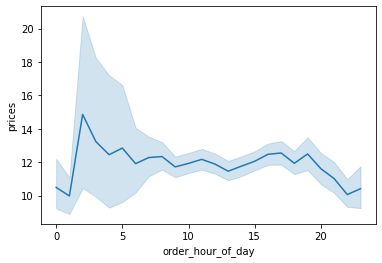
    


```python
#export visualizations
```


```python
Pet_bar.figure.savefig(r'C:\Users\kickw\OneDrive\Documents\Instacart Basket Analysis\04 Analysis\Visualizations\pets_barchart.png')
```


```python
Diet_bar.figure.savefig(r'C:\Users\kickw\OneDrive\Documents\Instacart Basket Analysis\04 Analysis\Visualizations\diet_barchart.png')
```


```python
Wealth_bar.figure.savefig(r'C:\Users\kickw\OneDrive\Documents\Instacart Basket Analysis\04 Analysis\Visualizations\wealth_barchart.png')
```


```python
Age_bar.figure.savefig(r'C:\Users\kickw\OneDrive\Documents\Instacart Basket Analysis\04 Analysis\Visualizations\age_barchart.png')
```


```python
Family_bar.figure.savefig(r'C:\Users\kickw\OneDrive\Documents\Instacart Basket Analysis\04 Analysis\Visualizations\family_barchart.png')
```


```python
pet_region_profile.figure.savefig(r'C:\Users\kickw\OneDrive\Documents\Instacart Basket Analysis\04 Analysis\Visualizations\pet_region_profile_barchart.png')
```


```python
pet_department_profile.figure.savefig(r'C:\Users\kickw\OneDrive\Documents\Instacart Basket Analysis\04 Analysis\Visualizations\pet_department_profile_barchart.png')
```


```python
diet_region_profile.figure.savefig(r'C:\Users\kickw\OneDrive\Documents\Instacart Basket Analysis\04 Analysis\Visualizations\diet_region_profile_barchart.png')
```


```python
diet_department_profile.figure.savefig(r'C:\Users\kickw\OneDrive\Documents\Instacart Basket Analysis\04 Analysis\Visualizations\diet_department_profile_barchart.png')
```


```python
income_region_profile.figure.savefig(r'C:\Users\kickw\OneDrive\Documents\Instacart Basket Analysis\04 Analysis\Visualizations\income_region_profile_barchart.png')
```


```python
income_department_profile.figure.savefig(r'C:\Users\kickw\OneDrive\Documents\Instacart Basket Analysis\04 Analysis\Visualizations\income_department_profile_barchart.png')
```


```python
age_region_profile.figure.savefig(r'C:\Users\kickw\OneDrive\Documents\Instacart Basket Analysis\04 Analysis\Visualizations\age_region_profile_barchart.png')
```


```python
age_department_profile.figure.savefig(r'C:\Users\kickw\OneDrive\Documents\Instacart Basket Analysis\04 Analysis\Visualizations\age_department_profile_barchart.png')
```


```python
family_region_profile.figure.savefig(r'C:\Users\kickw\OneDrive\Documents\Instacart Basket Analysis\04 Analysis\Visualizations\family_region_profile_barchart.png')
```


```python
family_department_profile.figure.savefig(r'C:\Users\kickw\OneDrive\Documents\Instacart Basket Analysis\04 Analysis\Visualizations\family_department_profile_barchart.png')
```


```python
money_hour_line.figure.savefig(r'C:\Users\kickw\OneDrive\Documents\Instacart Basket Analysis\04 Analysis\Visualizations\money_spent_hour.png')
```


```python
price_range_bar.figure.savefig(r'C:\Users\kickw\OneDrive\Documents\Instacart Basket Analysis\04 Analysis\Visualizations\products_per_price_range.png')
```

# 10.

#### Additional Analysis Needed


```python
#family and ordering crosstab
crosstab_family_ordering=pd.crosstab(df_profiles['days_since_prior_order'],df_profiles['Family_Status_Profile'], dropna=False )
crosstab_family_ordering

```


<div>
<style scoped>
    .dataframe tbody tr th:only-of-type {
        vertical-align: middle;
    }

    .dataframe tbody tr th {
        vertical-align: top;
    }

    .dataframe thead th {
        text-align: right;
    }
</style>
<table border="1" class="dataframe">
  <thead>
    <tr style="text-align: right;">
      <th>Family_Status_Profile</th>
      <th>Family</th>
      <th>Individual</th>
    </tr>
    <tr>
      <th>days_since_prior_order</th>
      <th></th>
      <th></th>
    </tr>
  </thead>
  <tbody>
    <tr>
      <th>0.0</th>
      <td>325543</td>
      <td>112803</td>
    </tr>
    <tr>
      <th>1.0</th>
      <td>696287</td>
      <td>236022</td>
    </tr>
    <tr>
      <th>2.0</th>
      <td>1086928</td>
      <td>365566</td>
    </tr>
    <tr>
      <th>3.0</th>
      <td>1397138</td>
      <td>464323</td>
    </tr>
    <tr>
      <th>4.0</th>
      <td>1542489</td>
      <td>516884</td>
    </tr>
    <tr>
      <th>5.0</th>
      <td>1572064</td>
      <td>527367</td>
    </tr>
    <tr>
      <th>6.0</th>
      <td>1863406</td>
      <td>617699</td>
    </tr>
    <tr>
      <th>7.0</th>
      <td>2568386</td>
      <td>852233</td>
    </tr>
    <tr>
      <th>8.0</th>
      <td>1425335</td>
      <td>470299</td>
    </tr>
    <tr>
      <th>9.0</th>
      <td>894945</td>
      <td>296883</td>
    </tr>
    <tr>
      <th>10.0</th>
      <td>705934</td>
      <td>238608</td>
    </tr>
    <tr>
      <th>11.0</th>
      <td>596915</td>
      <td>201747</td>
    </tr>
    <tr>
      <th>12.0</th>
      <td>565220</td>
      <td>186188</td>
    </tr>
    <tr>
      <th>13.0</th>
      <td>619410</td>
      <td>204312</td>
    </tr>
    <tr>
      <th>14.0</th>
      <td>742669</td>
      <td>249543</td>
    </tr>
    <tr>
      <th>15.0</th>
      <td>485863</td>
      <td>160750</td>
    </tr>
    <tr>
      <th>16.0</th>
      <td>332025</td>
      <td>110007</td>
    </tr>
    <tr>
      <th>17.0</th>
      <td>274543</td>
      <td>91402</td>
    </tr>
    <tr>
      <th>18.0</th>
      <td>252159</td>
      <td>84366</td>
    </tr>
    <tr>
      <th>19.0</th>
      <td>239056</td>
      <td>80241</td>
    </tr>
    <tr>
      <th>20.0</th>
      <td>271179</td>
      <td>90456</td>
    </tr>
    <tr>
      <th>21.0</th>
      <td>315440</td>
      <td>105382</td>
    </tr>
    <tr>
      <th>22.0</th>
      <td>220709</td>
      <td>72038</td>
    </tr>
    <tr>
      <th>23.0</th>
      <td>160681</td>
      <td>52318</td>
    </tr>
    <tr>
      <th>24.0</th>
      <td>137517</td>
      <td>45463</td>
    </tr>
    <tr>
      <th>25.0</th>
      <td>127883</td>
      <td>42110</td>
    </tr>
    <tr>
      <th>26.0</th>
      <td>126566</td>
      <td>40777</td>
    </tr>
    <tr>
      <th>27.0</th>
      <td>143060</td>
      <td>47510</td>
    </tr>
    <tr>
      <th>28.0</th>
      <td>177960</td>
      <td>58683</td>
    </tr>
    <tr>
      <th>29.0</th>
      <td>122995</td>
      <td>40760</td>
    </tr>
    <tr>
      <th>30.0</th>
      <td>2007640</td>
      <td>669093</td>
    </tr>
  </tbody>
</table>
</div>


```python
#family and ordering stacked bar
family_ordering_bar= crosstab_family_ordering.plot.bar(stacked= True)
plt.legend(title='Family Status')
```


    <matplotlib.legend.Legend at 0x1f6f66ae4f0>


    
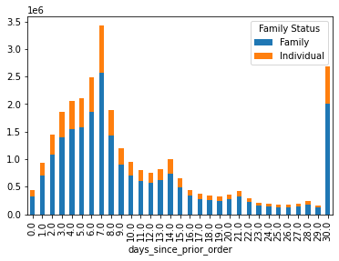
    


```python
#save figure
family_ordering_bar.figure.savefig(r'C:\Users\kickw\OneDrive\Documents\Instacart Basket Analysis\04 Analysis\Visualizations\family_ordering_bar.png')
```


```python
#age and ordering crosstab
crosstab_age_ordering=pd.crosstab(df_profiles['days_since_prior_order'],df_profiles['Age_Profile_y'], dropna=False )
crosstab_age_ordering
```


<div>
<style scoped>
    .dataframe tbody tr th:only-of-type {
        vertical-align: middle;
    }

    .dataframe tbody tr th {
        vertical-align: top;
    }

    .dataframe thead th {
        text-align: right;
    }
</style>
<table border="1" class="dataframe">
  <thead>
    <tr style="text-align: right;">
      <th>Age_Profile_y</th>
      <th>Middle Aged</th>
      <th>Older</th>
      <th>Younger</th>
    </tr>
    <tr>
      <th>days_since_prior_order</th>
      <th></th>
      <th></th>
      <th></th>
    </tr>
  </thead>
  <tbody>
    <tr>
      <th>0.0</th>
      <td>138703</td>
      <td>152403</td>
      <td>147240</td>
    </tr>
    <tr>
      <th>1.0</th>
      <td>294384</td>
      <td>320111</td>
      <td>317814</td>
    </tr>
    <tr>
      <th>2.0</th>
      <td>457825</td>
      <td>496948</td>
      <td>497721</td>
    </tr>
    <tr>
      <th>3.0</th>
      <td>578945</td>
      <td>641147</td>
      <td>641369</td>
    </tr>
    <tr>
      <th>4.0</th>
      <td>644094</td>
      <td>710326</td>
      <td>704953</td>
    </tr>
    <tr>
      <th>5.0</th>
      <td>659856</td>
      <td>718910</td>
      <td>720665</td>
    </tr>
    <tr>
      <th>6.0</th>
      <td>782073</td>
      <td>845476</td>
      <td>853556</td>
    </tr>
    <tr>
      <th>7.0</th>
      <td>1068002</td>
      <td>1166560</td>
      <td>1186057</td>
    </tr>
    <tr>
      <th>8.0</th>
      <td>596658</td>
      <td>641287</td>
      <td>657689</td>
    </tr>
    <tr>
      <th>9.0</th>
      <td>375810</td>
      <td>404783</td>
      <td>411235</td>
    </tr>
    <tr>
      <th>10.0</th>
      <td>297698</td>
      <td>322923</td>
      <td>323921</td>
    </tr>
    <tr>
      <th>11.0</th>
      <td>251639</td>
      <td>268873</td>
      <td>278150</td>
    </tr>
    <tr>
      <th>12.0</th>
      <td>235216</td>
      <td>253048</td>
      <td>263144</td>
    </tr>
    <tr>
      <th>13.0</th>
      <td>258894</td>
      <td>277979</td>
      <td>286849</td>
    </tr>
    <tr>
      <th>14.0</th>
      <td>310803</td>
      <td>339312</td>
      <td>342097</td>
    </tr>
    <tr>
      <th>15.0</th>
      <td>203238</td>
      <td>219598</td>
      <td>223777</td>
    </tr>
    <tr>
      <th>16.0</th>
      <td>140079</td>
      <td>148875</td>
      <td>153078</td>
    </tr>
    <tr>
      <th>17.0</th>
      <td>113785</td>
      <td>125942</td>
      <td>126218</td>
    </tr>
    <tr>
      <th>18.0</th>
      <td>105997</td>
      <td>115874</td>
      <td>114654</td>
    </tr>
    <tr>
      <th>19.0</th>
      <td>99686</td>
      <td>108278</td>
      <td>111333</td>
    </tr>
    <tr>
      <th>20.0</th>
      <td>113247</td>
      <td>123886</td>
      <td>124502</td>
    </tr>
    <tr>
      <th>21.0</th>
      <td>131395</td>
      <td>143997</td>
      <td>145430</td>
    </tr>
    <tr>
      <th>22.0</th>
      <td>93414</td>
      <td>99524</td>
      <td>99809</td>
    </tr>
    <tr>
      <th>23.0</th>
      <td>67577</td>
      <td>71850</td>
      <td>73572</td>
    </tr>
    <tr>
      <th>24.0</th>
      <td>58635</td>
      <td>61012</td>
      <td>63333</td>
    </tr>
    <tr>
      <th>25.0</th>
      <td>52916</td>
      <td>57929</td>
      <td>59148</td>
    </tr>
    <tr>
      <th>26.0</th>
      <td>52192</td>
      <td>57090</td>
      <td>58061</td>
    </tr>
    <tr>
      <th>27.0</th>
      <td>60776</td>
      <td>64650</td>
      <td>65144</td>
    </tr>
    <tr>
      <th>28.0</th>
      <td>73716</td>
      <td>81242</td>
      <td>81685</td>
    </tr>
    <tr>
      <th>29.0</th>
      <td>50885</td>
      <td>56050</td>
      <td>56820</td>
    </tr>
    <tr>
      <th>30.0</th>
      <td>843696</td>
      <td>918030</td>
      <td>915007</td>
    </tr>
  </tbody>
</table>
</div>


```python
#age and ordering stacked bar
age_ordering_bar= crosstab_age_ordering.plot.bar(stacked= True)
plt.legend(title='Age Category')
```


    <matplotlib.legend.Legend at 0x1f6f688ce50>


    
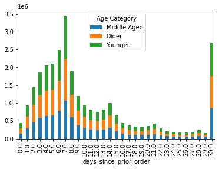
    


```python
#save figure
age_ordering_bar.figure.savefig(r'C:\Users\kickw\OneDrive\Documents\Instacart Basket Analysis\04 Analysis\Visualizations\age_ordering_bar.png')
```


```python
#family and loyalty crosstab
crosstab_family_loyalty=pd.crosstab(df_profiles['Family_Status_Profile'],df_profiles['loyalty_flag'], dropna=False )
crosstab_family_loyalty
```


<div>
<style scoped>
    .dataframe tbody tr th:only-of-type {
        vertical-align: middle;
    }

    .dataframe tbody tr th {
        vertical-align: top;
    }

    .dataframe thead th {
        text-align: right;
    }
</style>
<table border="1" class="dataframe">
  <thead>
    <tr style="text-align: right;">
      <th>loyalty_flag</th>
      <th>Loyal customer</th>
      <th>New customer</th>
      <th>Regular customer</th>
    </tr>
    <tr>
      <th>Family_Status_Profile</th>
      <th></th>
      <th></th>
      <th></th>
    </tr>
  </thead>
  <tbody>
    <tr>
      <th>Family</th>
      <td>7702117</td>
      <td>3605514</td>
      <td>11938001</td>
    </tr>
    <tr>
      <th>Individual</th>
      <td>2591620</td>
      <td>1202336</td>
      <td>3953076</td>
    </tr>
  </tbody>
</table>
</div>


```python
#family and loyalty stacked bar
plt.gcf().subplots_adjust(left=0.89)
family_loyalty_bar= crosstab_family_loyalty.plot.barh(stacked= True)
plt.legend(title='Loyalty Status')
```


    <matplotlib.legend.Legend at 0x1f6f4431880>


    <Figure size 432x288 with 0 Axes>


    
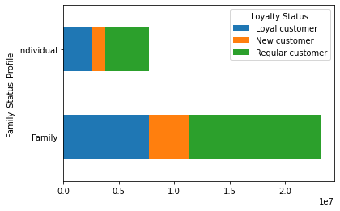
    


```python
#save figure
family_loyalty_bar.figure.savefig(r'C:\Users\kickw\OneDrive\Documents\Instacart Basket Analysis\04 Analysis\Visualizations\family_loyalty_bar.png')
```


```python
#income and loyalty crosstab
crosstab_income_loyalty=pd.crosstab(df_profiles['Income_Profile'],df_profiles['loyalty_flag'], dropna=False )
crosstab_income_loyalty
```


<div>
<style scoped>
    .dataframe tbody tr th:only-of-type {
        vertical-align: middle;
    }

    .dataframe tbody tr th {
        vertical-align: top;
    }

    .dataframe thead th {
        text-align: right;
    }
</style>
<table border="1" class="dataframe">
  <thead>
    <tr style="text-align: right;">
      <th>loyalty_flag</th>
      <th>Loyal customer</th>
      <th>New customer</th>
      <th>Regular customer</th>
    </tr>
    <tr>
      <th>Income_Profile</th>
      <th></th>
      <th></th>
      <th></th>
    </tr>
  </thead>
  <tbody>
    <tr>
      <th>Average Income</th>
      <td>5226562</td>
      <td>2321085</td>
      <td>7948461</td>
    </tr>
    <tr>
      <th>Higher Income</th>
      <td>2568805</td>
      <td>1173957</td>
      <td>4005504</td>
    </tr>
    <tr>
      <th>Lower Income</th>
      <td>2498370</td>
      <td>1312808</td>
      <td>3937112</td>
    </tr>
  </tbody>
</table>
</div>


```python
#income and loyalty stacked bar
plt.gcf().subplots_adjust(left=0.6)
income_loyalty_bar= crosstab_income_loyalty.plot.barh(stacked= True)
plt.legend(title='Loyalty Status')
```


    <matplotlib.legend.Legend at 0x1f6fe52a100>


    <Figure size 432x288 with 0 Axes>


    
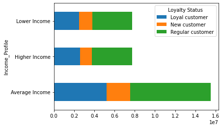
    


```python
#save figure
income_loyalty_bar.figure.savefig(r'C:\Users\kickw\OneDrive\Documents\Instacart Basket Analysis\04 Analysis\Visualizations\income_loyalty_bar.png')
```


```python
#region and ordering crosstab
crosstab_region_ordering=pd.crosstab(df_profiles['days_since_prior_order'],df_profiles['country_region'], dropna=False )
crosstab_region_ordering
```


<div>
<style scoped>
    .dataframe tbody tr th:only-of-type {
        vertical-align: middle;
    }

    .dataframe tbody tr th {
        vertical-align: top;
    }

    .dataframe thead th {
        text-align: right;
    }
</style>
<table border="1" class="dataframe">
  <thead>
    <tr style="text-align: right;">
      <th>country_region</th>
      <th>Mid West</th>
      <th>North East</th>
      <th>South</th>
      <th>West</th>
    </tr>
    <tr>
      <th>days_since_prior_order</th>
      <th></th>
      <th></th>
      <th></th>
      <th></th>
    </tr>
  </thead>
  <tbody>
    <tr>
      <th>0.0</th>
      <td>101813</td>
      <td>78372</td>
      <td>147415</td>
      <td>110746</td>
    </tr>
    <tr>
      <th>1.0</th>
      <td>216588</td>
      <td>164338</td>
      <td>307830</td>
      <td>243553</td>
    </tr>
    <tr>
      <th>2.0</th>
      <td>337085</td>
      <td>255891</td>
      <td>486396</td>
      <td>373122</td>
    </tr>
    <tr>
      <th>3.0</th>
      <td>427924</td>
      <td>335126</td>
      <td>621050</td>
      <td>477361</td>
    </tr>
    <tr>
      <th>4.0</th>
      <td>473020</td>
      <td>367936</td>
      <td>685080</td>
      <td>533337</td>
    </tr>
    <tr>
      <th>5.0</th>
      <td>486336</td>
      <td>373451</td>
      <td>699145</td>
      <td>540499</td>
    </tr>
    <tr>
      <th>6.0</th>
      <td>576227</td>
      <td>434617</td>
      <td>828835</td>
      <td>641426</td>
    </tr>
    <tr>
      <th>7.0</th>
      <td>804405</td>
      <td>605396</td>
      <td>1131154</td>
      <td>879664</td>
    </tr>
    <tr>
      <th>8.0</th>
      <td>446920</td>
      <td>331391</td>
      <td>631053</td>
      <td>486270</td>
    </tr>
    <tr>
      <th>9.0</th>
      <td>279871</td>
      <td>209742</td>
      <td>399398</td>
      <td>302817</td>
    </tr>
    <tr>
      <th>10.0</th>
      <td>220228</td>
      <td>166829</td>
      <td>315280</td>
      <td>242205</td>
    </tr>
    <tr>
      <th>11.0</th>
      <td>186984</td>
      <td>139959</td>
      <td>266621</td>
      <td>205098</td>
    </tr>
    <tr>
      <th>12.0</th>
      <td>177862</td>
      <td>132622</td>
      <td>248989</td>
      <td>191935</td>
    </tr>
    <tr>
      <th>13.0</th>
      <td>198006</td>
      <td>144891</td>
      <td>273999</td>
      <td>206826</td>
    </tr>
    <tr>
      <th>14.0</th>
      <td>237340</td>
      <td>173505</td>
      <td>328317</td>
      <td>253050</td>
    </tr>
    <tr>
      <th>15.0</th>
      <td>151817</td>
      <td>114538</td>
      <td>215595</td>
      <td>164663</td>
    </tr>
    <tr>
      <th>16.0</th>
      <td>103869</td>
      <td>78495</td>
      <td>148252</td>
      <td>111416</td>
    </tr>
    <tr>
      <th>17.0</th>
      <td>85649</td>
      <td>65471</td>
      <td>121007</td>
      <td>93818</td>
    </tr>
    <tr>
      <th>18.0</th>
      <td>78797</td>
      <td>59061</td>
      <td>112279</td>
      <td>86388</td>
    </tr>
    <tr>
      <th>19.0</th>
      <td>77157</td>
      <td>57098</td>
      <td>105376</td>
      <td>79666</td>
    </tr>
    <tr>
      <th>20.0</th>
      <td>85121</td>
      <td>63357</td>
      <td>119401</td>
      <td>93756</td>
    </tr>
    <tr>
      <th>21.0</th>
      <td>98852</td>
      <td>73602</td>
      <td>139555</td>
      <td>108813</td>
    </tr>
    <tr>
      <th>22.0</th>
      <td>69469</td>
      <td>52695</td>
      <td>96930</td>
      <td>73653</td>
    </tr>
    <tr>
      <th>23.0</th>
      <td>51680</td>
      <td>36444</td>
      <td>70391</td>
      <td>54484</td>
    </tr>
    <tr>
      <th>24.0</th>
      <td>43370</td>
      <td>31266</td>
      <td>61442</td>
      <td>46902</td>
    </tr>
    <tr>
      <th>25.0</th>
      <td>39849</td>
      <td>29889</td>
      <td>56409</td>
      <td>43846</td>
    </tr>
    <tr>
      <th>26.0</th>
      <td>38420</td>
      <td>30059</td>
      <td>56529</td>
      <td>42335</td>
    </tr>
    <tr>
      <th>27.0</th>
      <td>45304</td>
      <td>31704</td>
      <td>63449</td>
      <td>50113</td>
    </tr>
    <tr>
      <th>28.0</th>
      <td>57011</td>
      <td>41687</td>
      <td>80306</td>
      <td>57639</td>
    </tr>
    <tr>
      <th>29.0</th>
      <td>38939</td>
      <td>29617</td>
      <td>54151</td>
      <td>41048</td>
    </tr>
    <tr>
      <th>30.0</th>
      <td>638337</td>
      <td>468880</td>
      <td>894018</td>
      <td>675498</td>
    </tr>
  </tbody>
</table>
</div>


```python
#region and ordering stacked bar
region_ordering_bar= crosstab_region_ordering.plot.bar(stacked= True)
plt.legend(title='Region')
```


    <matplotlib.legend.Legend at 0x1f6f7649d60>


    
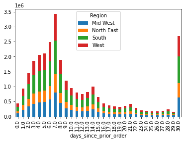
    


```python
#save figure
region_ordering_bar.figure.savefig(r'C:\Users\kickw\OneDrive\Documents\Instacart Basket Analysis\04 Analysis\Visualizations\income_loyalty_bar.png')
```


```python
#region and loyalty crosstab
crosstab_region_loyalty=pd.crosstab(df_profiles['country_region'],df_profiles['loyalty_flag'], dropna=False )
crosstab_region_ordering
```


<div>
<style scoped>
    .dataframe tbody tr th:only-of-type {
        vertical-align: middle;
    }

    .dataframe tbody tr th {
        vertical-align: top;
    }

    .dataframe thead th {
        text-align: right;
    }
</style>
<table border="1" class="dataframe">
  <thead>
    <tr style="text-align: right;">
      <th>country_region</th>
      <th>Mid West</th>
      <th>North East</th>
      <th>South</th>
      <th>West</th>
    </tr>
    <tr>
      <th>days_since_prior_order</th>
      <th></th>
      <th></th>
      <th></th>
      <th></th>
    </tr>
  </thead>
  <tbody>
    <tr>
      <th>0.0</th>
      <td>101813</td>
      <td>78372</td>
      <td>147415</td>
      <td>110746</td>
    </tr>
    <tr>
      <th>1.0</th>
      <td>216588</td>
      <td>164338</td>
      <td>307830</td>
      <td>243553</td>
    </tr>
    <tr>
      <th>2.0</th>
      <td>337085</td>
      <td>255891</td>
      <td>486396</td>
      <td>373122</td>
    </tr>
    <tr>
      <th>3.0</th>
      <td>427924</td>
      <td>335126</td>
      <td>621050</td>
      <td>477361</td>
    </tr>
    <tr>
      <th>4.0</th>
      <td>473020</td>
      <td>367936</td>
      <td>685080</td>
      <td>533337</td>
    </tr>
    <tr>
      <th>5.0</th>
      <td>486336</td>
      <td>373451</td>
      <td>699145</td>
      <td>540499</td>
    </tr>
    <tr>
      <th>6.0</th>
      <td>576227</td>
      <td>434617</td>
      <td>828835</td>
      <td>641426</td>
    </tr>
    <tr>
      <th>7.0</th>
      <td>804405</td>
      <td>605396</td>
      <td>1131154</td>
      <td>879664</td>
    </tr>
    <tr>
      <th>8.0</th>
      <td>446920</td>
      <td>331391</td>
      <td>631053</td>
      <td>486270</td>
    </tr>
    <tr>
      <th>9.0</th>
      <td>279871</td>
      <td>209742</td>
      <td>399398</td>
      <td>302817</td>
    </tr>
    <tr>
      <th>10.0</th>
      <td>220228</td>
      <td>166829</td>
      <td>315280</td>
      <td>242205</td>
    </tr>
    <tr>
      <th>11.0</th>
      <td>186984</td>
      <td>139959</td>
      <td>266621</td>
      <td>205098</td>
    </tr>
    <tr>
      <th>12.0</th>
      <td>177862</td>
      <td>132622</td>
      <td>248989</td>
      <td>191935</td>
    </tr>
    <tr>
      <th>13.0</th>
      <td>198006</td>
      <td>144891</td>
      <td>273999</td>
      <td>206826</td>
    </tr>
    <tr>
      <th>14.0</th>
      <td>237340</td>
      <td>173505</td>
      <td>328317</td>
      <td>253050</td>
    </tr>
    <tr>
      <th>15.0</th>
      <td>151817</td>
      <td>114538</td>
      <td>215595</td>
      <td>164663</td>
    </tr>
    <tr>
      <th>16.0</th>
      <td>103869</td>
      <td>78495</td>
      <td>148252</td>
      <td>111416</td>
    </tr>
    <tr>
      <th>17.0</th>
      <td>85649</td>
      <td>65471</td>
      <td>121007</td>
      <td>93818</td>
    </tr>
    <tr>
      <th>18.0</th>
      <td>78797</td>
      <td>59061</td>
      <td>112279</td>
      <td>86388</td>
    </tr>
    <tr>
      <th>19.0</th>
      <td>77157</td>
      <td>57098</td>
      <td>105376</td>
      <td>79666</td>
    </tr>
    <tr>
      <th>20.0</th>
      <td>85121</td>
      <td>63357</td>
      <td>119401</td>
      <td>93756</td>
    </tr>
    <tr>
      <th>21.0</th>
      <td>98852</td>
      <td>73602</td>
      <td>139555</td>
      <td>108813</td>
    </tr>
    <tr>
      <th>22.0</th>
      <td>69469</td>
      <td>52695</td>
      <td>96930</td>
      <td>73653</td>
    </tr>
    <tr>
      <th>23.0</th>
      <td>51680</td>
      <td>36444</td>
      <td>70391</td>
      <td>54484</td>
    </tr>
    <tr>
      <th>24.0</th>
      <td>43370</td>
      <td>31266</td>
      <td>61442</td>
      <td>46902</td>
    </tr>
    <tr>
      <th>25.0</th>
      <td>39849</td>
      <td>29889</td>
      <td>56409</td>
      <td>43846</td>
    </tr>
    <tr>
      <th>26.0</th>
      <td>38420</td>
      <td>30059</td>
      <td>56529</td>
      <td>42335</td>
    </tr>
    <tr>
      <th>27.0</th>
      <td>45304</td>
      <td>31704</td>
      <td>63449</td>
      <td>50113</td>
    </tr>
    <tr>
      <th>28.0</th>
      <td>57011</td>
      <td>41687</td>
      <td>80306</td>
      <td>57639</td>
    </tr>
    <tr>
      <th>29.0</th>
      <td>38939</td>
      <td>29617</td>
      <td>54151</td>
      <td>41048</td>
    </tr>
    <tr>
      <th>30.0</th>
      <td>638337</td>
      <td>468880</td>
      <td>894018</td>
      <td>675498</td>
    </tr>
  </tbody>
</table>
</div>


```python
#region and loyalty stacked bar
region_loyalty_bar= crosstab_region_loyalty.plot.bar(stacked= True)
plt.legend(title='Loyalty Status')
```


    <matplotlib.legend.Legend at 0x1f6f77ab910>


    
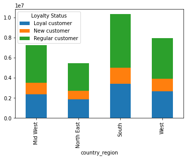
    


```python
#save figure
region_loyalty_bar.figure.savefig(r'C:\Users\kickw\OneDrive\Documents\Instacart Basket Analysis\04 Analysis\Visualizations\income_loyalty_bar.png')
```


```python
df_profiles['Pet_Owner_Profile'].value_counts(dropna= False)
```


    No Pets      27539023
    Pet Owner     3453641
    Name: Pet_Owner_Profile, dtype: int64


```python
df_profiles['Diet_Profile'].value_counts(dropna= False)
```


    Carnivore Diet     23075225
    Vegetarian Diet     5135243
    Undetermined        2614522
    Vegan Diet           167674
    Name: Diet_Profile, dtype: int64


```python
df_profiles['Income_Profile'].value_counts(dropna= False)
```


    Average Income    15496108
    Lower Income       7748290
    Higher Income      7748266
    Name: Income_Profile, dtype: int64


```python
df_profiles['Age_Profile_y'].value_counts(dropna= False)
```


    Younger        10674650
    Older          10583941
    Middle Aged     9734073
    Name: Age_Profile_y, dtype: int64


```python
df_profiles['Family_Status_Profile'].value_counts(dropna= False)
```


    Family        23245632
    Individual     7747032
    Name: Family_Status_Profile, dtype: int64


```python
df_profiles['Diet_Profile'].value_counts()
```


    Carnivore Diet     23075225
    Vegetarian Diet     5135243
    Undetermined        2614522
    Vegan Diet           167674
    Name: Diet_Profile, dtype: int64


```python
#region and department crosstab
crosstab_region_department=pd.crosstab(df_profiles['country_region'],df_profiles['department_id'], dropna=False )
crosstab_region_department
```


<div>
<style scoped>
    .dataframe tbody tr th:only-of-type {
        vertical-align: middle;
    }

    .dataframe tbody tr th {
        vertical-align: top;
    }

    .dataframe thead th {
        text-align: right;
    }
</style>
<table border="1" class="dataframe">
  <thead>
    <tr style="text-align: right;">
      <th>department_id</th>
      <th>1</th>
      <th>2</th>
      <th>3</th>
      <th>4</th>
      <th>5</th>
      <th>6</th>
      <th>7</th>
      <th>8</th>
      <th>9</th>
      <th>10</th>
      <th>...</th>
      <th>12</th>
      <th>13</th>
      <th>14</th>
      <th>15</th>
      <th>16</th>
      <th>17</th>
      <th>18</th>
      <th>19</th>
      <th>20</th>
      <th>21</th>
    </tr>
    <tr>
      <th>country_region</th>
      <th></th>
      <th></th>
      <th></th>
      <th></th>
      <th></th>
      <th></th>
      <th></th>
      <th></th>
      <th></th>
      <th></th>
      <th></th>
      <th></th>
      <th></th>
      <th></th>
      <th></th>
      <th></th>
      <th></th>
      <th></th>
      <th></th>
      <th></th>
      <th></th>
    </tr>
  </thead>
  <tbody>
    <tr>
      <th>Mid West</th>
      <td>498527</td>
      <td>7983</td>
      <td>262614</td>
      <td>2134116</td>
      <td>34052</td>
      <td>60666</td>
      <td>598990</td>
      <td>21358</td>
      <td>193463</td>
      <td>7929</td>
      <td>...</td>
      <td>158261</td>
      <td>420366</td>
      <td>157781</td>
      <td>237459</td>
      <td>1215821</td>
      <td>166992</td>
      <td>95741</td>
      <td>645143</td>
      <td>234464</td>
      <td>15563</td>
    </tr>
    <tr>
      <th>North East</th>
      <td>370817</td>
      <td>6268</td>
      <td>200136</td>
      <td>1593004</td>
      <td>25034</td>
      <td>44678</td>
      <td>462931</td>
      <td>17734</td>
      <td>143817</td>
      <td>5599</td>
      <td>...</td>
      <td>118572</td>
      <td>312763</td>
      <td>119327</td>
      <td>176936</td>
      <td>917293</td>
      <td>124604</td>
      <td>72712</td>
      <td>493154</td>
      <td>178398</td>
      <td>11512</td>
    </tr>
    <tr>
      <th>South</th>
      <td>710443</td>
      <td>11579</td>
      <td>373055</td>
      <td>3027478</td>
      <td>48822</td>
      <td>84649</td>
      <td>859435</td>
      <td>29912</td>
      <td>272813</td>
      <td>11180</td>
      <td>...</td>
      <td>224122</td>
      <td>591842</td>
      <td>225539</td>
      <td>337458</td>
      <td>1727823</td>
      <td>230062</td>
      <td>139511</td>
      <td>916780</td>
      <td>333620</td>
      <td>21787</td>
    </tr>
    <tr>
      <th>West</th>
      <td>543555</td>
      <td>8581</td>
      <td>289221</td>
      <td>2324678</td>
      <td>36766</td>
      <td>65998</td>
      <td>650578</td>
      <td>24061</td>
      <td>212043</td>
      <td>8743</td>
      <td>...</td>
      <td>173830</td>
      <td>457932</td>
      <td>175448</td>
      <td>260221</td>
      <td>1330891</td>
      <td>178200</td>
      <td>102428</td>
      <td>711329</td>
      <td>257352</td>
      <td>15906</td>
    </tr>
  </tbody>
</table>
<p>4 rows × 21 columns</p>
</div>


```python
#save results to clipboard
crosstab_region_department.to_clipboard()
```


```python
#income and prices crosstab
crosstab_income_prices=pd.crosstab(df_profiles['Income_Profile'],df_profiles['prices'], dropna=False )
crosstab_income_prices
```


<div>
<style scoped>
    .dataframe tbody tr th:only-of-type {
        vertical-align: middle;
    }

    .dataframe tbody tr th {
        vertical-align: top;
    }

    .dataframe thead th {
        text-align: right;
    }
</style>
<table border="1" class="dataframe">
  <thead>
    <tr style="text-align: right;">
      <th>prices</th>
      <th>1.0</th>
      <th>1.1</th>
      <th>1.2</th>
      <th>1.3</th>
      <th>1.4</th>
      <th>1.5</th>
      <th>1.6</th>
      <th>1.7</th>
      <th>1.8</th>
      <th>1.9</th>
      <th>...</th>
      <th>24.3</th>
      <th>24.4</th>
      <th>24.5</th>
      <th>24.6</th>
      <th>24.7</th>
      <th>24.8</th>
      <th>24.9</th>
      <th>25.0</th>
      <th>14900.0</th>
      <th>99999.0</th>
    </tr>
    <tr>
      <th>Income_Profile</th>
      <th></th>
      <th></th>
      <th></th>
      <th></th>
      <th></th>
      <th></th>
      <th></th>
      <th></th>
      <th></th>
      <th></th>
      <th></th>
      <th></th>
      <th></th>
      <th></th>
      <th></th>
      <th></th>
      <th></th>
      <th></th>
      <th></th>
      <th></th>
      <th></th>
    </tr>
  </thead>
  <tbody>
    <tr>
      <th>Average Income</th>
      <td>53638</td>
      <td>108980</td>
      <td>117287</td>
      <td>190640</td>
      <td>180361</td>
      <td>70332</td>
      <td>132520</td>
      <td>98212</td>
      <td>141855</td>
      <td>67544</td>
      <td>...</td>
      <td>1504</td>
      <td>240</td>
      <td>1068</td>
      <td>943</td>
      <td>3984</td>
      <td>208</td>
      <td>2977</td>
      <td>7126</td>
      <td>638</td>
      <td>101</td>
    </tr>
    <tr>
      <th>Higher Income</th>
      <td>27231</td>
      <td>54365</td>
      <td>60243</td>
      <td>96288</td>
      <td>88685</td>
      <td>36507</td>
      <td>68429</td>
      <td>48204</td>
      <td>69708</td>
      <td>35063</td>
      <td>...</td>
      <td>751</td>
      <td>142</td>
      <td>610</td>
      <td>533</td>
      <td>1836</td>
      <td>111</td>
      <td>1638</td>
      <td>3792</td>
      <td>3580</td>
      <td>553</td>
    </tr>
    <tr>
      <th>Lower Income</th>
      <td>28393</td>
      <td>68992</td>
      <td>65168</td>
      <td>120215</td>
      <td>105753</td>
      <td>40444</td>
      <td>84385</td>
      <td>58217</td>
      <td>96002</td>
      <td>46033</td>
      <td>...</td>
      <td>492</td>
      <td>79</td>
      <td>359</td>
      <td>369</td>
      <td>1207</td>
      <td>67</td>
      <td>851</td>
      <td>2210</td>
      <td>5</td>
      <td>0</td>
    </tr>
  </tbody>
</table>
<p>3 rows × 242 columns</p>
</div>


```python
df_income_prices= df_profiles.groupby('Income_Profile').agg({'prices':['mean']})
```


```python
#region and department crosstab
plt.gcf().subplots_adjust(bottom=0.8)
income_spending_bar= df_income_prices.plot.barh()
plt.legend(title='Average Product Price')
```


    <matplotlib.legend.Legend at 0x1f6f67de5e0>


    <Figure size 432x288 with 0 Axes>


    
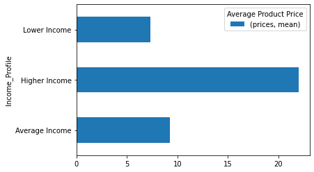
    


```python
#save figure
income_spending_bar.figure.savefig(r'C:\Users\kickw\OneDrive\Documents\Instacart Basket Analysis\04 Analysis\Visualizations\income_spending_bar.png')
```


```python
#income and days between order
df_income_days= df_profiles.groupby('Income_Profile').agg({'days_since_prior_order':['mean']})
```


```python

income_days_bar= df_income_days.plot.bar()
plt.gcf().subplots_adjust(bottom=0.35)
plt.legend(title='Average Days Between Orders')
```


    <matplotlib.legend.Legend at 0x1f6fdc2bcd0>


    
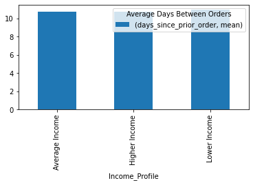
    


```python
#save figure
income_days_bar.figure.savefig(r'C:\Users\kickw\OneDrive\Documents\Instacart Basket Analysis\04 Analysis\Visualizations\income_days_bar.png')
```


```python
#average price by loyalty status
df_loyalty_prices= df_profiles.groupby('loyalty_flag').agg({'prices':['mean']})
```


```python
#price by loyalty status bar
loyalty_prices_bar= df_loyalty_prices.plot.barh()
plt.gcf().subplots_adjust(bottom=0.35)
plt.legend(title='Average Price of Products Bought')
```


    <matplotlib.legend.Legend at 0x1f7015bda60>


    
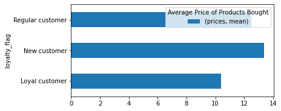
    


```python
#save figure
loyalty_prices_bar.figure.savefig(r'C:\Users\kickw\OneDrive\Documents\Instacart Basket Analysis\04 Analysis\Visualizations\loyalty_prices_bar.png')
```


```python
#export data set
```


```python
df_profiles.head()
```


<div>
<style scoped>
    .dataframe tbody tr th:only-of-type {
        vertical-align: middle;
    }

    .dataframe tbody tr th {
        vertical-align: top;
    }

    .dataframe thead th {
        text-align: right;
    }
</style>
<table border="1" class="dataframe">
  <thead>
    <tr style="text-align: right;">
      <th></th>
      <th>order_id</th>
      <th>user_id</th>
      <th>order_number</th>
      <th>orders_day_of_week</th>
      <th>order_hour_of_day</th>
      <th>days_since_prior_order</th>
      <th>customer_status</th>
      <th>product_id</th>
      <th>add_to_cart_order</th>
      <th>reordered</th>
      <th>...</th>
      <th>income_category</th>
      <th>income_flag</th>
      <th>aged</th>
      <th>Age_Profile_x</th>
      <th>Pet_Owner_Profile</th>
      <th>Diet_Profile</th>
      <th>Income_Profile</th>
      <th>Age_Profile_y</th>
      <th>Family_Status_Profile</th>
      <th>_merge</th>
    </tr>
  </thead>
  <tbody>
    <tr>
      <th>0</th>
      <td>2539329</td>
      <td>1</td>
      <td>1</td>
      <td>2</td>
      <td>8</td>
      <td>NaN</td>
      <td>New Customer</td>
      <td>196</td>
      <td>1</td>
      <td>0</td>
      <td>...</td>
      <td>40423</td>
      <td>Lower Income</td>
      <td>31</td>
      <td>Younger</td>
      <td>No Pets</td>
      <td>Undetermined</td>
      <td>Lower Income</td>
      <td>Younger</td>
      <td>Family</td>
      <td>both</td>
    </tr>
    <tr>
      <th>1</th>
      <td>2398795</td>
      <td>1</td>
      <td>2</td>
      <td>3</td>
      <td>7</td>
      <td>15.0</td>
      <td>Returning Customer</td>
      <td>196</td>
      <td>1</td>
      <td>1</td>
      <td>...</td>
      <td>40423</td>
      <td>Lower Income</td>
      <td>31</td>
      <td>Younger</td>
      <td>No Pets</td>
      <td>Undetermined</td>
      <td>Lower Income</td>
      <td>Younger</td>
      <td>Family</td>
      <td>both</td>
    </tr>
    <tr>
      <th>2</th>
      <td>473747</td>
      <td>1</td>
      <td>3</td>
      <td>3</td>
      <td>12</td>
      <td>21.0</td>
      <td>Returning Customer</td>
      <td>196</td>
      <td>1</td>
      <td>1</td>
      <td>...</td>
      <td>40423</td>
      <td>Lower Income</td>
      <td>31</td>
      <td>Younger</td>
      <td>No Pets</td>
      <td>Undetermined</td>
      <td>Lower Income</td>
      <td>Younger</td>
      <td>Family</td>
      <td>both</td>
    </tr>
    <tr>
      <th>3</th>
      <td>2254736</td>
      <td>1</td>
      <td>4</td>
      <td>4</td>
      <td>7</td>
      <td>29.0</td>
      <td>Returning Customer</td>
      <td>196</td>
      <td>1</td>
      <td>1</td>
      <td>...</td>
      <td>40423</td>
      <td>Lower Income</td>
      <td>31</td>
      <td>Younger</td>
      <td>No Pets</td>
      <td>Undetermined</td>
      <td>Lower Income</td>
      <td>Younger</td>
      <td>Family</td>
      <td>both</td>
    </tr>
    <tr>
      <th>4</th>
      <td>431534</td>
      <td>1</td>
      <td>5</td>
      <td>4</td>
      <td>15</td>
      <td>28.0</td>
      <td>Returning Customer</td>
      <td>196</td>
      <td>1</td>
      <td>1</td>
      <td>...</td>
      <td>40423</td>
      <td>Lower Income</td>
      <td>31</td>
      <td>Younger</td>
      <td>No Pets</td>
      <td>Undetermined</td>
      <td>Lower Income</td>
      <td>Younger</td>
      <td>Family</td>
      <td>both</td>
    </tr>
  </tbody>
</table>
<p>5 rows × 44 columns</p>
</div>


```python
df_profiles.columns
```


    Index(['order_id', 'user_id', 'order_number', 'orders_day_of_week',
           'order_hour_of_day', 'days_since_prior_order', 'customer_status',
           'product_id', 'add_to_cart_order', 'reordered', 'product_name',
           'aisle_id', 'department_id', 'prices', 'merged', 'price_range_loc',
           'Busiest_days', 'busiest_period_of_day', 'max_order', 'loyalty_flag',
           'spending_category', 'spending_flag', 'behavior_category',
           'behavior_flag', 'gender', 'state', 'age', 'date_joined', 'dependents',
           'marital_status', 'income', 'country_region', 'activity_category',
           'activity_flag', 'income_category', 'income_flag', 'aged',
           'Age_Profile_x', 'Pet_Owner_Profile', 'Diet_Profile', 'Income_Profile',
           'Age_Profile_y', 'Family_Status_Profile', '_merge'],
          dtype='object')


```python
df_profiles_cleaned=df_profiles.drop(columns = ['merged','activity_category','spending_category','behavior_category','income_category','aged',
       'Age_Profile_x', '_merge'])
```


```python
df_profiles_cleaned.head()
```


<div>
<style scoped>
    .dataframe tbody tr th:only-of-type {
        vertical-align: middle;
    }

    .dataframe tbody tr th {
        vertical-align: top;
    }

    .dataframe thead th {
        text-align: right;
    }
</style>
<table border="1" class="dataframe">
  <thead>
    <tr style="text-align: right;">
      <th></th>
      <th>order_id</th>
      <th>user_id</th>
      <th>order_number</th>
      <th>orders_day_of_week</th>
      <th>order_hour_of_day</th>
      <th>days_since_prior_order</th>
      <th>customer_status</th>
      <th>product_id</th>
      <th>add_to_cart_order</th>
      <th>reordered</th>
      <th>...</th>
      <th>marital_status</th>
      <th>income</th>
      <th>country_region</th>
      <th>activity_flag</th>
      <th>income_flag</th>
      <th>Pet_Owner_Profile</th>
      <th>Diet_Profile</th>
      <th>Income_Profile</th>
      <th>Age_Profile_y</th>
      <th>Family_Status_Profile</th>
    </tr>
  </thead>
  <tbody>
    <tr>
      <th>0</th>
      <td>2539329</td>
      <td>1</td>
      <td>1</td>
      <td>2</td>
      <td>8</td>
      <td>NaN</td>
      <td>New Customer</td>
      <td>196</td>
      <td>1</td>
      <td>0</td>
      <td>...</td>
      <td>married</td>
      <td>40423</td>
      <td>South</td>
      <td>High Activity</td>
      <td>Lower Income</td>
      <td>No Pets</td>
      <td>Undetermined</td>
      <td>Lower Income</td>
      <td>Younger</td>
      <td>Family</td>
    </tr>
    <tr>
      <th>1</th>
      <td>2398795</td>
      <td>1</td>
      <td>2</td>
      <td>3</td>
      <td>7</td>
      <td>15.0</td>
      <td>Returning Customer</td>
      <td>196</td>
      <td>1</td>
      <td>1</td>
      <td>...</td>
      <td>married</td>
      <td>40423</td>
      <td>South</td>
      <td>High Activity</td>
      <td>Lower Income</td>
      <td>No Pets</td>
      <td>Undetermined</td>
      <td>Lower Income</td>
      <td>Younger</td>
      <td>Family</td>
    </tr>
    <tr>
      <th>2</th>
      <td>473747</td>
      <td>1</td>
      <td>3</td>
      <td>3</td>
      <td>12</td>
      <td>21.0</td>
      <td>Returning Customer</td>
      <td>196</td>
      <td>1</td>
      <td>1</td>
      <td>...</td>
      <td>married</td>
      <td>40423</td>
      <td>South</td>
      <td>High Activity</td>
      <td>Lower Income</td>
      <td>No Pets</td>
      <td>Undetermined</td>
      <td>Lower Income</td>
      <td>Younger</td>
      <td>Family</td>
    </tr>
    <tr>
      <th>3</th>
      <td>2254736</td>
      <td>1</td>
      <td>4</td>
      <td>4</td>
      <td>7</td>
      <td>29.0</td>
      <td>Returning Customer</td>
      <td>196</td>
      <td>1</td>
      <td>1</td>
      <td>...</td>
      <td>married</td>
      <td>40423</td>
      <td>South</td>
      <td>High Activity</td>
      <td>Lower Income</td>
      <td>No Pets</td>
      <td>Undetermined</td>
      <td>Lower Income</td>
      <td>Younger</td>
      <td>Family</td>
    </tr>
    <tr>
      <th>4</th>
      <td>431534</td>
      <td>1</td>
      <td>5</td>
      <td>4</td>
      <td>15</td>
      <td>28.0</td>
      <td>Returning Customer</td>
      <td>196</td>
      <td>1</td>
      <td>1</td>
      <td>...</td>
      <td>married</td>
      <td>40423</td>
      <td>South</td>
      <td>High Activity</td>
      <td>Lower Income</td>
      <td>No Pets</td>
      <td>Undetermined</td>
      <td>Lower Income</td>
      <td>Younger</td>
      <td>Family</td>
    </tr>
  </tbody>
</table>
<p>5 rows × 36 columns</p>
</div>


```python

```


```python
df_profiles_cleaned.to_pickle(r'C:\Users\kickw\OneDrive\Documents\Instacart Basket Analysis\02 Data\Prepared Data\profiles_cleaned.pkl')
```
