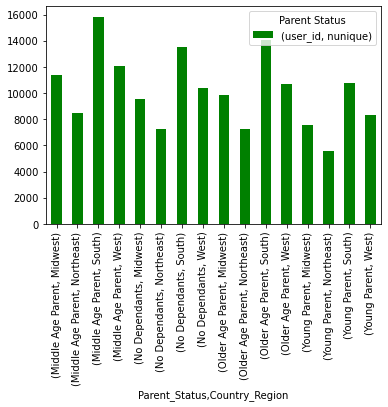

## CONTENT LIST
1. Import Libraries
2. Import df from Task 4.9
3. Security Implications
4. Compare customer behavior in different geographic areas
5. Create Exclusion Flag for Low-Activity Customers
6. Create 'Parent Status' Column
7. Create 'Income Level' Column
8. Create 'Pet Order Flag' Column then 'Pet Owner' Column
9. Create 'Baby Order Flag' Column then 'Baby Household' Column
10. Customer Profiles & their Comparison to Regions
11. Visualization - 'Parent Status' Distribution & Regional Distribution
12. Visualization - 'Income Level' Distribution & Regional Distribution
13. Visualization - 'Pet Owner' Distribution & Regional Distribution
14. Visualization - 'Baby Household' Distribution & Regional Distribution
15. Aggregate max, mean, & min variables on Customer Profiles
16. Link between Customer Profiles & Departments?
17. Visualizations for Customer Profiles by Department

## 01. Import Libraries


```python
import gc
gc.collect()
```


    289


```python
#Import Libraries
import pandas as pd
import numpy as np
import os
import matplotlib.pyplot as plt
import seaborn as sns
import scipy
```

## 02. Import df from Task 4.9


```python
path = r'C:\Users\chery\Desktop\CareerFoundry\Immersion Data Analytics\Achievement 4\02-2022 Instacart Basket Analysis'
```


```python
df = pd.read_pickle(os.path.join(path, '02 Data', 'Prepared Data', 'merged_task_4_9_part1.pkl'))
```


```python
df.shape
```


    (32404859, 31)


```python
df.head()
```


<div>
<style scoped>
    .dataframe tbody tr th:only-of-type {
        vertical-align: middle;
    }

    .dataframe tbody tr th {
        vertical-align: top;
    }

    .dataframe thead th {
        text-align: right;
    }
</style>
<table border="1" class="dataframe">
  <thead>
    <tr style="text-align: right;">
      <th></th>
      <th>order_id</th>
      <th>user_id</th>
      <th>order_number</th>
      <th>orders_day_of_week</th>
      <th>order_hour_of_day</th>
      <th>days_since_prior_order</th>
      <th>customer_status</th>
      <th>product_id</th>
      <th>add_to_cart_order</th>
      <th>reordered</th>
      <th>...</th>
      <th>spender_flag</th>
      <th>order_frequency</th>
      <th>frequent_customer_flag</th>
      <th>Gender</th>
      <th>State</th>
      <th>Customer_Age</th>
      <th>date_joined</th>
      <th>number_dependants</th>
      <th>marital_status</th>
      <th>income</th>
    </tr>
  </thead>
  <tbody>
    <tr>
      <th>0</th>
      <td>2539329</td>
      <td>1</td>
      <td>1</td>
      <td>2</td>
      <td>8</td>
      <td>NaN</td>
      <td>New Customer</td>
      <td>196</td>
      <td>1</td>
      <td>0</td>
      <td>...</td>
      <td>Low spender</td>
      <td>20.5</td>
      <td>Non-frequent customer</td>
      <td>Female</td>
      <td>Alabama</td>
      <td>31</td>
      <td>2/17/2019</td>
      <td>3</td>
      <td>married</td>
      <td>40423</td>
    </tr>
    <tr>
      <th>1</th>
      <td>2398795</td>
      <td>1</td>
      <td>2</td>
      <td>3</td>
      <td>7</td>
      <td>15.0</td>
      <td>Repeat Customer</td>
      <td>196</td>
      <td>1</td>
      <td>1</td>
      <td>...</td>
      <td>Low spender</td>
      <td>20.5</td>
      <td>Non-frequent customer</td>
      <td>Female</td>
      <td>Alabama</td>
      <td>31</td>
      <td>2/17/2019</td>
      <td>3</td>
      <td>married</td>
      <td>40423</td>
    </tr>
    <tr>
      <th>2</th>
      <td>473747</td>
      <td>1</td>
      <td>3</td>
      <td>3</td>
      <td>12</td>
      <td>21.0</td>
      <td>Repeat Customer</td>
      <td>196</td>
      <td>1</td>
      <td>1</td>
      <td>...</td>
      <td>Low spender</td>
      <td>20.5</td>
      <td>Non-frequent customer</td>
      <td>Female</td>
      <td>Alabama</td>
      <td>31</td>
      <td>2/17/2019</td>
      <td>3</td>
      <td>married</td>
      <td>40423</td>
    </tr>
    <tr>
      <th>3</th>
      <td>2254736</td>
      <td>1</td>
      <td>4</td>
      <td>4</td>
      <td>7</td>
      <td>29.0</td>
      <td>Repeat Customer</td>
      <td>196</td>
      <td>1</td>
      <td>1</td>
      <td>...</td>
      <td>Low spender</td>
      <td>20.5</td>
      <td>Non-frequent customer</td>
      <td>Female</td>
      <td>Alabama</td>
      <td>31</td>
      <td>2/17/2019</td>
      <td>3</td>
      <td>married</td>
      <td>40423</td>
    </tr>
    <tr>
      <th>4</th>
      <td>431534</td>
      <td>1</td>
      <td>5</td>
      <td>4</td>
      <td>15</td>
      <td>28.0</td>
      <td>Repeat Customer</td>
      <td>196</td>
      <td>1</td>
      <td>1</td>
      <td>...</td>
      <td>Low spender</td>
      <td>20.5</td>
      <td>Non-frequent customer</td>
      <td>Female</td>
      <td>Alabama</td>
      <td>31</td>
      <td>2/17/2019</td>
      <td>3</td>
      <td>married</td>
      <td>40423</td>
    </tr>
  </tbody>
</table>
<p>5 rows × 31 columns</p>
</div>


```python
df.columns
```


    Index(['order_id', 'user_id', 'order_number', 'orders_day_of_week',
           'order_hour_of_day', 'days_since_prior_order', 'customer_status',
           'product_id', 'add_to_cart_order', 'reordered', '_merge',
           'product_name', 'aisle_id', 'department_id', 'prices',
           'price_range_loc', 'busiest_days', 'busiest_period_of_day', 'max_order',
           'loyalty_flag', 'mean_price_ords', 'spender_flag', 'order_frequency',
           'frequent_customer_flag', 'Gender', 'State', 'Customer_Age',
           'date_joined', 'number_dependants', 'marital_status', 'income'],
          dtype='object')


## 03. Security Implications

Customer's first & last name are PII & were removed earlier because of potential privacy issue (especially with household income being included in the data)

## 04. Compare customer behavior in different geographic areas


```python
#View all States in 'State' column

df['State'].value_counts(dropna= False)
```


    Pennsylvania            667082
    California              659783
    Rhode Island            656913
    Georgia                 656389
    New Mexico              654494
    Arizona                 653964
    North Carolina          651900
    Oklahoma                651739
    Alaska                  648495
    Minnesota               647825
    Massachusetts           646358
    Wyoming                 644255
    Virginia                641421
    Missouri                640732
    Texas                   640394
    Colorado                639280
    Maine                   638583
    North Dakota            638491
    Alabama                 638003
    Kansas                  637538
    Louisiana               637482
    Delaware                637024
    South Carolina          636754
    Oregon                  636425
    Arkansas                636144
    Nevada                  636139
    New York                635983
    Montana                 635265
    South Dakota            633772
    Illinois                633024
    Hawaii                  632901
    Washington              632852
    Mississippi             632675
    Kentucky                632490
    Michigan                630928
    Florida                 629027
    Ohio                    628319
    Wisconsin               628108
    New Jersey              627692
    Indiana                 627282
    Maryland                626579
    Nebraska                625813
    Iowa                    625493
    Connecticut             623022
    Tennessee               617873
    New Hampshire           615378
    District of Columbia    613695
    West Virginia           612296
    Utah                    611941
    Vermont                 611725
    Idaho                   607119
    Name: State, dtype: int64


```python
#Create “Region” column based on “State” column using For-loop

result = []

for value in df ["State"]:
    if (value == "Maine" or value=="New Hampshire" or value=="Vermont" or value=="Massachusetts" or value=="Rhode Island" or value=="Connecticut" or value=="New York" or value=="Pennsylvania" or value=="New Jersey"):
        result.append("Northeast")
    elif (value == "Wisconsin" or value=="Michigan" or value=="Illinois" or value=="Indiana" or value=="Ohio" or value=="North Dakota" or value=="South Dakota" or value=="Nebraska" or value=="Kansas" or value=="Minnesota" or value=="Iowa" or value=="Missouri"):
        result.append("Midwest")
    elif (value == "Delaware" or value== "Maryland" or value== "District of Columbia" or value== "Virginia" or value== "West Virginia" or value== "North Carolina" or value== "South Carolina" or value== "Georgia" or value== "Florida" or value== "Kentucky" or value== "Tennessee" or value== "Mississippi" or value== "Alabama" or value== "Oklahoma" or value== "Texas" or value== "Arkansas" or value== "Louisiana"):
        result.append("South")
    elif (value == "Idaho" or value== "Montana" or value== "Wyoming" or value== "Nevada" or value== "Utah" or value== "Colorado" or value== "Arizona" or value== "New Mexico" or value== "Alaska" or value== "Washington" or value== "Oregon" or value== "California" or value== "Hawaii"):
        result.append("West")
    else:
        result.append("Not Enough Data")
```


```python
#Viewing result
result
```


    ['South',
     'South',
     'South',
     'South',
     'South',
     'South',
     'South',
     'South',
     'South',
     'South',
     'South',
     'South',
     'South',
     'South',
     'South',
     'South',
     'South',
     'South',
     'South',
     'South',
     'South',
     'South',
     'South',
     'South',
     'South',
     'South',
     'South',
     'South',
     'South',
     'South',
     'South',
     'South',
     'South',
     'South',
     'South',
     'South',
     'South',
     'South',
     'South',
     'South',
     'South',
     'South',
     'South',
     'South',
     'South',
     'South',
     'South',
     'South',
     'South',
     'South',
     'South',
     'South',
     'South',
     'South',
     'South',
     'South',
     'South',
     'South',
     'South',
     'Midwest',
     'Midwest',
     'Midwest',
     'Midwest',
     'Midwest',
     'Midwest',
     'Midwest',
     'Midwest',
     'Midwest',
     'Midwest',
     'Midwest',
     'Midwest',
     'Midwest',
     'Midwest',
     'Midwest',
     'Midwest',
     'Midwest',
     'Midwest',
     'Midwest',
     'Midwest',
     'Midwest',
     'Midwest',
     'Midwest',
     'Midwest',
     'Midwest',
     'Midwest',
     'Midwest',
     'Midwest',
     'Midwest',
     'Midwest',
     'Midwest',
     'Midwest',
     'Midwest',
     'Midwest',
     'Midwest',
     'Midwest',
     'Midwest',
     'Midwest',
     'Midwest',
     'Midwest',
     'Midwest',
     'Midwest',
     'Midwest',
     'Midwest',
     'Midwest',
     'Midwest',
     'Midwest',
     'Midwest',
     'Midwest',
     'Midwest',
     'Midwest',
     'Midwest',
     'Midwest',
     'Midwest',
     'Midwest',
     'Midwest',
     'Midwest',
     'Midwest',
     'Midwest',
     'Midwest',
     'Midwest',
     'Midwest',
     'Midwest',
     'Midwest',
     'Midwest',
     'Midwest',
     'Midwest',
     'Midwest',
     'Midwest',
     'Midwest',
     'Midwest',
     'Midwest',
     'South',
     'South',
     'South',
     'South',
     'South',
     'South',
     'South',
     'South',
     'South',
     'South',
     'South',
     'South',
     'South',
     'South',
     'South',
     'South',
     'South',
     'South',
     'South',
     'South',
     'South',
     'South',
     'South',
     'South',
     'South',
     'South',
     'South',
     'South',
     'South',
     'South',
     'South',
     'South',
     'South',
     'South',
     'South',
     'South',
     'South',
     'South',
     'South',
     'South',
     'South',
     'South',
     'South',
     'South',
     'South',
     'South',
     'South',
     'South',
     'South',
     'South',
     'South',
     'South',
     'South',
     'South',
     'South',
     'South',
     'South',
     'South',
     'South',
     'South',
     'South',
     'South',
     'South',
     'South',
     'South',
     'South',
     'South',
     'South',
     'South',
     'South',
     'South',
     'South',
     'South',
     'South',
     'South',
     'South',
     'South',
     'South',
     'South',
     'South',
     'South',
     'South',
     'South',
     'South',
     'South',
     'South',
     'South',
     'South',
     'South',
     'South',
     'South',
     'South',
     'South',
     'South',
     'South',
     'South',
     'South',
     'South',
     'South',
     'South',
     'South',
     'South',
     'South',
     'South',
     'South',
     'South',
     'South',
     'South',
     'South',
     'South',
     'South',
     'South',
     'South',
     'South',
     'South',
     'South',
     'South',
     'South',
     'South',
     'South',
     'South',
     'South',
     'South',
     'South',
     'South',
     'South',
     'South',
     'South',
     'South',
     'South',
     'South',
     'South',
     'South',
     'South',
     'South',
     'South',
     'South',
     'South',
     'South',
     'South',
     'South',
     'South',
     'South',
     'South',
     'South',
     'South',
     'South',
     'South',
     'South',
     'South',
     'South',
     'South',
     'South',
     'South',
     'South',
     'South',
     'South',
     'South',
     'South',
     'South',
     'South',
     'South',
     'South',
     'South',
     'South',
     'South',
     'South',
     'South',
     'South',
     'South',
     'South',
     'South',
     'South',
     'South',
     'South',
     'South',
     'South',
     'South',
     'South',
     'South',
     'South',
     'South',
     'South',
     'South',
     'South',
     'South',
     'South',
     'South',
     'South',
     'South',
     'South',
     'South',
     'South',
     'South',
     'South',
     'South',
     'South',
     'South',
     'South',
     'South',
     'South',
     'South',
     'South',
     'South',
     'West',
     'West',
     'West',
     'West',
     'West',
     'West',
     'West',
     'West',
     'West',
     'West',
     'West',
     'West',
     'West',
     'West',
     'West',
     'West',
     'West',
     'West',
     'West',
     'West',
     'West',
     'West',
     'West',
     'West',
     'West',
     'West',
     'West',
     'West',
     'West',
     'West',
     'West',
     'West',
     'West',
     'West',
     'West',
     'West',
     'West',
     'West',
     'West',
     'West',
     'West',
     'West',
     'West',
     'West',
     'West',
     'West',
     'West',
     'West',
     'West',
     'West',
     'West',
     'West',
     'West',
     'West',
     'West',
     'West',
     'West',
     'West',
     'West',
     'West',
     'West',
     'West',
     'West',
     'West',
     'West',
     'West',
     'West',
     'West',
     'West',
     'West',
     'West',
     'West',
     'West',
     'West',
     'West',
     'West',
     'West',
     'West',
     'West',
     'West',
     'West',
     'West',
     'West',
     'West',
     'West',
     'West',
     'West',
     'West',
     'West',
     'West',
     'West',
     'West',
     'West',
     'West',
     'West',
     'West',
     'West',
     'West',
     'West',
     'West',
     'West',
     'West',
     'West',
     'West',
     'West',
     'West',
     'West',
     'West',
     'West',
     'West',
     'West',
     'West',
     'West',
     'West',
     'West',
     'West',
     'West',
     'West',
     'West',
     'West',
     'West',
     'West',
     'West',
     'West',
     'West',
     'West',
     'West',
     'West',
     'West',
     'West',
     'West',
     'West',
     'West',
     'West',
     'West',
     'West',
     'West',
     'West',
     'West',
     'West',
     'West',
     'West',
     'West',
     'West',
     'West',
     'West',
     'West',
     'West',
     'West',
     'West',
     'West',
     'West',
     'West',
     'West',
     'West',
     'West',
     'West',
     'West',
     'West',
     'West',
     'West',
     'West',
     'West',
     'West',
     'West',
     'West',
     'West',
     'West',
     'West',
     'West',
     'West',
     'West',
     'West',
     'West',
     'West',
     'West',
     'West',
     'West',
     'West',
     'West',
     'West',
     'West',
     'West',
     'West',
     'West',
     'West',
     'West',
     'West',
     'West',
     'West',
     'West',
     'West',
     'West',
     'West',
     'West',
     'West',
     'West',
     'West',
     'West',
     'West',
     'West',
     'West',
     'West',
     'West',
     'West',
     'South',
     'South',
     'South',
     'South',
     'South',
     'South',
     'South',
     'South',
     'South',
     'South',
     'South',
     'South',
     'South',
     'South',
     'South',
     'South',
     'South',
     'South',
     'South',
     'South',
     'South',
     'South',
     'South',
     'South',
     'South',
     'South',
     'South',
     'South',
     'South',
     'South',
     'South',
     'South',
     'South',
     'South',
     'South',
     'South',
     'South',
     'South',
     'South',
     'South',
     'South',
     'South',
     'South',
     'South',
     'South',
     'South',
     'South',
     'South',
     'South',
     'South',
     'South',
     'South',
     'South',
     'South',
     'South',
     'South',
     'South',
     'South',
     'South',
     'South',
     'South',
     'South',
     'South',
     'South',
     'South',
     'South',
     'South',
     'South',
     'South',
     'South',
     'South',
     'South',
     'South',
     'South',
     'South',
     'South',
     'South',
     'South',
     'South',
     'South',
     'South',
     'South',
     'South',
     'South',
     'South',
     'South',
     'South',
     'South',
     'South',
     'South',
     'South',
     'South',
     'South',
     'South',
     'South',
     'South',
     'South',
     'South',
     'South',
     'South',
     'South',
     'South',
     'South',
     'South',
     'South',
     'South',
     'South',
     'South',
     'South',
     'South',
     'South',
     'South',
     'South',
     'South',
     'South',
     'South',
     'South',
     'South',
     'South',
     'South',
     'South',
     'South',
     'South',
     'South',
     'South',
     'South',
     'South',
     'South',
     'South',
     'South',
     'South',
     'South',
     'South',
     'South',
     'South',
     'South',
     'South',
     'South',
     'South',
     'South',
     'South',
     'South',
     'South',
     'South',
     'South',
     'South',
     'South',
     'South',
     'South',
     'South',
     'South',
     'South',
     'South',
     'South',
     'South',
     'South',
     'South',
     'South',
     'South',
     'South',
     'South',
     'South',
     'South',
     'South',
     'South',
     'South',
     'South',
     'South',
     'South',
     'South',
     'South',
     'South',
     'South',
     'South',
     'South',
     'South',
     'South',
     'South',
     'South',
     'South',
     'South',
     'South',
     'South',
     'South',
     'South',
     'South',
     'South',
     'South',
     'South',
     'South',
     'South',
     'South',
     'South',
     'South',
     'South',
     'South',
     'South',
     'South',
     'South',
     'South',
     'South',
     'South',
     'South',
     'South',
     'South',
     'South',
     'South',
     'South',
     'South',
     'South',
     'South',
     'South',
     'South',
     'South',
     'South',
     'South',
     'South',
     'South',
     'South',
     'South',
     'South',
     'South',
     'South',
     'South',
     'South',
     'South',
     'South',
     'South',
     'South',
     'South',
     'South',
     'South',
     'South',
     'South',
     'South',
     'South',
     'South',
     'South',
     'South',
     'South',
     'South',
     'South',
     'South',
     'South',
     'South',
     'South',
     'South',
     'South',
     'South',
     'South',
     'South',
     'South',
     'South',
     'South',
     'South',
     'South',
     'South',
     'South',
     'South',
     'South',
     'South',
     'South',
     'South',
     'South',
     'South',
     'South',
     'South',
     'South',
     'South',
     'South',
     'South',
     'South',
     'South',
     'South',
     'South',
     'South',
     'South',
     'South',
     'South',
     'South',
     'South',
     'South',
     'South',
     'South',
     'South',
     'South',
     'South',
     'South',
     'South',
     'South',
     'South',
     'South',
     'South',
     'South',
     'South',
     'South',
     'South',
     'South',
     'South',
     'South',
     'South',
     'South',
     'South',
     'South',
     'South',
     'South',
     'South',
     'South',
     'South',
     'South',
     'South',
     'South',
     'South',
     'South',
     'South',
     'South',
     'South',
     'South',
     'South',
     'South',
     'South',
     'South',
     'South',
     'South',
     'South',
     'South',
     'South',
     'South',
     'South',
     'South',
     'South',
     'South',
     'South',
     'South',
     'South',
     'South',
     'South',
     'South',
     'South',
     'South',
     'South',
     'South',
     'South',
     'South',
     'South',
     'South',
     'South',
     'South',
     'South',
     'South',
     'South',
     'South',
     'South',
     'South',
     'South',
     'South',
     'South',
     'South',
     'South',
     'South',
     'South',
     'South',
     'South',
     'South',
     'South',
     'South',
     'South',
     'South',
     'South',
     'South',
     'South',
     'South',
     'South',
     'South',
     'South',
     'South',
     'South',
     'South',
     'South',
     'South',
     'South',
     'South',
     'South',
     'South',
     'South',
     'South',
     'South',
     'South',
     'South',
     'South',
     'South',
     'South',
     'South',
     'South',
     'South',
     'South',
     'South',
     'South',
     'South',
     'South',
     'South',
     'South',
     'South',
     'South',
     'South',
     'South',
     'South',
     'South',
     'South',
     'South',
     'South',
     'South',
     'South',
     'South',
     'South',
     'South',
     'South',
     'South',
     'South',
     'South',
     'South',
     'South',
     'South',
     'South',
     'South',
     'South',
     'South',
     'South',
     'South',
     'South',
     'South',
     'South',
     'South',
     'South',
     'South',
     'South',
     'South',
     'South',
     'South',
     'South',
     'South',
     'South',
     'South',
     'South',
     'South',
     'South',
     'South',
     'South',
     'South',
     'South',
     'South',
     'South',
     'South',
     'South',
     'South',
     'South',
     'South',
     'South',
     'South',
     'South',
     ...]


```python
#Create 'Country_Region' column in df using result

df['Country_Region'] = result
```


```python
#Print frequency of this new column

df['Country_Region'].value_counts(dropna=False)
```


    South        10791885
    West          8292913
    Midwest       7597325
    Northeast     5722736
    Name: Country_Region, dtype: int64


```python
#Difference in spending habits b/w regions? - Crossing Region variable w/ Spending Flag

crosstab = pd.crosstab(df['Country_Region'], df['spender_flag'], dropna = False)
```


```python
#Copy crosstab to clipboard to then past in Excel

crosstab.to_clipboard()
```


```python
#View crosstab
crosstab
```


<div>
<style scoped>
    .dataframe tbody tr th:only-of-type {
        vertical-align: middle;
    }

    .dataframe tbody tr th {
        vertical-align: top;
    }

    .dataframe thead th {
        text-align: right;
    }
</style>
<table border="1" class="dataframe">
  <thead>
    <tr style="text-align: right;">
      <th>spender_flag</th>
      <th>High spender</th>
      <th>Low spender</th>
    </tr>
    <tr>
      <th>Country_Region</th>
      <th></th>
      <th></th>
    </tr>
  </thead>
  <tbody>
    <tr>
      <th>Midwest</th>
      <td>155946</td>
      <td>7441379</td>
    </tr>
    <tr>
      <th>Northeast</th>
      <td>108218</td>
      <td>5614518</td>
    </tr>
    <tr>
      <th>South</th>
      <td>209637</td>
      <td>10582248</td>
    </tr>
    <tr>
      <th>West</th>
      <td>160316</td>
      <td>8132597</td>
    </tr>
  </tbody>
</table>
</div>


Customers from the South make up the largest percentage overall of both high & low spenders followed by the West, Midwest & then finally the Northeast. The highest percentage of low spenders are from the Northeast while the highest percentage of high spenders are from the Midwest.


```python
#Regional statistics - Regional Prices

df.groupby(['Country_Region']).agg({'prices':['median']})
```


<div>
<style scoped>
    .dataframe tbody tr th:only-of-type {
        vertical-align: middle;
    }

    .dataframe tbody tr th {
        vertical-align: top;
    }

    .dataframe thead tr th {
        text-align: left;
    }

    .dataframe thead tr:last-of-type th {
        text-align: right;
    }
</style>
<table border="1" class="dataframe">
  <thead>
    <tr>
      <th></th>
      <th>prices</th>
    </tr>
    <tr>
      <th></th>
      <th>median</th>
    </tr>
    <tr>
      <th>Country_Region</th>
      <th></th>
    </tr>
  </thead>
  <tbody>
    <tr>
      <th>Midwest</th>
      <td>7.4</td>
    </tr>
    <tr>
      <th>Northeast</th>
      <td>7.4</td>
    </tr>
    <tr>
      <th>South</th>
      <td>7.4</td>
    </tr>
    <tr>
      <th>West</th>
      <td>7.4</td>
    </tr>
  </tbody>
</table>
</div>


No apparent differences in the median prices paid b/w regions


```python
df.groupby(['Country_Region']).agg({'prices':['sum']})
```


<div>
<style scoped>
    .dataframe tbody tr th:only-of-type {
        vertical-align: middle;
    }

    .dataframe tbody tr th {
        vertical-align: top;
    }

    .dataframe thead tr th {
        text-align: left;
    }

    .dataframe thead tr:last-of-type th {
        text-align: right;
    }
</style>
<table border="1" class="dataframe">
  <thead>
    <tr>
      <th></th>
      <th>prices</th>
    </tr>
    <tr>
      <th></th>
      <th>sum</th>
    </tr>
    <tr>
      <th>Country_Region</th>
      <th></th>
    </tr>
  </thead>
  <tbody>
    <tr>
      <th>Midwest</th>
      <td>7.368753e+07</td>
    </tr>
    <tr>
      <th>Northeast</th>
      <td>4.872040e+07</td>
    </tr>
    <tr>
      <th>South</th>
      <td>9.817832e+07</td>
    </tr>
    <tr>
      <th>West</th>
      <td>6.820244e+07</td>
    </tr>
  </tbody>
</table>
</div>


The South certainly makes up the largest percentage of prices paid followed by the Midwest, West then the Northeast.


```python
df.groupby(['Country_Region']).agg({'order_number':['sum']})
```


<div>
<style scoped>
    .dataframe tbody tr th:only-of-type {
        vertical-align: middle;
    }

    .dataframe tbody tr th {
        vertical-align: top;
    }

    .dataframe thead tr th {
        text-align: left;
    }

    .dataframe thead tr:last-of-type th {
        text-align: right;
    }
</style>
<table border="1" class="dataframe">
  <thead>
    <tr>
      <th></th>
      <th>order_number</th>
    </tr>
    <tr>
      <th></th>
      <th>sum</th>
    </tr>
    <tr>
      <th>Country_Region</th>
      <th></th>
    </tr>
  </thead>
  <tbody>
    <tr>
      <th>Midwest</th>
      <td>123958909</td>
    </tr>
    <tr>
      <th>Northeast</th>
      <td>95073717</td>
    </tr>
    <tr>
      <th>South</th>
      <td>178562060</td>
    </tr>
    <tr>
      <th>West</th>
      <td>138309325</td>
    </tr>
  </tbody>
</table>
</div>


The South once again emerges as the largest percentage this time in terms of total orders followed by the West, MidWest then the Northeast.


```python
df.groupby(['Country_Region']).agg({'order_hour_of_day':['median']})
```


<div>
<style scoped>
    .dataframe tbody tr th:only-of-type {
        vertical-align: middle;
    }

    .dataframe tbody tr th {
        vertical-align: top;
    }

    .dataframe thead tr th {
        text-align: left;
    }

    .dataframe thead tr:last-of-type th {
        text-align: right;
    }
</style>
<table border="1" class="dataframe">
  <thead>
    <tr>
      <th></th>
      <th>order_hour_of_day</th>
    </tr>
    <tr>
      <th></th>
      <th>median</th>
    </tr>
    <tr>
      <th>Country_Region</th>
      <th></th>
    </tr>
  </thead>
  <tbody>
    <tr>
      <th>Midwest</th>
      <td>13</td>
    </tr>
    <tr>
      <th>Northeast</th>
      <td>13</td>
    </tr>
    <tr>
      <th>South</th>
      <td>13</td>
    </tr>
    <tr>
      <th>West</th>
      <td>13</td>
    </tr>
  </tbody>
</table>
</div>


No apparent differences b/w regions in the median hour that orders are placed 


```python
df.groupby(['Country_Region']).agg({'days_since_prior_order':['median']})
```


<div>
<style scoped>
    .dataframe tbody tr th:only-of-type {
        vertical-align: middle;
    }

    .dataframe tbody tr th {
        vertical-align: top;
    }

    .dataframe thead tr th {
        text-align: left;
    }

    .dataframe thead tr:last-of-type th {
        text-align: right;
    }
</style>
<table border="1" class="dataframe">
  <thead>
    <tr>
      <th></th>
      <th>days_since_prior_order</th>
    </tr>
    <tr>
      <th></th>
      <th>median</th>
    </tr>
    <tr>
      <th>Country_Region</th>
      <th></th>
    </tr>
  </thead>
  <tbody>
    <tr>
      <th>Midwest</th>
      <td>7.0</td>
    </tr>
    <tr>
      <th>Northeast</th>
      <td>7.0</td>
    </tr>
    <tr>
      <th>South</th>
      <td>7.0</td>
    </tr>
    <tr>
      <th>West</th>
      <td>7.0</td>
    </tr>
  </tbody>
</table>
</div>


No apparent differences b/w regions in the days since prior orders

### IN SUMMARY: The regions appear to have similar spending habits in regards to 'days_since_prior_order', 'order_hour_of_day' & 'prices'. The South places the greatest number of orders & in turn that is reflected in the highest sum of the prices paid.

## 05. Create Exclusion Flag for Low-Activity Customers


```python
#Checking df shape before sample created
df.shape
```


    (32404859, 32)


```python
#Create 'If' statements using loc() function

df.loc[df['order_number'] <5,'Activity_Flag'] = 'Low_Activity'
```


```python
df.loc[df['order_number'] >= 5,'Activity_Flag'] = 'High_Activity'
```


```python
#Print frequency of new 'Activity_Flag' column

df ['Activity_Flag'].value_counts(dropna=False)
```


    High_Activity    24414877
    Low_Activity      7989982
    Name: Activity_Flag, dtype: int64


```python
#Create sample df of solely low_activty customers

df_low_activity = df[df.Activity_Flag == 'Low_Activity']
```


```python
#Check sample df
df_low_activity.shape
```


    (7989982, 33)


```python
df_low_activity ['Activity_Flag'].value_counts(dropna= False)
```


    Low_Activity    7989982
    Name: Activity_Flag, dtype: int64


```python
#Export df_low_activity df

df_low_activity.to_pickle(os.path.join(path,'02 Data','Prepared Data', 'df_low_activity_task_4_10_part1.pkl'))
```


```python
#Update current df to exclude 'Low_Activity' customers

df = df[df.Activity_Flag == 'High_Activity']
```


```python
#Check main df
df.shape
```


    (24414877, 33)


```python
df['Activity_Flag'].value_counts(dropna= False)
```


    High_Activity    24414877
    Name: Activity_Flag, dtype: int64


```python
#Export df for saving progress purposes

df.to_pickle(os.path.join(path,'02 Data','Prepared Data', 'high_activity_only_task_4_10.pkl'))
```

## 06. Create 'Parent Status' Column


```python
#Import df

df = pd.read_pickle(os.path.join(path, '02 Data', 'Prepared Data', 'high_activity_only_task_4_10.pkl'))
```


```python
#Creat parent status column
df ['Parent_Status']=""
```


```python
df.loc[((df['Customer_Age'] >= 18) & (df['Customer_Age'] <= 35) & (df['number_dependants'] >= 1)), 'Parent_Status'] = 'Young Parent'
```


```python
df.loc[(df ['number_dependants'] == 0), 'Parent_Status'] = 'No Dependants'
```


```python
df.loc[(df['Customer_Age'] >= 35) & (df['Customer_Age'] <= 60) & (df['number_dependants'] >= 1), 'Parent_Status'] = 'Middle Age Parent'
```


```python
df.loc[(df['Customer_Age'] >= 60) & (df['number_dependants'] >= 1), 'Parent_Status'] = 'Older Age Parent'
```


```python
#View column counts
df['Parent_Status'].value_counts(dropna= False)
```


    Middle Age Parent    7190133
    Older Age Parent     6241386
    No Dependants        6105002
    Young Parent         4878356
    Name: Parent_Status, dtype: int64


## 07. Create 'Income Level' Column


```python
#Create 'Income' column

df ['Income Level']=""
```


```python
df.loc[(df['income'] < 40100), 'Income Level'] = 'Lower Income'
```


```python
df.loc[(df['income'] >= 40100) & (df['income'] <= 120400), 'Income Level'] = 'Middle Income'
```


```python
df.loc[(df['income'] > 120400), 'Income Level'] = 'Higher Income'
```


```python
df['Income Level'].value_counts(dropna= False)
```


    Middle Income    15977048
    Higher Income     7187406
    Lower Income      1250423
    Name: Income Level, dtype: int64


```python
df.head()
```


<div>
<style scoped>
    .dataframe tbody tr th:only-of-type {
        vertical-align: middle;
    }

    .dataframe tbody tr th {
        vertical-align: top;
    }

    .dataframe thead th {
        text-align: right;
    }
</style>
<table border="1" class="dataframe">
  <thead>
    <tr style="text-align: right;">
      <th></th>
      <th>order_id</th>
      <th>user_id</th>
      <th>order_number</th>
      <th>orders_day_of_week</th>
      <th>order_hour_of_day</th>
      <th>days_since_prior_order</th>
      <th>customer_status</th>
      <th>product_id</th>
      <th>add_to_cart_order</th>
      <th>reordered</th>
      <th>...</th>
      <th>State</th>
      <th>Customer_Age</th>
      <th>date_joined</th>
      <th>number_dependants</th>
      <th>marital_status</th>
      <th>income</th>
      <th>Country_Region</th>
      <th>Activity_Flag</th>
      <th>Parent_Status</th>
      <th>Income Level</th>
    </tr>
  </thead>
  <tbody>
    <tr>
      <th>4</th>
      <td>431534</td>
      <td>1</td>
      <td>5</td>
      <td>4</td>
      <td>15</td>
      <td>28.0</td>
      <td>Repeat Customer</td>
      <td>196</td>
      <td>1</td>
      <td>1</td>
      <td>...</td>
      <td>Alabama</td>
      <td>31</td>
      <td>2/17/2019</td>
      <td>3</td>
      <td>married</td>
      <td>40423</td>
      <td>South</td>
      <td>High_Activity</td>
      <td>Young Parent</td>
      <td>Middle Income</td>
    </tr>
    <tr>
      <th>5</th>
      <td>3367565</td>
      <td>1</td>
      <td>6</td>
      <td>2</td>
      <td>7</td>
      <td>19.0</td>
      <td>Repeat Customer</td>
      <td>196</td>
      <td>1</td>
      <td>1</td>
      <td>...</td>
      <td>Alabama</td>
      <td>31</td>
      <td>2/17/2019</td>
      <td>3</td>
      <td>married</td>
      <td>40423</td>
      <td>South</td>
      <td>High_Activity</td>
      <td>Young Parent</td>
      <td>Middle Income</td>
    </tr>
    <tr>
      <th>6</th>
      <td>550135</td>
      <td>1</td>
      <td>7</td>
      <td>1</td>
      <td>9</td>
      <td>20.0</td>
      <td>Repeat Customer</td>
      <td>196</td>
      <td>1</td>
      <td>1</td>
      <td>...</td>
      <td>Alabama</td>
      <td>31</td>
      <td>2/17/2019</td>
      <td>3</td>
      <td>married</td>
      <td>40423</td>
      <td>South</td>
      <td>High_Activity</td>
      <td>Young Parent</td>
      <td>Middle Income</td>
    </tr>
    <tr>
      <th>7</th>
      <td>3108588</td>
      <td>1</td>
      <td>8</td>
      <td>1</td>
      <td>14</td>
      <td>14.0</td>
      <td>Repeat Customer</td>
      <td>196</td>
      <td>2</td>
      <td>1</td>
      <td>...</td>
      <td>Alabama</td>
      <td>31</td>
      <td>2/17/2019</td>
      <td>3</td>
      <td>married</td>
      <td>40423</td>
      <td>South</td>
      <td>High_Activity</td>
      <td>Young Parent</td>
      <td>Middle Income</td>
    </tr>
    <tr>
      <th>8</th>
      <td>2295261</td>
      <td>1</td>
      <td>9</td>
      <td>1</td>
      <td>16</td>
      <td>0.0</td>
      <td>Repeat Customer</td>
      <td>196</td>
      <td>4</td>
      <td>1</td>
      <td>...</td>
      <td>Alabama</td>
      <td>31</td>
      <td>2/17/2019</td>
      <td>3</td>
      <td>married</td>
      <td>40423</td>
      <td>South</td>
      <td>High_Activity</td>
      <td>Young Parent</td>
      <td>Middle Income</td>
    </tr>
  </tbody>
</table>
<p>5 rows × 35 columns</p>
</div>


```python
#Export df for saving progress purposes

df.to_pickle(os.path.join(path,'02 Data','Prepared Data', 'parent_income_profiles.pkl'))
```

## 08. Create 'Pet Order Flag' Column then 'Pet Owner' Column

### Create Pet Order Flag Column


```python
#Import parent_income_profiles df

df = pd.read_pickle(os.path.join(path, '02 Data', 'Prepared Data', 'parent_income_profiles.pkl'))
```


```python
#Create pet order flag column

df ['Pet Order Flag']=""
```


```python
df.loc[(df['department_id'] == 8), 'Pet Order Flag'] = 1
```


```python
df.loc[(df['department_id'] != 8), 'Pet Order Flag'] = 0
```


```python
df['Pet Order Flag'].value_counts(dropna= False)
```


    0    24342766
    1       72111
    Name: Pet Order Flag, dtype: int64


```python
df.head()
```


<div>
<style scoped>
    .dataframe tbody tr th:only-of-type {
        vertical-align: middle;
    }

    .dataframe tbody tr th {
        vertical-align: top;
    }

    .dataframe thead th {
        text-align: right;
    }
</style>
<table border="1" class="dataframe">
  <thead>
    <tr style="text-align: right;">
      <th></th>
      <th>order_id</th>
      <th>user_id</th>
      <th>order_number</th>
      <th>orders_day_of_week</th>
      <th>order_hour_of_day</th>
      <th>days_since_prior_order</th>
      <th>customer_status</th>
      <th>product_id</th>
      <th>add_to_cart_order</th>
      <th>reordered</th>
      <th>...</th>
      <th>Customer_Age</th>
      <th>date_joined</th>
      <th>number_dependants</th>
      <th>marital_status</th>
      <th>income</th>
      <th>Country_Region</th>
      <th>Activity_Flag</th>
      <th>Parent_Status</th>
      <th>Income Level</th>
      <th>Pet Order Flag</th>
    </tr>
  </thead>
  <tbody>
    <tr>
      <th>4</th>
      <td>431534</td>
      <td>1</td>
      <td>5</td>
      <td>4</td>
      <td>15</td>
      <td>28.0</td>
      <td>Repeat Customer</td>
      <td>196</td>
      <td>1</td>
      <td>1</td>
      <td>...</td>
      <td>31</td>
      <td>2/17/2019</td>
      <td>3</td>
      <td>married</td>
      <td>40423</td>
      <td>South</td>
      <td>High_Activity</td>
      <td>Young Parent</td>
      <td>Middle Income</td>
      <td>0</td>
    </tr>
    <tr>
      <th>5</th>
      <td>3367565</td>
      <td>1</td>
      <td>6</td>
      <td>2</td>
      <td>7</td>
      <td>19.0</td>
      <td>Repeat Customer</td>
      <td>196</td>
      <td>1</td>
      <td>1</td>
      <td>...</td>
      <td>31</td>
      <td>2/17/2019</td>
      <td>3</td>
      <td>married</td>
      <td>40423</td>
      <td>South</td>
      <td>High_Activity</td>
      <td>Young Parent</td>
      <td>Middle Income</td>
      <td>0</td>
    </tr>
    <tr>
      <th>6</th>
      <td>550135</td>
      <td>1</td>
      <td>7</td>
      <td>1</td>
      <td>9</td>
      <td>20.0</td>
      <td>Repeat Customer</td>
      <td>196</td>
      <td>1</td>
      <td>1</td>
      <td>...</td>
      <td>31</td>
      <td>2/17/2019</td>
      <td>3</td>
      <td>married</td>
      <td>40423</td>
      <td>South</td>
      <td>High_Activity</td>
      <td>Young Parent</td>
      <td>Middle Income</td>
      <td>0</td>
    </tr>
    <tr>
      <th>7</th>
      <td>3108588</td>
      <td>1</td>
      <td>8</td>
      <td>1</td>
      <td>14</td>
      <td>14.0</td>
      <td>Repeat Customer</td>
      <td>196</td>
      <td>2</td>
      <td>1</td>
      <td>...</td>
      <td>31</td>
      <td>2/17/2019</td>
      <td>3</td>
      <td>married</td>
      <td>40423</td>
      <td>South</td>
      <td>High_Activity</td>
      <td>Young Parent</td>
      <td>Middle Income</td>
      <td>0</td>
    </tr>
    <tr>
      <th>8</th>
      <td>2295261</td>
      <td>1</td>
      <td>9</td>
      <td>1</td>
      <td>16</td>
      <td>0.0</td>
      <td>Repeat Customer</td>
      <td>196</td>
      <td>4</td>
      <td>1</td>
      <td>...</td>
      <td>31</td>
      <td>2/17/2019</td>
      <td>3</td>
      <td>married</td>
      <td>40423</td>
      <td>South</td>
      <td>High_Activity</td>
      <td>Young Parent</td>
      <td>Middle Income</td>
      <td>0</td>
    </tr>
  </tbody>
</table>
<p>5 rows × 36 columns</p>
</div>


```python
df.shape
```


    (24414877, 36)


```python
#Export df with Pet Order Flag column

df.to_pickle(os.path.join(path,'02 Data','Prepared Data', 'pet_order_flag.pkl'))
```

### Create Pet Owner Column


```python
#Import pet order flag df

df= pd.read_pickle(os.path.join(path, '02 Data', 'Prepared Data', 'pet_order_flag.pkl'))
```


```python
df.head()
```


<div>
<style scoped>
    .dataframe tbody tr th:only-of-type {
        vertical-align: middle;
    }

    .dataframe tbody tr th {
        vertical-align: top;
    }

    .dataframe thead th {
        text-align: right;
    }
</style>
<table border="1" class="dataframe">
  <thead>
    <tr style="text-align: right;">
      <th></th>
      <th>order_id</th>
      <th>user_id</th>
      <th>order_number</th>
      <th>orders_day_of_week</th>
      <th>order_hour_of_day</th>
      <th>days_since_prior_order</th>
      <th>customer_status</th>
      <th>product_id</th>
      <th>add_to_cart_order</th>
      <th>reordered</th>
      <th>...</th>
      <th>Customer_Age</th>
      <th>date_joined</th>
      <th>number_dependants</th>
      <th>marital_status</th>
      <th>income</th>
      <th>Country_Region</th>
      <th>Activity_Flag</th>
      <th>Parent_Status</th>
      <th>Income Level</th>
      <th>Pet Order Flag</th>
    </tr>
  </thead>
  <tbody>
    <tr>
      <th>4</th>
      <td>431534</td>
      <td>1</td>
      <td>5</td>
      <td>4</td>
      <td>15</td>
      <td>28.0</td>
      <td>Repeat Customer</td>
      <td>196</td>
      <td>1</td>
      <td>1</td>
      <td>...</td>
      <td>31</td>
      <td>2/17/2019</td>
      <td>3</td>
      <td>married</td>
      <td>40423</td>
      <td>South</td>
      <td>High_Activity</td>
      <td>Young Parent</td>
      <td>Middle Income</td>
      <td>0</td>
    </tr>
    <tr>
      <th>5</th>
      <td>3367565</td>
      <td>1</td>
      <td>6</td>
      <td>2</td>
      <td>7</td>
      <td>19.0</td>
      <td>Repeat Customer</td>
      <td>196</td>
      <td>1</td>
      <td>1</td>
      <td>...</td>
      <td>31</td>
      <td>2/17/2019</td>
      <td>3</td>
      <td>married</td>
      <td>40423</td>
      <td>South</td>
      <td>High_Activity</td>
      <td>Young Parent</td>
      <td>Middle Income</td>
      <td>0</td>
    </tr>
    <tr>
      <th>6</th>
      <td>550135</td>
      <td>1</td>
      <td>7</td>
      <td>1</td>
      <td>9</td>
      <td>20.0</td>
      <td>Repeat Customer</td>
      <td>196</td>
      <td>1</td>
      <td>1</td>
      <td>...</td>
      <td>31</td>
      <td>2/17/2019</td>
      <td>3</td>
      <td>married</td>
      <td>40423</td>
      <td>South</td>
      <td>High_Activity</td>
      <td>Young Parent</td>
      <td>Middle Income</td>
      <td>0</td>
    </tr>
    <tr>
      <th>7</th>
      <td>3108588</td>
      <td>1</td>
      <td>8</td>
      <td>1</td>
      <td>14</td>
      <td>14.0</td>
      <td>Repeat Customer</td>
      <td>196</td>
      <td>2</td>
      <td>1</td>
      <td>...</td>
      <td>31</td>
      <td>2/17/2019</td>
      <td>3</td>
      <td>married</td>
      <td>40423</td>
      <td>South</td>
      <td>High_Activity</td>
      <td>Young Parent</td>
      <td>Middle Income</td>
      <td>0</td>
    </tr>
    <tr>
      <th>8</th>
      <td>2295261</td>
      <td>1</td>
      <td>9</td>
      <td>1</td>
      <td>16</td>
      <td>0.0</td>
      <td>Repeat Customer</td>
      <td>196</td>
      <td>4</td>
      <td>1</td>
      <td>...</td>
      <td>31</td>
      <td>2/17/2019</td>
      <td>3</td>
      <td>married</td>
      <td>40423</td>
      <td>South</td>
      <td>High_Activity</td>
      <td>Young Parent</td>
      <td>Middle Income</td>
      <td>0</td>
    </tr>
  </tbody>
</table>
<p>5 rows × 36 columns</p>
</div>


```python
df.shape
```


    (24414877, 36)


```python
# Group by user_id, sum by total num of orders in dept 8 per user_id (Pet Order Flag)

df_grouped = df.groupby('user_id').agg({'Pet Order Flag':'sum'})
```


```python
# Create Pet Owner column 

df_grouped['Pet Owner'] =""
```


```python
# If Pet Order >= 1 then "Pet Owner" (user had 1 or more orders in dept 8

df_grouped.loc[(df_grouped['Pet Order Flag'] >= 1), 'Pet Owner'] = "Pet Owner"
```


```python
# If user has no orders in dept 8

df_grouped.loc[(df_grouped['Pet Order Flag'] == 0), 'Pet Owner'] = "Not Pet Owner"
```


```python
# Drop Pet Order Flag column

df_grouped = df_grouped.drop(columns = ['Pet Order Flag'])
```


```python
df_grouped.shape
```


    (162631, 1)


```python
#Export grouped Pet Order Flag df

df_grouped.to_pickle(os.path.join(path,'02 Data','Prepared Data', 'grouped_pet_order_flag.pkl'))
```

### Merge original df with Pet Owner df


```python
#Import pet order flag

df= pd.read_pickle(os.path.join(path, '02 Data', 'Prepared Data', 'pet_order_flag.pkl'))
```


```python
#Import grouped pet order flag

df_grouped = pd.read_pickle(os.path.join(path, '02 Data', 'Prepared Data', 'grouped_pet_order_flag.pkl'))
```


```python
# Left join df (left) with df_grouped (right) to get "Pet Order" for each user_id

df = df.merge(df_grouped, on='user_id', how='left')
```


```python
df['Pet Owner'].value_counts(dropna= False)
```


    Not Pet Owner    21782777
    Pet Owner         2632100
    Name: Pet Owner, dtype: int64


```python
df.head()
```


<div>
<style scoped>
    .dataframe tbody tr th:only-of-type {
        vertical-align: middle;
    }

    .dataframe tbody tr th {
        vertical-align: top;
    }

    .dataframe thead th {
        text-align: right;
    }
</style>
<table border="1" class="dataframe">
  <thead>
    <tr style="text-align: right;">
      <th></th>
      <th>order_id</th>
      <th>user_id</th>
      <th>order_number</th>
      <th>orders_day_of_week</th>
      <th>order_hour_of_day</th>
      <th>days_since_prior_order</th>
      <th>customer_status</th>
      <th>product_id</th>
      <th>add_to_cart_order</th>
      <th>reordered</th>
      <th>...</th>
      <th>date_joined</th>
      <th>number_dependants</th>
      <th>marital_status</th>
      <th>income</th>
      <th>Country_Region</th>
      <th>Activity_Flag</th>
      <th>Parent_Status</th>
      <th>Income Level</th>
      <th>Pet Order Flag</th>
      <th>Pet Owner</th>
    </tr>
  </thead>
  <tbody>
    <tr>
      <th>0</th>
      <td>431534</td>
      <td>1</td>
      <td>5</td>
      <td>4</td>
      <td>15</td>
      <td>28.0</td>
      <td>Repeat Customer</td>
      <td>196</td>
      <td>1</td>
      <td>1</td>
      <td>...</td>
      <td>2/17/2019</td>
      <td>3</td>
      <td>married</td>
      <td>40423</td>
      <td>South</td>
      <td>High_Activity</td>
      <td>Young Parent</td>
      <td>Middle Income</td>
      <td>0</td>
      <td>Not Pet Owner</td>
    </tr>
    <tr>
      <th>1</th>
      <td>3367565</td>
      <td>1</td>
      <td>6</td>
      <td>2</td>
      <td>7</td>
      <td>19.0</td>
      <td>Repeat Customer</td>
      <td>196</td>
      <td>1</td>
      <td>1</td>
      <td>...</td>
      <td>2/17/2019</td>
      <td>3</td>
      <td>married</td>
      <td>40423</td>
      <td>South</td>
      <td>High_Activity</td>
      <td>Young Parent</td>
      <td>Middle Income</td>
      <td>0</td>
      <td>Not Pet Owner</td>
    </tr>
    <tr>
      <th>2</th>
      <td>550135</td>
      <td>1</td>
      <td>7</td>
      <td>1</td>
      <td>9</td>
      <td>20.0</td>
      <td>Repeat Customer</td>
      <td>196</td>
      <td>1</td>
      <td>1</td>
      <td>...</td>
      <td>2/17/2019</td>
      <td>3</td>
      <td>married</td>
      <td>40423</td>
      <td>South</td>
      <td>High_Activity</td>
      <td>Young Parent</td>
      <td>Middle Income</td>
      <td>0</td>
      <td>Not Pet Owner</td>
    </tr>
    <tr>
      <th>3</th>
      <td>3108588</td>
      <td>1</td>
      <td>8</td>
      <td>1</td>
      <td>14</td>
      <td>14.0</td>
      <td>Repeat Customer</td>
      <td>196</td>
      <td>2</td>
      <td>1</td>
      <td>...</td>
      <td>2/17/2019</td>
      <td>3</td>
      <td>married</td>
      <td>40423</td>
      <td>South</td>
      <td>High_Activity</td>
      <td>Young Parent</td>
      <td>Middle Income</td>
      <td>0</td>
      <td>Not Pet Owner</td>
    </tr>
    <tr>
      <th>4</th>
      <td>2295261</td>
      <td>1</td>
      <td>9</td>
      <td>1</td>
      <td>16</td>
      <td>0.0</td>
      <td>Repeat Customer</td>
      <td>196</td>
      <td>4</td>
      <td>1</td>
      <td>...</td>
      <td>2/17/2019</td>
      <td>3</td>
      <td>married</td>
      <td>40423</td>
      <td>South</td>
      <td>High_Activity</td>
      <td>Young Parent</td>
      <td>Middle Income</td>
      <td>0</td>
      <td>Not Pet Owner</td>
    </tr>
  </tbody>
</table>
<p>5 rows × 37 columns</p>
</div>


```python
df = df.drop(columns =['Pet Order Flag'])
```


```python
df.shape
```


    (24414877, 36)


```python
df.head()
```


<div>
<style scoped>
    .dataframe tbody tr th:only-of-type {
        vertical-align: middle;
    }

    .dataframe tbody tr th {
        vertical-align: top;
    }

    .dataframe thead th {
        text-align: right;
    }
</style>
<table border="1" class="dataframe">
  <thead>
    <tr style="text-align: right;">
      <th></th>
      <th>order_id</th>
      <th>user_id</th>
      <th>order_number</th>
      <th>orders_day_of_week</th>
      <th>order_hour_of_day</th>
      <th>days_since_prior_order</th>
      <th>customer_status</th>
      <th>product_id</th>
      <th>add_to_cart_order</th>
      <th>reordered</th>
      <th>...</th>
      <th>Customer_Age</th>
      <th>date_joined</th>
      <th>number_dependants</th>
      <th>marital_status</th>
      <th>income</th>
      <th>Country_Region</th>
      <th>Activity_Flag</th>
      <th>Parent_Status</th>
      <th>Income Level</th>
      <th>Pet Owner</th>
    </tr>
  </thead>
  <tbody>
    <tr>
      <th>0</th>
      <td>431534</td>
      <td>1</td>
      <td>5</td>
      <td>4</td>
      <td>15</td>
      <td>28.0</td>
      <td>Repeat Customer</td>
      <td>196</td>
      <td>1</td>
      <td>1</td>
      <td>...</td>
      <td>31</td>
      <td>2/17/2019</td>
      <td>3</td>
      <td>married</td>
      <td>40423</td>
      <td>South</td>
      <td>High_Activity</td>
      <td>Young Parent</td>
      <td>Middle Income</td>
      <td>Not Pet Owner</td>
    </tr>
    <tr>
      <th>1</th>
      <td>3367565</td>
      <td>1</td>
      <td>6</td>
      <td>2</td>
      <td>7</td>
      <td>19.0</td>
      <td>Repeat Customer</td>
      <td>196</td>
      <td>1</td>
      <td>1</td>
      <td>...</td>
      <td>31</td>
      <td>2/17/2019</td>
      <td>3</td>
      <td>married</td>
      <td>40423</td>
      <td>South</td>
      <td>High_Activity</td>
      <td>Young Parent</td>
      <td>Middle Income</td>
      <td>Not Pet Owner</td>
    </tr>
    <tr>
      <th>2</th>
      <td>550135</td>
      <td>1</td>
      <td>7</td>
      <td>1</td>
      <td>9</td>
      <td>20.0</td>
      <td>Repeat Customer</td>
      <td>196</td>
      <td>1</td>
      <td>1</td>
      <td>...</td>
      <td>31</td>
      <td>2/17/2019</td>
      <td>3</td>
      <td>married</td>
      <td>40423</td>
      <td>South</td>
      <td>High_Activity</td>
      <td>Young Parent</td>
      <td>Middle Income</td>
      <td>Not Pet Owner</td>
    </tr>
    <tr>
      <th>3</th>
      <td>3108588</td>
      <td>1</td>
      <td>8</td>
      <td>1</td>
      <td>14</td>
      <td>14.0</td>
      <td>Repeat Customer</td>
      <td>196</td>
      <td>2</td>
      <td>1</td>
      <td>...</td>
      <td>31</td>
      <td>2/17/2019</td>
      <td>3</td>
      <td>married</td>
      <td>40423</td>
      <td>South</td>
      <td>High_Activity</td>
      <td>Young Parent</td>
      <td>Middle Income</td>
      <td>Not Pet Owner</td>
    </tr>
    <tr>
      <th>4</th>
      <td>2295261</td>
      <td>1</td>
      <td>9</td>
      <td>1</td>
      <td>16</td>
      <td>0.0</td>
      <td>Repeat Customer</td>
      <td>196</td>
      <td>4</td>
      <td>1</td>
      <td>...</td>
      <td>31</td>
      <td>2/17/2019</td>
      <td>3</td>
      <td>married</td>
      <td>40423</td>
      <td>South</td>
      <td>High_Activity</td>
      <td>Young Parent</td>
      <td>Middle Income</td>
      <td>Not Pet Owner</td>
    </tr>
  </tbody>
</table>
<p>5 rows × 36 columns</p>
</div>


```python
#Export df with Pet Owner column

df.to_pickle(os.path.join(path,'02 Data','Prepared Data', 'pet_owner_column_created.pkl'))
```

## 09. Create 'Baby Order Flag' Column then 'Baby Household' Column

### Create Baby Order Flag Column


```python
#Create baby order column

df['Baby Order Flag']=""
```


```python
df.loc[(df['department_id'] == 18), 'Baby Order Flag'] = 1
```


```python
df.loc[(df['department_id'] != 18), 'Baby Order Flag'] = 0
```


```python
#Print value counts for new column

df['Baby Order Flag'].value_counts(dropna= False)
```


    0    24078930
    1      335947
    Name: Baby Order Flag, dtype: int64


```python
df.head()
```


<div>
<style scoped>
    .dataframe tbody tr th:only-of-type {
        vertical-align: middle;
    }

    .dataframe tbody tr th {
        vertical-align: top;
    }

    .dataframe thead th {
        text-align: right;
    }
</style>
<table border="1" class="dataframe">
  <thead>
    <tr style="text-align: right;">
      <th></th>
      <th>order_id</th>
      <th>user_id</th>
      <th>order_number</th>
      <th>orders_day_of_week</th>
      <th>order_hour_of_day</th>
      <th>days_since_prior_order</th>
      <th>customer_status</th>
      <th>product_id</th>
      <th>add_to_cart_order</th>
      <th>reordered</th>
      <th>...</th>
      <th>date_joined</th>
      <th>number_dependants</th>
      <th>marital_status</th>
      <th>income</th>
      <th>Country_Region</th>
      <th>Activity_Flag</th>
      <th>Parent_Status</th>
      <th>Income Level</th>
      <th>Pet Owner</th>
      <th>Baby Order Flag</th>
    </tr>
  </thead>
  <tbody>
    <tr>
      <th>0</th>
      <td>431534</td>
      <td>1</td>
      <td>5</td>
      <td>4</td>
      <td>15</td>
      <td>28.0</td>
      <td>Repeat Customer</td>
      <td>196</td>
      <td>1</td>
      <td>1</td>
      <td>...</td>
      <td>2/17/2019</td>
      <td>3</td>
      <td>married</td>
      <td>40423</td>
      <td>South</td>
      <td>High_Activity</td>
      <td>Young Parent</td>
      <td>Middle Income</td>
      <td>Not Pet Owner</td>
      <td>0</td>
    </tr>
    <tr>
      <th>1</th>
      <td>3367565</td>
      <td>1</td>
      <td>6</td>
      <td>2</td>
      <td>7</td>
      <td>19.0</td>
      <td>Repeat Customer</td>
      <td>196</td>
      <td>1</td>
      <td>1</td>
      <td>...</td>
      <td>2/17/2019</td>
      <td>3</td>
      <td>married</td>
      <td>40423</td>
      <td>South</td>
      <td>High_Activity</td>
      <td>Young Parent</td>
      <td>Middle Income</td>
      <td>Not Pet Owner</td>
      <td>0</td>
    </tr>
    <tr>
      <th>2</th>
      <td>550135</td>
      <td>1</td>
      <td>7</td>
      <td>1</td>
      <td>9</td>
      <td>20.0</td>
      <td>Repeat Customer</td>
      <td>196</td>
      <td>1</td>
      <td>1</td>
      <td>...</td>
      <td>2/17/2019</td>
      <td>3</td>
      <td>married</td>
      <td>40423</td>
      <td>South</td>
      <td>High_Activity</td>
      <td>Young Parent</td>
      <td>Middle Income</td>
      <td>Not Pet Owner</td>
      <td>0</td>
    </tr>
    <tr>
      <th>3</th>
      <td>3108588</td>
      <td>1</td>
      <td>8</td>
      <td>1</td>
      <td>14</td>
      <td>14.0</td>
      <td>Repeat Customer</td>
      <td>196</td>
      <td>2</td>
      <td>1</td>
      <td>...</td>
      <td>2/17/2019</td>
      <td>3</td>
      <td>married</td>
      <td>40423</td>
      <td>South</td>
      <td>High_Activity</td>
      <td>Young Parent</td>
      <td>Middle Income</td>
      <td>Not Pet Owner</td>
      <td>0</td>
    </tr>
    <tr>
      <th>4</th>
      <td>2295261</td>
      <td>1</td>
      <td>9</td>
      <td>1</td>
      <td>16</td>
      <td>0.0</td>
      <td>Repeat Customer</td>
      <td>196</td>
      <td>4</td>
      <td>1</td>
      <td>...</td>
      <td>2/17/2019</td>
      <td>3</td>
      <td>married</td>
      <td>40423</td>
      <td>South</td>
      <td>High_Activity</td>
      <td>Young Parent</td>
      <td>Middle Income</td>
      <td>Not Pet Owner</td>
      <td>0</td>
    </tr>
  </tbody>
</table>
<p>5 rows × 37 columns</p>
</div>


### Create Baby Household Column


```python
# Group by user_id, sum by total num of orders in dept 18 per user_id (Baby Order Flag)

df_baby_grouped = df.groupby('user_id').agg({'Baby Order Flag':'sum'})
```


```python
# Create Baby Household column 

df_baby_grouped['Baby Household'] =""
```


```python
# If Baby Order >= 1 then "Baby Household" (user had 1 or more orders in dept 18)

df_baby_grouped.loc[(df_baby_grouped['Baby Order Flag'] >= 1), 'Baby Household'] = "Baby Household"
```


```python
# If Baby Order = 0 then "Baby Household" (user had no orders in dept 18)

df_baby_grouped.loc[(df_baby_grouped['Baby Order Flag'] == 0), 'Baby Household'] = "Non-Baby Household"
```


```python
df_baby_grouped.shape
```


    (162631, 2)


```python
df_baby_grouped.head()
```


<div>
<style scoped>
    .dataframe tbody tr th:only-of-type {
        vertical-align: middle;
    }

    .dataframe tbody tr th {
        vertical-align: top;
    }

    .dataframe thead th {
        text-align: right;
    }
</style>
<table border="1" class="dataframe">
  <thead>
    <tr style="text-align: right;">
      <th></th>
      <th>Baby Order Flag</th>
      <th>Baby Household</th>
    </tr>
    <tr>
      <th>user_id</th>
      <th></th>
      <th></th>
    </tr>
  </thead>
  <tbody>
    <tr>
      <th>1</th>
      <td>0</td>
      <td>Non-Baby Household</td>
    </tr>
    <tr>
      <th>10</th>
      <td>0</td>
      <td>Non-Baby Household</td>
    </tr>
    <tr>
      <th>100</th>
      <td>0</td>
      <td>Non-Baby Household</td>
    </tr>
    <tr>
      <th>1000</th>
      <td>0</td>
      <td>Non-Baby Household</td>
    </tr>
    <tr>
      <th>10000</th>
      <td>0</td>
      <td>Non-Baby Household</td>
    </tr>
  </tbody>
</table>
</div>


### Merge original df with Baby Household df


```python
# Left join df (left) with df_baby_grouped (right) to get "Baby Household" for each user_id

df = df.merge(df_baby_grouped, on='user_id', how='left')
```


```python
df['Baby Household'].value_counts(dropna= False)
```


    Non-Baby Household    16594684
    Baby Household         7820193
    Name: Baby Household, dtype: int64


```python
df.head()
```


<div>
<style scoped>
    .dataframe tbody tr th:only-of-type {
        vertical-align: middle;
    }

    .dataframe tbody tr th {
        vertical-align: top;
    }

    .dataframe thead th {
        text-align: right;
    }
</style>
<table border="1" class="dataframe">
  <thead>
    <tr style="text-align: right;">
      <th></th>
      <th>order_id</th>
      <th>user_id</th>
      <th>order_number</th>
      <th>orders_day_of_week</th>
      <th>order_hour_of_day</th>
      <th>days_since_prior_order</th>
      <th>customer_status</th>
      <th>product_id</th>
      <th>add_to_cart_order</th>
      <th>reordered</th>
      <th>...</th>
      <th>marital_status</th>
      <th>income</th>
      <th>Country_Region</th>
      <th>Activity_Flag</th>
      <th>Parent_Status</th>
      <th>Income Level</th>
      <th>Pet Owner</th>
      <th>Baby Order Flag_x</th>
      <th>Baby Order Flag_y</th>
      <th>Baby Household</th>
    </tr>
  </thead>
  <tbody>
    <tr>
      <th>0</th>
      <td>431534</td>
      <td>1</td>
      <td>5</td>
      <td>4</td>
      <td>15</td>
      <td>28.0</td>
      <td>Repeat Customer</td>
      <td>196</td>
      <td>1</td>
      <td>1</td>
      <td>...</td>
      <td>married</td>
      <td>40423</td>
      <td>South</td>
      <td>High_Activity</td>
      <td>Young Parent</td>
      <td>Middle Income</td>
      <td>Not Pet Owner</td>
      <td>0</td>
      <td>0</td>
      <td>Non-Baby Household</td>
    </tr>
    <tr>
      <th>1</th>
      <td>3367565</td>
      <td>1</td>
      <td>6</td>
      <td>2</td>
      <td>7</td>
      <td>19.0</td>
      <td>Repeat Customer</td>
      <td>196</td>
      <td>1</td>
      <td>1</td>
      <td>...</td>
      <td>married</td>
      <td>40423</td>
      <td>South</td>
      <td>High_Activity</td>
      <td>Young Parent</td>
      <td>Middle Income</td>
      <td>Not Pet Owner</td>
      <td>0</td>
      <td>0</td>
      <td>Non-Baby Household</td>
    </tr>
    <tr>
      <th>2</th>
      <td>550135</td>
      <td>1</td>
      <td>7</td>
      <td>1</td>
      <td>9</td>
      <td>20.0</td>
      <td>Repeat Customer</td>
      <td>196</td>
      <td>1</td>
      <td>1</td>
      <td>...</td>
      <td>married</td>
      <td>40423</td>
      <td>South</td>
      <td>High_Activity</td>
      <td>Young Parent</td>
      <td>Middle Income</td>
      <td>Not Pet Owner</td>
      <td>0</td>
      <td>0</td>
      <td>Non-Baby Household</td>
    </tr>
    <tr>
      <th>3</th>
      <td>3108588</td>
      <td>1</td>
      <td>8</td>
      <td>1</td>
      <td>14</td>
      <td>14.0</td>
      <td>Repeat Customer</td>
      <td>196</td>
      <td>2</td>
      <td>1</td>
      <td>...</td>
      <td>married</td>
      <td>40423</td>
      <td>South</td>
      <td>High_Activity</td>
      <td>Young Parent</td>
      <td>Middle Income</td>
      <td>Not Pet Owner</td>
      <td>0</td>
      <td>0</td>
      <td>Non-Baby Household</td>
    </tr>
    <tr>
      <th>4</th>
      <td>2295261</td>
      <td>1</td>
      <td>9</td>
      <td>1</td>
      <td>16</td>
      <td>0.0</td>
      <td>Repeat Customer</td>
      <td>196</td>
      <td>4</td>
      <td>1</td>
      <td>...</td>
      <td>married</td>
      <td>40423</td>
      <td>South</td>
      <td>High_Activity</td>
      <td>Young Parent</td>
      <td>Middle Income</td>
      <td>Not Pet Owner</td>
      <td>0</td>
      <td>0</td>
      <td>Non-Baby Household</td>
    </tr>
  </tbody>
</table>
<p>5 rows × 39 columns</p>
</div>


```python
df.shape
```


    (24414877, 39)


```python
#Drop Baby Order Flag columns

df = df.drop(columns = ['Baby Order Flag_x','Baby Order Flag_y'])
```


```python
#Ensure columns dropped
df.head()
```


<div>
<style scoped>
    .dataframe tbody tr th:only-of-type {
        vertical-align: middle;
    }

    .dataframe tbody tr th {
        vertical-align: top;
    }

    .dataframe thead th {
        text-align: right;
    }
</style>
<table border="1" class="dataframe">
  <thead>
    <tr style="text-align: right;">
      <th></th>
      <th>order_id</th>
      <th>user_id</th>
      <th>order_number</th>
      <th>orders_day_of_week</th>
      <th>order_hour_of_day</th>
      <th>days_since_prior_order</th>
      <th>customer_status</th>
      <th>product_id</th>
      <th>add_to_cart_order</th>
      <th>reordered</th>
      <th>...</th>
      <th>date_joined</th>
      <th>number_dependants</th>
      <th>marital_status</th>
      <th>income</th>
      <th>Country_Region</th>
      <th>Activity_Flag</th>
      <th>Parent_Status</th>
      <th>Income Level</th>
      <th>Pet Owner</th>
      <th>Baby Household</th>
    </tr>
  </thead>
  <tbody>
    <tr>
      <th>0</th>
      <td>431534</td>
      <td>1</td>
      <td>5</td>
      <td>4</td>
      <td>15</td>
      <td>28.0</td>
      <td>Repeat Customer</td>
      <td>196</td>
      <td>1</td>
      <td>1</td>
      <td>...</td>
      <td>2/17/2019</td>
      <td>3</td>
      <td>married</td>
      <td>40423</td>
      <td>South</td>
      <td>High_Activity</td>
      <td>Young Parent</td>
      <td>Middle Income</td>
      <td>Not Pet Owner</td>
      <td>Non-Baby Household</td>
    </tr>
    <tr>
      <th>1</th>
      <td>3367565</td>
      <td>1</td>
      <td>6</td>
      <td>2</td>
      <td>7</td>
      <td>19.0</td>
      <td>Repeat Customer</td>
      <td>196</td>
      <td>1</td>
      <td>1</td>
      <td>...</td>
      <td>2/17/2019</td>
      <td>3</td>
      <td>married</td>
      <td>40423</td>
      <td>South</td>
      <td>High_Activity</td>
      <td>Young Parent</td>
      <td>Middle Income</td>
      <td>Not Pet Owner</td>
      <td>Non-Baby Household</td>
    </tr>
    <tr>
      <th>2</th>
      <td>550135</td>
      <td>1</td>
      <td>7</td>
      <td>1</td>
      <td>9</td>
      <td>20.0</td>
      <td>Repeat Customer</td>
      <td>196</td>
      <td>1</td>
      <td>1</td>
      <td>...</td>
      <td>2/17/2019</td>
      <td>3</td>
      <td>married</td>
      <td>40423</td>
      <td>South</td>
      <td>High_Activity</td>
      <td>Young Parent</td>
      <td>Middle Income</td>
      <td>Not Pet Owner</td>
      <td>Non-Baby Household</td>
    </tr>
    <tr>
      <th>3</th>
      <td>3108588</td>
      <td>1</td>
      <td>8</td>
      <td>1</td>
      <td>14</td>
      <td>14.0</td>
      <td>Repeat Customer</td>
      <td>196</td>
      <td>2</td>
      <td>1</td>
      <td>...</td>
      <td>2/17/2019</td>
      <td>3</td>
      <td>married</td>
      <td>40423</td>
      <td>South</td>
      <td>High_Activity</td>
      <td>Young Parent</td>
      <td>Middle Income</td>
      <td>Not Pet Owner</td>
      <td>Non-Baby Household</td>
    </tr>
    <tr>
      <th>4</th>
      <td>2295261</td>
      <td>1</td>
      <td>9</td>
      <td>1</td>
      <td>16</td>
      <td>0.0</td>
      <td>Repeat Customer</td>
      <td>196</td>
      <td>4</td>
      <td>1</td>
      <td>...</td>
      <td>2/17/2019</td>
      <td>3</td>
      <td>married</td>
      <td>40423</td>
      <td>South</td>
      <td>High_Activity</td>
      <td>Young Parent</td>
      <td>Middle Income</td>
      <td>Not Pet Owner</td>
      <td>Non-Baby Household</td>
    </tr>
  </tbody>
</table>
<p>5 rows × 37 columns</p>
</div>


```python
#Export df with Baby Household column

df.to_pickle(os.path.join(path,'02 Data','Prepared Data', 'baby_household_column_created.pkl'))
```

## 10. Customer Profiles & their Comparison to Regions

### Create Customer Profile df


```python
#Create new df with only necessary columns

df_customer_profile = df[['user_id', 'Country_Region', 'department_id', 'Parent_Status', 'Income Level', 'Pet Owner', 'Baby Household']]
```


```python
#View df_customer_profile

df_customer_profile.head()
```


<div>
<style scoped>
    .dataframe tbody tr th:only-of-type {
        vertical-align: middle;
    }

    .dataframe tbody tr th {
        vertical-align: top;
    }

    .dataframe thead th {
        text-align: right;
    }
</style>
<table border="1" class="dataframe">
  <thead>
    <tr style="text-align: right;">
      <th></th>
      <th>user_id</th>
      <th>Country_Region</th>
      <th>department_id</th>
      <th>Parent_Status</th>
      <th>Income Level</th>
      <th>Pet Owner</th>
      <th>Baby Household</th>
    </tr>
  </thead>
  <tbody>
    <tr>
      <th>0</th>
      <td>1</td>
      <td>South</td>
      <td>7</td>
      <td>Young Parent</td>
      <td>Middle Income</td>
      <td>Not Pet Owner</td>
      <td>Non-Baby Household</td>
    </tr>
    <tr>
      <th>1</th>
      <td>1</td>
      <td>South</td>
      <td>7</td>
      <td>Young Parent</td>
      <td>Middle Income</td>
      <td>Not Pet Owner</td>
      <td>Non-Baby Household</td>
    </tr>
    <tr>
      <th>2</th>
      <td>1</td>
      <td>South</td>
      <td>7</td>
      <td>Young Parent</td>
      <td>Middle Income</td>
      <td>Not Pet Owner</td>
      <td>Non-Baby Household</td>
    </tr>
    <tr>
      <th>3</th>
      <td>1</td>
      <td>South</td>
      <td>7</td>
      <td>Young Parent</td>
      <td>Middle Income</td>
      <td>Not Pet Owner</td>
      <td>Non-Baby Household</td>
    </tr>
    <tr>
      <th>4</th>
      <td>1</td>
      <td>South</td>
      <td>7</td>
      <td>Young Parent</td>
      <td>Middle Income</td>
      <td>Not Pet Owner</td>
      <td>Non-Baby Household</td>
    </tr>
  </tbody>
</table>
</div>


```python
df_customer_profile.shape
```


    (24414877, 7)


```python
#Export df with solely customer profile columns

df_customer_profile.to_pickle(os.path.join(path,'02 Data','Prepared Data', 'only_customer_profiles.pkl'))
```

### Group by Country Region


```python
#Count of user_id in each region

df_region = df_customer_profile.groupby('Country_Region').agg({'user_id':['nunique']})
```


```python
#View grouped result
df_region
```


<div>
<style scoped>
    .dataframe tbody tr th:only-of-type {
        vertical-align: middle;
    }

    .dataframe tbody tr th {
        vertical-align: top;
    }

    .dataframe thead tr th {
        text-align: left;
    }

    .dataframe thead tr:last-of-type th {
        text-align: right;
    }
</style>
<table border="1" class="dataframe">
  <thead>
    <tr>
      <th></th>
      <th>user_id</th>
    </tr>
    <tr>
      <th></th>
      <th>nunique</th>
    </tr>
    <tr>
      <th>Country_Region</th>
      <th></th>
    </tr>
  </thead>
  <tbody>
    <tr>
      <th>Midwest</th>
      <td>38376</td>
    </tr>
    <tr>
      <th>Northeast</th>
      <td>28581</td>
    </tr>
    <tr>
      <th>South</th>
      <td>54193</td>
    </tr>
    <tr>
      <th>West</th>
      <td>41481</td>
    </tr>
  </tbody>
</table>
</div>


### Group by Parent Status


```python
df_parent = df_customer_profile.groupby('Parent_Status').agg({'user_id':['nunique']})
```


```python
df_parent
```


<div>
<style scoped>
    .dataframe tbody tr th:only-of-type {
        vertical-align: middle;
    }

    .dataframe tbody tr th {
        vertical-align: top;
    }

    .dataframe thead tr th {
        text-align: left;
    }

    .dataframe thead tr:last-of-type th {
        text-align: right;
    }
</style>
<table border="1" class="dataframe">
  <thead>
    <tr>
      <th></th>
      <th>user_id</th>
    </tr>
    <tr>
      <th></th>
      <th>nunique</th>
    </tr>
    <tr>
      <th>Parent_Status</th>
      <th></th>
    </tr>
  </thead>
  <tbody>
    <tr>
      <th>Middle Age Parent</th>
      <td>47743</td>
    </tr>
    <tr>
      <th>No Dependants</th>
      <td>40727</td>
    </tr>
    <tr>
      <th>Older Age Parent</th>
      <td>41942</td>
    </tr>
    <tr>
      <th>Young Parent</th>
      <td>32219</td>
    </tr>
  </tbody>
</table>
</div>


### Group by Parent Status & Region


```python
#Count of user_id in each Parent category

df_parent_region = df_customer_profile.groupby(['Parent_Status','Country_Region']).agg({'user_id':['nunique']})
```


```python
df_parent_region
```


<div>
<style scoped>
    .dataframe tbody tr th:only-of-type {
        vertical-align: middle;
    }

    .dataframe tbody tr th {
        vertical-align: top;
    }

    .dataframe thead tr th {
        text-align: left;
    }

    .dataframe thead tr:last-of-type th {
        text-align: right;
    }
</style>
<table border="1" class="dataframe">
  <thead>
    <tr>
      <th></th>
      <th></th>
      <th>user_id</th>
    </tr>
    <tr>
      <th></th>
      <th></th>
      <th>nunique</th>
    </tr>
    <tr>
      <th>Parent_Status</th>
      <th>Country_Region</th>
      <th></th>
    </tr>
  </thead>
  <tbody>
    <tr>
      <th rowspan="4" valign="top">Middle Age Parent</th>
      <th>Midwest</th>
      <td>11364</td>
    </tr>
    <tr>
      <th>Northeast</th>
      <td>8490</td>
    </tr>
    <tr>
      <th>South</th>
      <td>15827</td>
    </tr>
    <tr>
      <th>West</th>
      <td>12062</td>
    </tr>
    <tr>
      <th rowspan="4" valign="top">No Dependants</th>
      <th>Midwest</th>
      <td>9566</td>
    </tr>
    <tr>
      <th>Northeast</th>
      <td>7255</td>
    </tr>
    <tr>
      <th>South</th>
      <td>13537</td>
    </tr>
    <tr>
      <th>West</th>
      <td>10369</td>
    </tr>
    <tr>
      <th rowspan="4" valign="top">Older Age Parent</th>
      <th>Midwest</th>
      <td>9874</td>
    </tr>
    <tr>
      <th>Northeast</th>
      <td>7285</td>
    </tr>
    <tr>
      <th>South</th>
      <td>14063</td>
    </tr>
    <tr>
      <th>West</th>
      <td>10720</td>
    </tr>
    <tr>
      <th rowspan="4" valign="top">Young Parent</th>
      <th>Midwest</th>
      <td>7572</td>
    </tr>
    <tr>
      <th>Northeast</th>
      <td>5551</td>
    </tr>
    <tr>
      <th>South</th>
      <td>10766</td>
    </tr>
    <tr>
      <th>West</th>
      <td>8330</td>
    </tr>
  </tbody>
</table>
</div>


### Group by Income Level


```python
df_income = df_customer_profile.groupby('Income Level').agg({'user_id':['nunique']})
```


```python
df_income
```


<div>
<style scoped>
    .dataframe tbody tr th:only-of-type {
        vertical-align: middle;
    }

    .dataframe tbody tr th {
        vertical-align: top;
    }

    .dataframe thead tr th {
        text-align: left;
    }

    .dataframe thead tr:last-of-type th {
        text-align: right;
    }
</style>
<table border="1" class="dataframe">
  <thead>
    <tr>
      <th></th>
      <th>user_id</th>
    </tr>
    <tr>
      <th></th>
      <th>nunique</th>
    </tr>
    <tr>
      <th>Income Level</th>
      <th></th>
    </tr>
  </thead>
  <tbody>
    <tr>
      <th>Higher Income</th>
      <td>44913</td>
    </tr>
    <tr>
      <th>Lower Income</th>
      <td>12736</td>
    </tr>
    <tr>
      <th>Middle Income</th>
      <td>104982</td>
    </tr>
  </tbody>
</table>
</div>


### Group by Income Level & Region


```python
df_income_region = df_customer_profile.groupby(['Income Level','Country_Region']).agg({'user_id':['nunique']})
```


```python
df_income_region
```


<div>
<style scoped>
    .dataframe tbody tr th:only-of-type {
        vertical-align: middle;
    }

    .dataframe tbody tr th {
        vertical-align: top;
    }

    .dataframe thead tr th {
        text-align: left;
    }

    .dataframe thead tr:last-of-type th {
        text-align: right;
    }
</style>
<table border="1" class="dataframe">
  <thead>
    <tr>
      <th></th>
      <th></th>
      <th>user_id</th>
    </tr>
    <tr>
      <th></th>
      <th></th>
      <th>nunique</th>
    </tr>
    <tr>
      <th>Income Level</th>
      <th>Country_Region</th>
      <th></th>
    </tr>
  </thead>
  <tbody>
    <tr>
      <th rowspan="4" valign="top">Higher Income</th>
      <th>Midwest</th>
      <td>10738</td>
    </tr>
    <tr>
      <th>Northeast</th>
      <td>7936</td>
    </tr>
    <tr>
      <th>South</th>
      <td>14814</td>
    </tr>
    <tr>
      <th>West</th>
      <td>11425</td>
    </tr>
    <tr>
      <th rowspan="4" valign="top">Lower Income</th>
      <th>Midwest</th>
      <td>2962</td>
    </tr>
    <tr>
      <th>Northeast</th>
      <td>2279</td>
    </tr>
    <tr>
      <th>South</th>
      <td>4234</td>
    </tr>
    <tr>
      <th>West</th>
      <td>3261</td>
    </tr>
    <tr>
      <th rowspan="4" valign="top">Middle Income</th>
      <th>Midwest</th>
      <td>24676</td>
    </tr>
    <tr>
      <th>Northeast</th>
      <td>18366</td>
    </tr>
    <tr>
      <th>South</th>
      <td>35145</td>
    </tr>
    <tr>
      <th>West</th>
      <td>26795</td>
    </tr>
  </tbody>
</table>
</div>


### Group by Pet Owner


```python
df_pet = df_customer_profile.groupby('Pet Owner').agg({'user_id':['nunique']})
```


```python
df_pet
```


<div>
<style scoped>
    .dataframe tbody tr th:only-of-type {
        vertical-align: middle;
    }

    .dataframe tbody tr th {
        vertical-align: top;
    }

    .dataframe thead tr th {
        text-align: left;
    }

    .dataframe thead tr:last-of-type th {
        text-align: right;
    }
</style>
<table border="1" class="dataframe">
  <thead>
    <tr>
      <th></th>
      <th>user_id</th>
    </tr>
    <tr>
      <th></th>
      <th>nunique</th>
    </tr>
    <tr>
      <th>Pet Owner</th>
      <th></th>
    </tr>
  </thead>
  <tbody>
    <tr>
      <th>Not Pet Owner</th>
      <td>151786</td>
    </tr>
    <tr>
      <th>Pet Owner</th>
      <td>10845</td>
    </tr>
  </tbody>
</table>
</div>


### Group by Pet Owner & Region


```python
df_pet_region = df_customer_profile.groupby(['Pet Owner','Country_Region']).agg({'user_id':['nunique']})
```


```python
df_pet_region
```


<div>
<style scoped>
    .dataframe tbody tr th:only-of-type {
        vertical-align: middle;
    }

    .dataframe tbody tr th {
        vertical-align: top;
    }

    .dataframe thead tr th {
        text-align: left;
    }

    .dataframe thead tr:last-of-type th {
        text-align: right;
    }
</style>
<table border="1" class="dataframe">
  <thead>
    <tr>
      <th></th>
      <th></th>
      <th>user_id</th>
    </tr>
    <tr>
      <th></th>
      <th></th>
      <th>nunique</th>
    </tr>
    <tr>
      <th>Pet Owner</th>
      <th>Country_Region</th>
      <th></th>
    </tr>
  </thead>
  <tbody>
    <tr>
      <th rowspan="4" valign="top">Not Pet Owner</th>
      <th>Midwest</th>
      <td>35806</td>
    </tr>
    <tr>
      <th>Northeast</th>
      <td>26702</td>
    </tr>
    <tr>
      <th>South</th>
      <td>50643</td>
    </tr>
    <tr>
      <th>West</th>
      <td>38635</td>
    </tr>
    <tr>
      <th rowspan="4" valign="top">Pet Owner</th>
      <th>Midwest</th>
      <td>2570</td>
    </tr>
    <tr>
      <th>Northeast</th>
      <td>1879</td>
    </tr>
    <tr>
      <th>South</th>
      <td>3550</td>
    </tr>
    <tr>
      <th>West</th>
      <td>2846</td>
    </tr>
  </tbody>
</table>
</div>


### Group by Baby Household


```python
df_baby = df_customer_profile.groupby('Baby Household').agg({'user_id':['nunique']})
```


```python
df_baby
```


<div>
<style scoped>
    .dataframe tbody tr th:only-of-type {
        vertical-align: middle;
    }

    .dataframe tbody tr th {
        vertical-align: top;
    }

    .dataframe thead tr th {
        text-align: left;
    }

    .dataframe thead tr:last-of-type th {
        text-align: right;
    }
</style>
<table border="1" class="dataframe">
  <thead>
    <tr>
      <th></th>
      <th>user_id</th>
    </tr>
    <tr>
      <th></th>
      <th>nunique</th>
    </tr>
    <tr>
      <th>Baby Household</th>
      <th></th>
    </tr>
  </thead>
  <tbody>
    <tr>
      <th>Baby Household</th>
      <td>25771</td>
    </tr>
    <tr>
      <th>Non-Baby Household</th>
      <td>136860</td>
    </tr>
  </tbody>
</table>
</div>


### Group by Baby Household & Region


```python
df_baby_region = df_customer_profile.groupby(['Baby Household','Country_Region']).agg({'user_id':['nunique']})
```


```python
df_baby_region
```


<div>
<style scoped>
    .dataframe tbody tr th:only-of-type {
        vertical-align: middle;
    }

    .dataframe tbody tr th {
        vertical-align: top;
    }

    .dataframe thead tr th {
        text-align: left;
    }

    .dataframe thead tr:last-of-type th {
        text-align: right;
    }
</style>
<table border="1" class="dataframe">
  <thead>
    <tr>
      <th></th>
      <th></th>
      <th>user_id</th>
    </tr>
    <tr>
      <th></th>
      <th></th>
      <th>nunique</th>
    </tr>
    <tr>
      <th>Baby Household</th>
      <th>Country_Region</th>
      <th></th>
    </tr>
  </thead>
  <tbody>
    <tr>
      <th rowspan="4" valign="top">Baby Household</th>
      <th>Midwest</th>
      <td>6161</td>
    </tr>
    <tr>
      <th>Northeast</th>
      <td>4492</td>
    </tr>
    <tr>
      <th>South</th>
      <td>8612</td>
    </tr>
    <tr>
      <th>West</th>
      <td>6506</td>
    </tr>
    <tr>
      <th rowspan="4" valign="top">Non-Baby Household</th>
      <th>Midwest</th>
      <td>32215</td>
    </tr>
    <tr>
      <th>Northeast</th>
      <td>24089</td>
    </tr>
    <tr>
      <th>South</th>
      <td>45581</td>
    </tr>
    <tr>
      <th>West</th>
      <td>34975</td>
    </tr>
  </tbody>
</table>
</div>


## 11. Visualization - 'Parent Status' Distribution & Regional Distribution


```python
#Create Bar Chart for parent status

df_parent.plot.bar(color=['green'])
plt.legend(title='Parent Status')
```


    <matplotlib.legend.Legend at 0x1b0b37cd490>


    

    


```python
#Saving Bar Chart in jupyter memory

bar_parent_status = df_parent.plot.bar(color=['green'])
plt.legend(title='Parent Status')
```


    <matplotlib.legend.Legend at 0x1af48bf70a0>


    

    


```python
#View bar chart
bar_parent_status.figure
```


    

    


```python
#Export chart outside of jupyter in form of image file
bar_parent_status.figure.savefig(os.path.join(path, '04 Analysis','Visualizations', 'bar_parent_stask_4_10.png'))
```


```python
#Create Bar Chart for parent status & region

bar_parent_region = df_parent_region.plot.bar(color=['green'])
plt.legend(title='Parent Status')
```


    <matplotlib.legend.Legend at 0x1af48c3c8b0>


    

    


```python
#Export chart

bar_parent_region.figure.savefig(os.path.join(path, '04 Analysis','Visualizations', 'bar_parent_region_task_4_10.png'))
```

## 12. Visualization - 'Income Level' Distribution & Regional Distribution


```python
#Create Bar Chart for income status

bar_income = df_income.plot.bar(color=['green'])
plt.legend(title='Income Level')
```


    <matplotlib.legend.Legend at 0x1af48cd3e50>


    

    


```python
#Export Income Bar Chart

bar_income.figure.savefig(os.path.join(path, '04 Analysis','Visualizations', 'bar_income_4_10.png'))
```


```python
#Create Bar Chart for income status by region

bar_income_region = df_income_region.plot.bar(color=['green'])
plt.legend(title='Income Level')
```


    <matplotlib.legend.Legend at 0x1af4c2284c0>


    

    


```python
#Export Income & Region Bar Chart

bar_income_region.figure.savefig(os.path.join(path, '04 Analysis','Visualizations', 'bar_income_region_task_4_10.png'))
```

## 13. Visualization - 'Pet Owner' Distribution & Regional Distribution


```python
#Create Bar Chart for pet owner status

bar_pet = df_pet.plot.bar(color=['orange'])
plt.legend(title='Pet Owner')
```


    <matplotlib.legend.Legend at 0x22a812d3a90>


    

    


```python
#Export Pet Bar chart

bar_pet.figure.savefig(os.path.join(path, '04 Analysis','Visualizations', 'bar_pet_owner.png'))
```


```python
#Create Bar Chart for pet owner status & region

bar_pet_region = df_pet_region.plot.bar(color=['orange'])
plt.legend(title='Pet Owner')
```


    <matplotlib.legend.Legend at 0x22a81346430>


    

    


```python
#Export Pet & Region Bar chart

bar_pet_region.figure.savefig(os.path.join(path, '04 Analysis','Visualizations', 'bar_pet_region.png'))
```

## 14. Visualization - 'Baby Household' Distribution & Regional Distribution 


```python
#Create baby household bar chart 

bar_baby = df_baby.plot.bar(color=['orange'])
plt.legend(title='Baby Household')
```


    <matplotlib.legend.Legend at 0x22a813c2760>


    

    


```python
#Export baby household chart 

bar_baby.figure.savefig(os.path.join(path, '04 Analysis','Visualizations', 'bar_baby_household.png'))
```


```python
#Create Bar Chart for baby household & region

bar_baby_region = df_baby_region.plot.bar(color=['orange'])
plt.legend(title='Baby Household')
```


    <matplotlib.legend.Legend at 0x22a81416700>


    

    


```python
#Export baby household & region chart 

bar_baby_region.figure.savefig(os.path.join(path, '04 Analysis','Visualizations', 'bar_baby_household_region.png'))
```

## 15. Aggregate max, mean, & min variables on Customer Profiles 


```python
#Do certain Parent categories shop at different hours of the day?

df.groupby('Parent_Status').agg({'order_hour_of_day':['max','min','mean','median']})
```


<div>
<style scoped>
    .dataframe tbody tr th:only-of-type {
        vertical-align: middle;
    }

    .dataframe tbody tr th {
        vertical-align: top;
    }

    .dataframe thead tr th {
        text-align: left;
    }

    .dataframe thead tr:last-of-type th {
        text-align: right;
    }
</style>
<table border="1" class="dataframe">
  <thead>
    <tr>
      <th></th>
      <th colspan="4" halign="left">order_hour_of_day</th>
    </tr>
    <tr>
      <th></th>
      <th>max</th>
      <th>min</th>
      <th>mean</th>
      <th>median</th>
    </tr>
    <tr>
      <th>Parent_Status</th>
      <th></th>
      <th></th>
      <th></th>
      <th></th>
    </tr>
  </thead>
  <tbody>
    <tr>
      <th>Middle Age Parent</th>
      <td>23</td>
      <td>0</td>
      <td>13.374915</td>
      <td>13</td>
    </tr>
    <tr>
      <th>No Dependants</th>
      <td>23</td>
      <td>0</td>
      <td>13.365228</td>
      <td>13</td>
    </tr>
    <tr>
      <th>Older Age Parent</th>
      <td>23</td>
      <td>0</td>
      <td>13.362096</td>
      <td>13</td>
    </tr>
    <tr>
      <th>Young Parent</th>
      <td>23</td>
      <td>0</td>
      <td>13.341019</td>
      <td>13</td>
    </tr>
  </tbody>
</table>
</div>


No strong correlation b/w variables


```python
#Do certain Parent categories shop on different days of the week?

df.groupby('Parent_Status').agg({'orders_day_of_week':['max','min','mean','median']})
```


<div>
<style scoped>
    .dataframe tbody tr th:only-of-type {
        vertical-align: middle;
    }

    .dataframe tbody tr th {
        vertical-align: top;
    }

    .dataframe thead tr th {
        text-align: left;
    }

    .dataframe thead tr:last-of-type th {
        text-align: right;
    }
</style>
<table border="1" class="dataframe">
  <thead>
    <tr>
      <th></th>
      <th colspan="4" halign="left">orders_day_of_week</th>
    </tr>
    <tr>
      <th></th>
      <th>max</th>
      <th>min</th>
      <th>mean</th>
      <th>median</th>
    </tr>
    <tr>
      <th>Parent_Status</th>
      <th></th>
      <th></th>
      <th></th>
      <th></th>
    </tr>
  </thead>
  <tbody>
    <tr>
      <th>Middle Age Parent</th>
      <td>6</td>
      <td>0</td>
      <td>2.751182</td>
      <td>3</td>
    </tr>
    <tr>
      <th>No Dependants</th>
      <td>6</td>
      <td>0</td>
      <td>2.741635</td>
      <td>3</td>
    </tr>
    <tr>
      <th>Older Age Parent</th>
      <td>6</td>
      <td>0</td>
      <td>2.753424</td>
      <td>3</td>
    </tr>
    <tr>
      <th>Young Parent</th>
      <td>6</td>
      <td>0</td>
      <td>2.744084</td>
      <td>3</td>
    </tr>
  </tbody>
</table>
</div>


No strong correlation b/w variables


```python
#Do certain ages tend to be pet owners?

df.groupby('Pet Owner').agg({'Customer_Age':['mean','median','min', 'max']})
```


<div>
<style scoped>
    .dataframe tbody tr th:only-of-type {
        vertical-align: middle;
    }

    .dataframe tbody tr th {
        vertical-align: top;
    }

    .dataframe thead tr th {
        text-align: left;
    }

    .dataframe thead tr:last-of-type th {
        text-align: right;
    }
</style>
<table border="1" class="dataframe">
  <thead>
    <tr>
      <th></th>
      <th colspan="4" halign="left">Customer_Age</th>
    </tr>
    <tr>
      <th></th>
      <th>mean</th>
      <th>median</th>
      <th>min</th>
      <th>max</th>
    </tr>
    <tr>
      <th>Pet Owner</th>
      <th></th>
      <th></th>
      <th></th>
      <th></th>
    </tr>
  </thead>
  <tbody>
    <tr>
      <th>Not Pet Owner</th>
      <td>49.426973</td>
      <td>49</td>
      <td>18</td>
      <td>81</td>
    </tr>
    <tr>
      <th>Pet Owner</th>
      <td>49.708635</td>
      <td>50</td>
      <td>18</td>
      <td>81</td>
    </tr>
  </tbody>
</table>
</div>


No strong correlation b/w variables


```python
#Do females or males tend to place orders fewer days apart? 

df.groupby('Gender').agg({'days_since_prior_order':['mean','median','min', 'max']})
```


<div>
<style scoped>
    .dataframe tbody tr th:only-of-type {
        vertical-align: middle;
    }

    .dataframe tbody tr th {
        vertical-align: top;
    }

    .dataframe thead tr th {
        text-align: left;
    }

    .dataframe thead tr:last-of-type th {
        text-align: right;
    }
</style>
<table border="1" class="dataframe">
  <thead>
    <tr>
      <th></th>
      <th colspan="4" halign="left">days_since_prior_order</th>
    </tr>
    <tr>
      <th></th>
      <th>mean</th>
      <th>median</th>
      <th>min</th>
      <th>max</th>
    </tr>
    <tr>
      <th>Gender</th>
      <th></th>
      <th></th>
      <th></th>
      <th></th>
    </tr>
  </thead>
  <tbody>
    <tr>
      <th>Female</th>
      <td>10.063808</td>
      <td>7.0</td>
      <td>0.0</td>
      <td>30.0</td>
    </tr>
    <tr>
      <th>Male</th>
      <td>10.106382</td>
      <td>7.0</td>
      <td>0.0</td>
      <td>30.0</td>
    </tr>
  </tbody>
</table>
</div>


Females tend to shop slightly more frequently than male customers


```python
#Do females or males tend to place orders at certain times of day? 

df.groupby('Gender').agg({'order_hour_of_day':['mean','median','min', 'max']})
```


<div>
<style scoped>
    .dataframe tbody tr th:only-of-type {
        vertical-align: middle;
    }

    .dataframe tbody tr th {
        vertical-align: top;
    }

    .dataframe thead tr th {
        text-align: left;
    }

    .dataframe thead tr:last-of-type th {
        text-align: right;
    }
</style>
<table border="1" class="dataframe">
  <thead>
    <tr>
      <th></th>
      <th colspan="4" halign="left">order_hour_of_day</th>
    </tr>
    <tr>
      <th></th>
      <th>mean</th>
      <th>median</th>
      <th>min</th>
      <th>max</th>
    </tr>
    <tr>
      <th>Gender</th>
      <th></th>
      <th></th>
      <th></th>
      <th></th>
    </tr>
  </thead>
  <tbody>
    <tr>
      <th>Female</th>
      <td>13.361393</td>
      <td>13</td>
      <td>0</td>
      <td>23</td>
    </tr>
    <tr>
      <th>Male</th>
      <td>13.363479</td>
      <td>13</td>
      <td>0</td>
      <td>23</td>
    </tr>
  </tbody>
</table>
</div>


No strong correlation b/w variables


```python
#Do higher spenders shop at different hours of the day?

df.groupby('spender_flag').agg({'order_hour_of_day':['mean','median','min', 'max']})
```


<div>
<style scoped>
    .dataframe tbody tr th:only-of-type {
        vertical-align: middle;
    }

    .dataframe tbody tr th {
        vertical-align: top;
    }

    .dataframe thead tr th {
        text-align: left;
    }

    .dataframe thead tr:last-of-type th {
        text-align: right;
    }
</style>
<table border="1" class="dataframe">
  <thead>
    <tr>
      <th></th>
      <th colspan="4" halign="left">order_hour_of_day</th>
    </tr>
    <tr>
      <th></th>
      <th>mean</th>
      <th>median</th>
      <th>min</th>
      <th>max</th>
    </tr>
    <tr>
      <th>spender_flag</th>
      <th></th>
      <th></th>
      <th></th>
      <th></th>
    </tr>
  </thead>
  <tbody>
    <tr>
      <th>High spender</th>
      <td>13.250896</td>
      <td>13</td>
      <td>0</td>
      <td>23</td>
    </tr>
    <tr>
      <th>Low spender</th>
      <td>13.364693</td>
      <td>13</td>
      <td>0</td>
      <td>23</td>
    </tr>
  </tbody>
</table>
</div>


Higher spenders tend to shop at slightly earlier times in the day


```python
#Do higher spenders shop on different days of the week?

df.groupby('spender_flag').agg({'orders_day_of_week':['mean','median','min', 'max']})
```


<div>
<style scoped>
    .dataframe tbody tr th:only-of-type {
        vertical-align: middle;
    }

    .dataframe tbody tr th {
        vertical-align: top;
    }

    .dataframe thead tr th {
        text-align: left;
    }

    .dataframe thead tr:last-of-type th {
        text-align: right;
    }
</style>
<table border="1" class="dataframe">
  <thead>
    <tr>
      <th></th>
      <th colspan="4" halign="left">orders_day_of_week</th>
    </tr>
    <tr>
      <th></th>
      <th>mean</th>
      <th>median</th>
      <th>min</th>
      <th>max</th>
    </tr>
    <tr>
      <th>spender_flag</th>
      <th></th>
      <th></th>
      <th></th>
      <th></th>
    </tr>
  </thead>
  <tbody>
    <tr>
      <th>High spender</th>
      <td>2.782689</td>
      <td>3</td>
      <td>0</td>
      <td>6</td>
    </tr>
    <tr>
      <th>Low spender</th>
      <td>2.747249</td>
      <td>3</td>
      <td>0</td>
      <td>6</td>
    </tr>
  </tbody>
</table>
</div>


Higher spenders tend to shop slightly later in the week


```python
#Do pet owners tend to have higher incomes?

df.groupby('Pet Owner').agg({'income':['mean','median','min', 'max']})
```


<div>
<style scoped>
    .dataframe tbody tr th:only-of-type {
        vertical-align: middle;
    }

    .dataframe tbody tr th {
        vertical-align: top;
    }

    .dataframe thead tr th {
        text-align: left;
    }

    .dataframe thead tr:last-of-type th {
        text-align: right;
    }
</style>
<table border="1" class="dataframe">
  <thead>
    <tr>
      <th></th>
      <th colspan="4" halign="left">income</th>
    </tr>
    <tr>
      <th></th>
      <th>mean</th>
      <th>median</th>
      <th>min</th>
      <th>max</th>
    </tr>
    <tr>
      <th>Pet Owner</th>
      <th></th>
      <th></th>
      <th></th>
      <th></th>
    </tr>
  </thead>
  <tbody>
    <tr>
      <th>Not Pet Owner</th>
      <td>99252.678048</td>
      <td>96507</td>
      <td>25903</td>
      <td>593901</td>
    </tr>
    <tr>
      <th>Pet Owner</th>
      <td>105211.200993</td>
      <td>99649</td>
      <td>26256</td>
      <td>591089</td>
    </tr>
  </tbody>
</table>
</div>


Yes, pet owners tend to have higher income levels


```python
#Do those with higher income levels order more frequently? 

df.groupby('Income Level').agg({'days_since_prior_order':['mean','median','min', 'max']})
```


<div>
<style scoped>
    .dataframe tbody tr th:only-of-type {
        vertical-align: middle;
    }

    .dataframe tbody tr th {
        vertical-align: top;
    }

    .dataframe thead tr th {
        text-align: left;
    }

    .dataframe thead tr:last-of-type th {
        text-align: right;
    }
</style>
<table border="1" class="dataframe">
  <thead>
    <tr>
      <th></th>
      <th colspan="4" halign="left">days_since_prior_order</th>
    </tr>
    <tr>
      <th></th>
      <th>mean</th>
      <th>median</th>
      <th>min</th>
      <th>max</th>
    </tr>
    <tr>
      <th>Income Level</th>
      <th></th>
      <th></th>
      <th></th>
      <th></th>
    </tr>
  </thead>
  <tbody>
    <tr>
      <th>Higher Income</th>
      <td>10.037040</td>
      <td>7.0</td>
      <td>0.0</td>
      <td>30.0</td>
    </tr>
    <tr>
      <th>Lower Income</th>
      <td>10.472628</td>
      <td>7.0</td>
      <td>0.0</td>
      <td>30.0</td>
    </tr>
    <tr>
      <th>Middle Income</th>
      <td>10.076596</td>
      <td>7.0</td>
      <td>0.0</td>
      <td>30.0</td>
    </tr>
  </tbody>
</table>
</div>


Yes, higher income customers tend to shop slightly more frequently


```python
#Do households with babies place orders fewer days apart?

df.groupby('Baby Household').agg({'days_since_prior_order':['mean','median','min', 'max']})
```


<div>
<style scoped>
    .dataframe tbody tr th:only-of-type {
        vertical-align: middle;
    }

    .dataframe tbody tr th {
        vertical-align: top;
    }

    .dataframe thead tr th {
        text-align: left;
    }

    .dataframe thead tr:last-of-type th {
        text-align: right;
    }
</style>
<table border="1" class="dataframe">
  <thead>
    <tr>
      <th></th>
      <th colspan="4" halign="left">days_since_prior_order</th>
    </tr>
    <tr>
      <th></th>
      <th>mean</th>
      <th>median</th>
      <th>min</th>
      <th>max</th>
    </tr>
    <tr>
      <th>Baby Household</th>
      <th></th>
      <th></th>
      <th></th>
      <th></th>
    </tr>
  </thead>
  <tbody>
    <tr>
      <th>Baby Household</th>
      <td>8.671506</td>
      <td>7.0</td>
      <td>0.0</td>
      <td>30.0</td>
    </tr>
    <tr>
      <th>Non-Baby Household</th>
      <td>10.751449</td>
      <td>7.0</td>
      <td>0.0</td>
      <td>30.0</td>
    </tr>
  </tbody>
</table>
</div>


Yes, baby households tend to place orders more frequently (fewer days apart) than non-baby households

## 16. Link between Customer Profiles & Departments?

### Parent Status


```python
#Parent Status by Department

crosstab_parent_department = pd.crosstab(df_customer_profile['department_id'],df_customer_profile['Parent_Status'], dropna=False )
crosstab_parent_department 
```


<div>
<style scoped>
    .dataframe tbody tr th:only-of-type {
        vertical-align: middle;
    }

    .dataframe tbody tr th {
        vertical-align: top;
    }

    .dataframe thead th {
        text-align: right;
    }
</style>
<table border="1" class="dataframe">
  <thead>
    <tr style="text-align: right;">
      <th>Parent_Status</th>
      <th>Middle Age Parent</th>
      <th>No Dependants</th>
      <th>Older Age Parent</th>
      <th>Young Parent</th>
    </tr>
    <tr>
      <th>department_id</th>
      <th></th>
      <th></th>
      <th></th>
      <th></th>
    </tr>
  </thead>
  <tbody>
    <tr>
      <th>1</th>
      <td>479820</td>
      <td>405513</td>
      <td>417655</td>
      <td>324626</td>
    </tr>
    <tr>
      <th>2</th>
      <td>7734</td>
      <td>6935</td>
      <td>6858</td>
      <td>5639</td>
    </tr>
    <tr>
      <th>3</th>
      <td>259877</td>
      <td>221599</td>
      <td>225756</td>
      <td>176098</td>
    </tr>
    <tr>
      <th>4</th>
      <td>2125440</td>
      <td>1812885</td>
      <td>1849447</td>
      <td>1439319</td>
    </tr>
    <tr>
      <th>5</th>
      <td>30666</td>
      <td>27959</td>
      <td>26386</td>
      <td>22961</td>
    </tr>
    <tr>
      <th>6</th>
      <td>58413</td>
      <td>50038</td>
      <td>49693</td>
      <td>39756</td>
    </tr>
    <tr>
      <th>7</th>
      <td>598183</td>
      <td>512055</td>
      <td>524930</td>
      <td>401279</td>
    </tr>
    <tr>
      <th>8</th>
      <td>20922</td>
      <td>18250</td>
      <td>18484</td>
      <td>14455</td>
    </tr>
    <tr>
      <th>9</th>
      <td>187875</td>
      <td>157414</td>
      <td>161388</td>
      <td>127048</td>
    </tr>
    <tr>
      <th>10</th>
      <td>8128</td>
      <td>6585</td>
      <td>7225</td>
      <td>5620</td>
    </tr>
    <tr>
      <th>11</th>
      <td>98557</td>
      <td>82361</td>
      <td>82754</td>
      <td>64808</td>
    </tr>
    <tr>
      <th>12</th>
      <td>154284</td>
      <td>128206</td>
      <td>135898</td>
      <td>105502</td>
    </tr>
    <tr>
      <th>13</th>
      <td>408662</td>
      <td>345318</td>
      <td>354770</td>
      <td>276625</td>
    </tr>
    <tr>
      <th>14</th>
      <td>154728</td>
      <td>130160</td>
      <td>133591</td>
      <td>106466</td>
    </tr>
    <tr>
      <th>15</th>
      <td>232208</td>
      <td>195449</td>
      <td>201899</td>
      <td>158234</td>
    </tr>
    <tr>
      <th>16</th>
      <td>1211959</td>
      <td>1030238</td>
      <td>1048117</td>
      <td>830174</td>
    </tr>
    <tr>
      <th>17</th>
      <td>160710</td>
      <td>132159</td>
      <td>140171</td>
      <td>106309</td>
    </tr>
    <tr>
      <th>18</th>
      <td>101319</td>
      <td>84313</td>
      <td>85358</td>
      <td>64957</td>
    </tr>
    <tr>
      <th>19</th>
      <td>644293</td>
      <td>545439</td>
      <td>556461</td>
      <td>440928</td>
    </tr>
    <tr>
      <th>20</th>
      <td>229459</td>
      <td>197994</td>
      <td>199755</td>
      <td>155803</td>
    </tr>
    <tr>
      <th>21</th>
      <td>16896</td>
      <td>14132</td>
      <td>14790</td>
      <td>11749</td>
    </tr>
  </tbody>
</table>
</div>


```python
crosstab_parent_department.to_clipboard()
```

Each age category places roughly the same percentage of orders from each department - Middle Aged Parents always make up the largest percentage while Young Parents make up the lowest percentage. No Dependants & Older Age Parents alternate as the 2nd & 3rd largest percentage. 

Produce & Dairy/eggs are by far the most popular departments for each age group.

Surprisingly, all categories (including No Dependants) purchase items from the Baby department. Perhaps as gifts?

### Income Level


```python
#Income Level by Department

crosstab_income_department = pd.crosstab(df_customer_profile['department_id'],df_customer_profile['Income Level'], dropna=False )
crosstab_income_department 
```


<div>
<style scoped>
    .dataframe tbody tr th:only-of-type {
        vertical-align: middle;
    }

    .dataframe tbody tr th {
        vertical-align: top;
    }

    .dataframe thead th {
        text-align: right;
    }
</style>
<table border="1" class="dataframe">
  <thead>
    <tr style="text-align: right;">
      <th>Income Level</th>
      <th>Higher Income</th>
      <th>Lower Income</th>
      <th>Middle Income</th>
    </tr>
    <tr>
      <th>department_id</th>
      <th></th>
      <th></th>
      <th></th>
    </tr>
  </thead>
  <tbody>
    <tr>
      <th>1</th>
      <td>490841</td>
      <td>76502</td>
      <td>1060271</td>
    </tr>
    <tr>
      <th>2</th>
      <td>8111</td>
      <td>1544</td>
      <td>17511</td>
    </tr>
    <tr>
      <th>3</th>
      <td>268988</td>
      <td>37912</td>
      <td>576430</td>
    </tr>
    <tr>
      <th>4</th>
      <td>2150982</td>
      <td>296229</td>
      <td>4779880</td>
    </tr>
    <tr>
      <th>5</th>
      <td>35456</td>
      <td>6059</td>
      <td>66457</td>
    </tr>
    <tr>
      <th>6</th>
      <td>59328</td>
      <td>7554</td>
      <td>131018</td>
    </tr>
    <tr>
      <th>7</th>
      <td>574983</td>
      <td>150700</td>
      <td>1310764</td>
    </tr>
    <tr>
      <th>8</th>
      <td>23225</td>
      <td>3364</td>
      <td>45522</td>
    </tr>
    <tr>
      <th>9</th>
      <td>194212</td>
      <td>21542</td>
      <td>417971</td>
    </tr>
    <tr>
      <th>10</th>
      <td>7188</td>
      <td>1841</td>
      <td>18529</td>
    </tr>
    <tr>
      <th>11</th>
      <td>96643</td>
      <td>17272</td>
      <td>214565</td>
    </tr>
    <tr>
      <th>12</th>
      <td>167559</td>
      <td>9521</td>
      <td>346810</td>
    </tr>
    <tr>
      <th>13</th>
      <td>419001</td>
      <td>58408</td>
      <td>907966</td>
    </tr>
    <tr>
      <th>14</th>
      <td>149127</td>
      <td>36019</td>
      <td>339799</td>
    </tr>
    <tr>
      <th>15</th>
      <td>242781</td>
      <td>25981</td>
      <td>519028</td>
    </tr>
    <tr>
      <th>16</th>
      <td>1227261</td>
      <td>184047</td>
      <td>2709180</td>
    </tr>
    <tr>
      <th>17</th>
      <td>160513</td>
      <td>32319</td>
      <td>346517</td>
    </tr>
    <tr>
      <th>18</th>
      <td>103722</td>
      <td>9916</td>
      <td>222309</td>
    </tr>
    <tr>
      <th>19</th>
      <td>559941</td>
      <td>231560</td>
      <td>1395620</td>
    </tr>
    <tr>
      <th>20</th>
      <td>230577</td>
      <td>39395</td>
      <td>513039</td>
    </tr>
    <tr>
      <th>21</th>
      <td>16967</td>
      <td>2738</td>
      <td>37862</td>
    </tr>
  </tbody>
</table>
</div>


```python
crosstab_income_department.to_clipboard()
```

Each income level places roughly the same percentage of orders from each department - Higher Income always make up the largest percentage followed by Middle Income then Lower Income.


Percentages to take note of are:

*Middle income groups purchase the least from Departments 5 (alcohol) & 8 (pet)

*Lower income consistently make up 4-6% of most departments but this increases greatly in Department 19 (snacks) where they make up 11%

*The percentage of Higher income orders on the otherhand drop to 26% for snacks (the lowest percentage) for higher income

*Higher income customers largest percentage spent is in deparments 8 (pets) & 12(meat/seafood)

### Pet Owner


```python
#Pet Owner by Department

crosstab_pet_department = pd.crosstab(df_customer_profile['department_id'],df_customer_profile['Pet Owner'], dropna=False )
crosstab_pet_department 
```


<div>
<style scoped>
    .dataframe tbody tr th:only-of-type {
        vertical-align: middle;
    }

    .dataframe tbody tr th {
        vertical-align: top;
    }

    .dataframe thead th {
        text-align: right;
    }
</style>
<table border="1" class="dataframe">
  <thead>
    <tr style="text-align: right;">
      <th>Pet Owner</th>
      <th>Not Pet Owner</th>
      <th>Pet Owner</th>
    </tr>
    <tr>
      <th>department_id</th>
      <th></th>
      <th></th>
    </tr>
  </thead>
  <tbody>
    <tr>
      <th>1</th>
      <td>1418385</td>
      <td>209229</td>
    </tr>
    <tr>
      <th>2</th>
      <td>23146</td>
      <td>4020</td>
    </tr>
    <tr>
      <th>3</th>
      <td>778259</td>
      <td>105071</td>
    </tr>
    <tr>
      <th>4</th>
      <td>6634401</td>
      <td>592690</td>
    </tr>
    <tr>
      <th>5</th>
      <td>87851</td>
      <td>20121</td>
    </tr>
    <tr>
      <th>6</th>
      <td>174523</td>
      <td>23377</td>
    </tr>
    <tr>
      <th>7</th>
      <td>1792923</td>
      <td>243524</td>
    </tr>
    <tr>
      <th>8</th>
      <td>0</td>
      <td>72111</td>
    </tr>
    <tr>
      <th>9</th>
      <td>558284</td>
      <td>75441</td>
    </tr>
    <tr>
      <th>10</th>
      <td>25910</td>
      <td>1648</td>
    </tr>
    <tr>
      <th>11</th>
      <td>271091</td>
      <td>57389</td>
    </tr>
    <tr>
      <th>12</th>
      <td>464194</td>
      <td>59696</td>
    </tr>
    <tr>
      <th>13</th>
      <td>1222280</td>
      <td>163095</td>
    </tr>
    <tr>
      <th>14</th>
      <td>469390</td>
      <td>55555</td>
    </tr>
    <tr>
      <th>15</th>
      <td>692825</td>
      <td>94965</td>
    </tr>
    <tr>
      <th>16</th>
      <td>3718875</td>
      <td>401613</td>
    </tr>
    <tr>
      <th>17</th>
      <td>438312</td>
      <td>101037</td>
    </tr>
    <tr>
      <th>18</th>
      <td>307288</td>
      <td>28659</td>
    </tr>
    <tr>
      <th>19</th>
      <td>1953412</td>
      <td>233709</td>
    </tr>
    <tr>
      <th>20</th>
      <td>700039</td>
      <td>82972</td>
    </tr>
    <tr>
      <th>21</th>
      <td>51389</td>
      <td>6178</td>
    </tr>
  </tbody>
</table>
</div>


crosstab_pet_department.to_clipboard()

Pet owners consistently make up 8-12% of all departments while of course making up 100% of department 8 (pets). Things to note include:

*Pet owners smallest percentage is in Department 10 (bulk)

*Non-pet owners smallest percentage is Department 5 (alcohol) & Department 17 (household)

### Baby Households


```python
#Baby Household by Department

crosstab_baby_department = pd.crosstab(df_customer_profile['department_id'],df_customer_profile['Baby Household'], dropna=False )
crosstab_baby_department 
```


<div>
<style scoped>
    .dataframe tbody tr th:only-of-type {
        vertical-align: middle;
    }

    .dataframe tbody tr th {
        vertical-align: top;
    }

    .dataframe thead th {
        text-align: right;
    }
</style>
<table border="1" class="dataframe">
  <thead>
    <tr style="text-align: right;">
      <th>Baby Household</th>
      <th>Baby Household</th>
      <th>Non-Baby Household</th>
    </tr>
    <tr>
      <th>department_id</th>
      <th></th>
      <th></th>
    </tr>
  </thead>
  <tbody>
    <tr>
      <th>1</th>
      <td>530363</td>
      <td>1097251</td>
    </tr>
    <tr>
      <th>2</th>
      <td>8964</td>
      <td>18202</td>
    </tr>
    <tr>
      <th>3</th>
      <td>290303</td>
      <td>593027</td>
    </tr>
    <tr>
      <th>4</th>
      <td>2249054</td>
      <td>4978037</td>
    </tr>
    <tr>
      <th>5</th>
      <td>15903</td>
      <td>92069</td>
    </tr>
    <tr>
      <th>6</th>
      <td>59661</td>
      <td>138239</td>
    </tr>
    <tr>
      <th>7</th>
      <td>516211</td>
      <td>1520236</td>
    </tr>
    <tr>
      <th>8</th>
      <td>18240</td>
      <td>53871</td>
    </tr>
    <tr>
      <th>9</th>
      <td>229047</td>
      <td>404678</td>
    </tr>
    <tr>
      <th>10</th>
      <td>8052</td>
      <td>19506</td>
    </tr>
    <tr>
      <th>11</th>
      <td>108635</td>
      <td>219845</td>
    </tr>
    <tr>
      <th>12</th>
      <td>167399</td>
      <td>356491</td>
    </tr>
    <tr>
      <th>13</th>
      <td>414660</td>
      <td>970715</td>
    </tr>
    <tr>
      <th>14</th>
      <td>165098</td>
      <td>359847</td>
    </tr>
    <tr>
      <th>15</th>
      <td>252289</td>
      <td>535501</td>
    </tr>
    <tr>
      <th>16</th>
      <td>1382269</td>
      <td>2738219</td>
    </tr>
    <tr>
      <th>17</th>
      <td>173023</td>
      <td>366326</td>
    </tr>
    <tr>
      <th>18</th>
      <td>335947</td>
      <td>0</td>
    </tr>
    <tr>
      <th>19</th>
      <td>636629</td>
      <td>1550492</td>
    </tr>
    <tr>
      <th>20</th>
      <td>240573</td>
      <td>542438</td>
    </tr>
    <tr>
      <th>21</th>
      <td>17873</td>
      <td>39694</td>
    </tr>
  </tbody>
</table>
</div>


```python
crosstab_baby_department.to_clipboard()
```

Baby households consistently make up 29-34% of all departments while of course making up 100% of department 18 (baby). Things to note include:

*Baby households smallest percentage is in Department 5 (alcohol) at a very low 15% which in turn makes Non-baby households largest percentage be at 85% for Department 5 (alcohol).

## 17. Visualizations for Customer Profiles by Department


```python
#Parent Status & Department Stacked Bar

parent_department_stacked_bar = crosstab_parent_department.plot.bar(stacked= True)
plt.legend(title='Parent Status')
```


    <matplotlib.legend.Legend at 0x18164c604c0>


    

    


```python
#Export bar chart 

parent_department_stacked_bar.figure.savefig(os.path.join(path, '04 Analysis','Visualizations', 'parent_department_stacked_bar.png'))
```


```python
#Income Level & Department Stacked Bar

income_department_stacked_bar = crosstab_income_department.plot.bar(stacked= True)
plt.legend(title='Income Level')
```


    <matplotlib.legend.Legend at 0x18164f4a130>


    

    


```python
#Export bar chart 

income_department_stacked_bar.figure.savefig(os.path.join(path, '04 Analysis','Visualizations', 'income_department_stacked_bar.png'))
```


```python
#Pet Owner & Department Stacked Bar

pet_department_stacked_bar = crosstab_pet_department.plot.bar(stacked= True)
plt.legend(title='Pet Owner')
```


    <matplotlib.legend.Legend at 0x22a80fda940>


    

    


```python
#Export bar chart 

pet_department_stacked_bar.figure.savefig(os.path.join(path, '04 Analysis','Visualizations', 'pet_department_stacked_bar.png'))
```


```python
#Baby Household & Department Stacked Bar

baby_department_stacked_bar = crosstab_baby_department.plot.bar(stacked= True)
plt.legend(title='Baby Household')
```


    <matplotlib.legend.Legend at 0x22a80f047f0>


    

    


```python
#Export bar chart 

baby_department_stacked_bar.figure.savefig(os.path.join(path, '04 Analysis','Visualizations', 'baby_department_stacked_bar.png'))
```
