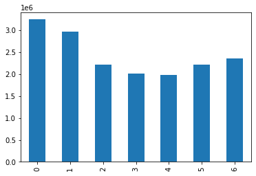
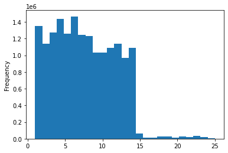
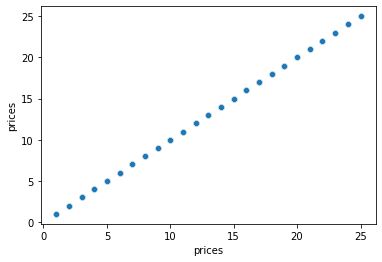
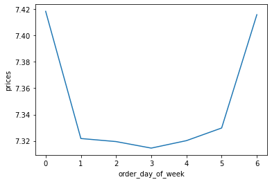
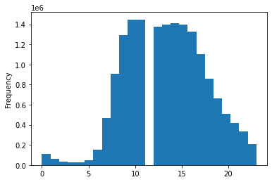
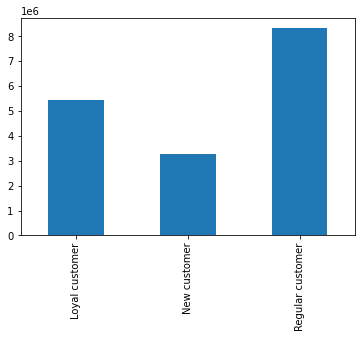
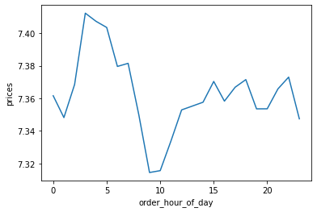
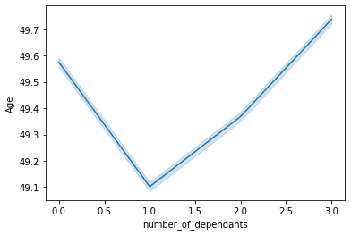
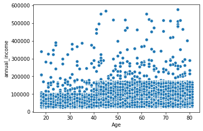

```python
# Import analysis libraries
import pandas as pd
import numpy as np
import os
import matplotlib.pyplot as plt
import seaborn as sns
import scipy
```


```python
# Import Instacart prepared data
df = pd.read_pickle(r'/Users/jlsanabria77/Desktop/17-02.2021 Instacat Basket Analysis 3/02 Data/Prepared Data/ords_prods_merged88.pkl')
```


```python
# We create a path to make all processes faster
path = 'Users/jlsanabria77/Desktop/17-02.2021 Instacat Basket Analysis 3'
```


```python
path
```


    'Users/jlsanabria77/Desktop/17-02.2021 Instacat Basket Analysis 3'


# 2.Create a bar chart, a histogram, a scatterplot and a line chart.


```python
# Creating a bar chart
bar_9 = df['order_day_of_week'].value_counts().sort_index().plot.bar()
```


    

    


```python
# Saving bar chart
bar_9.figure.savefig('/Users/jlsanabria77/Desktop/17-02.2021 Instacat Basket Analysis 3/04 Analysis/Visualizations/bar_9_order_dow.png')
```


```python
# Create a Histogram. But first we will treat outliers as missing so the histogram makes sense. As explained in the exercise
df.loc[df['prices'] >100,'prices'] = np.nan

```


```python
df.loc[df['prices'] <= 0, 'prices'] = np.nan
```


```python
# Check the repalcement is succesfula
df['prices'].max()
```


    25.0


```python
hist = df['prices'].plot.hist(bins = 25)
```


    

    


```python
# create a scatter plot
sns.scatterplot(x = 'prices', y = 'prices',data = df)
```


    <AxesSubplot:xlabel='prices', ylabel='prices'>


    

    


Line Chart


```python
# we will use a 70/30 split for this sample
```


```python
# Create a list holding True/False values to the test np.random.rant() <= 0.7
dev = np.random.rand(len(df)) <= 0.7
```


```python
# Store 70% of the sample in the dataframe big
big= df[dev]
```


```python
# Store 30% of the sample in the dataframe small
small= df[~dev]
```


```python
Check length of dataframe and check both smaple subsets equal the total of rows
len(df)
```


    17027529


```python
len(big) + len(small)
```


    17027529


```python
# Reduce sampples to columns only necessary
df_2 = small [['order_day_of_week','prices']]
```


```python
# Create line chart
line = sns.lineplot(data = df_2, x = 'order_day_of_week', y= 'prices')
```


    

    


# 3.Histogram 'order_hour_of_day'


```python
# 
hist3 = df['order_hour_of_day'].plot.hist(bins = 25)
```


    

    


This histogram shows a bell shape and has a gap in the middle. It shows that the highest frequency of orders occur during the central hours of the day from 12pm and decreases after that. Very few orders are placed through the hours of the night and increases during the morning.

# 4.Bar Chart for 'loyalty_flag' column


```python
bar_loyal = df['loyalty_flag'].value_counts().sort_index().plot.bar()
```


    

    


Out of the three types of cusotmers, most customers are in the category of "regular"

# 5. Prices-Hour of Day relation?


```python
# I will use the sample already set for the exercise and the 70/30 split
```


```python
line_2 = sns.lineplot(data = df, y = 'order_hour_of_day', x = 'prices')
```


    

    


This chart shows the average price of a product bought across all hours of the day. We can see that the most expeisve products are bought in the very early hours of the morning. and the cheapest products are bought around 9am.

This interesting discovery tells us two things:
People buy the most expensive items late at night perhpas when browsing online and not sleeping. The cheapest buys are done when people are on their way to work  or school, perhaps snacks, or basic items.

# 6. Targeted Marketing Campaings


```python
# Determine connection between age and family status.
# Create line chart. Using the sampling already created.
line_3 = sns.lineplot(data = df, y = 'Age', x = 'number_of_dependants')
```


    

    


This line charts shows that the average age of people with zero dependants is quite high. After that the average age of people with dependants increases as the average age increases too.

# 7. Age-Spending Power (scatterplot)


```python
scatterplot1 = sns.scatterplot(x = 'Age', y = 'annual_income', data = df)
```


    

    


This Scatterplot tells us that as people get older they get more income and therefore more spending power. We can see a increase in concentration plots just after the 40 year mark.

# 8.Export Visualizations


```python
# Export Histogram 'order_hour_of_day'
hist3.figure.savefig(r'/Users/jlsanabria77/Desktop/17-02.2021 Instacat Basket Analysis 3/04 Analysis/Visualizations/hist_orders_hod.png')
```


```python
# Export bar chart 'loyalty_flag' column
bar_loyal.figure.savefig(r'/Users/jlsanabria77/Desktop/17-02.2021 Instacat Basket Analysis 3/04 Analysis/Visualizations/bar_loyalty_flag.png')
```


```python
# Export line chart 'prices' 'hour_of_the_day'
line_2.figure.savefig(r'/Users/jlsanabria77/Desktop/17-02.2021 Instacat Basket Analysis 3/04 Analysis/Visualizations/line_prices_hour_day.png')
```


```python
# Export line chart 'age' 'family status'
line_3.figure.savefig(r'/Users/jlsanabria77/Desktop/17-02.2021 Instacat Basket Analysis 3/04 Analysis/Visualizations/line_age_family.png')
```


```python
# Export scatterplot 'Age' 'Spending Power'
scatterplot1.figure.savefig(r'/Users/jlsanabria77/Desktop/17-02.2021 Instacat Basket Analysis 3/04 Analysis/Visualizations/age_spending_power.png')
```


```python

```
